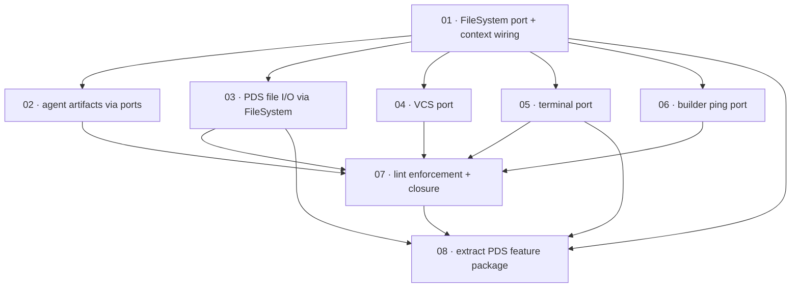

# Plan: Hexagonal ports adoption

**Status:** Draft · **Layout:** kanban · **Date:** 2026-07-11 · **Owner:** Ant Stanley · **Source spec:** [DEVELOPMENT.md §Hexagonal architecture — ports and adapters](../../../DEVELOPMENT.md)

Close the gap between the adopted hexagonal rule and the code: move every remaining
direct side effect — `node:fs` in six CLI modules, `node:child_process` in `repo.ts`,
the bare `fetch` in `deploy.ts`, and the terminal reads in `logger.ts` /
`pds login` — behind repo-owned ports wired at the composition root. The
decomposition leads with the enabler every other task is reviewed through: a
`FileSystem` port plus the `OpsContext.ports` plumbing and a test-context factory
(task 01). Five migration tasks then convert one seam each, task 07 turns the rule
into a lint gate so the discipline is enforced mechanically, and task 08 uses the
ported seams to extract the standard.site integration into its own `blogwright-pds`
feature package.

---

## Source and definition-of-done baseline

- **Spec.** `DEVELOPMENT.md` §Hexagonal architecture — ports and adapters (the rule,
  the port conventions, the existing-ports table) and §Assumptions and open
  questions (the enumerated divergences this plan closes). Constraints from the
  planning request: keep the three-package split, prefer function-typed ports,
  tests substitute at ports (no module mocks or env-var seams — `OPS_AGENT_DIR` is
  retired), adapters translate errors, composition root stays `context.ts`/`bin.ts`.
- **Already built.** The architecture is mostly in place — this plan treats as
  preconditions: the `Transport` port and transport-level mocks (`core/src/aws/
  signer.ts`), the `XrpcTransport` port with injectable `fetchImpl`
  (`cli/src/pds/xrpc.ts`), the `PdsRepo`/`OpenRepo` ports (`cli/src/pds/sync.ts:12,18`),
  `StateStore` and `Logger` injection via `OpsContext`, pervasive default-param
  injection in `pds/commands.ts`, side-effect-free domain modules (`commands.ts`,
  `graph.ts`, `nodes.ts`, `microvms.ts`, `seo.ts` — verified by code read), and zero
  `vi.mock`/`vi.stubEnv`/`vi.stubGlobal` across the test suite.
- **Definition of done.** `DEVELOPMENT.md` §Definition of done, inherited by every
  task: tests written with the change (positive and negative space), small
  single-purpose functions, errors with context, ports for new side effects, and
  `pnpm build && pnpm test && pnpm lint && pnpm knip` green. Task files add only
  task-specific acceptance.

---

## Task graph

The dependency table is the source of truth; the Mermaid graph visualizes it.

| Task | Depends on | Edge kind | Produces (reviewable artifact) |
|---|---|---|---|
| 01 · FileSystem port + context wiring | — | — | config loading and repo-root discovery run against an in-memory filesystem; `createTestContext` replaces the `as unknown as OpsContext` casts |
| 02 · agent artifacts via ports | 01 | build, contract | agent packaging has its first test, running without `OPS_AGENT_DIR` or a real `agent/` dir |
| 03 · PDS file I/O via FileSystem | 01 | contract | `pds keygen`/`init`/`sync` file access runs against the in-memory filesystem |
| 04 · VCS port | 01 | build, contract | deploy's zip pipeline is testable through a fake VCS; `child_process` appears only in the adapter |
| 05 · terminal port | 01 | contract | `confirm` and the `pds login` prompt run against a scripted terminal in tests |
| 06 · builder ping port | 01 | contract | `pollBuild`'s wake-up nudge is covered by a test with a fake ping |
| 07 · lint enforcement + closure | 02, 03, 04, 05, 06 | build, review | lint fails on a direct `node:fs` import outside adapters; DEVELOPMENT.md's exception list is emptied |
| 08 · extract PDS feature package | 01, 03, 05, 07 | build, contract | the standard.site integration is its own package `blogwright-pds`; the CLI consumes it and `blogwright/rkey` still resolves |

---

## Implementation order and milestones

**Order:** `01, 02, 03, 04, 05, 06, 07, 08` — task 01 leads because every migration is
reviewed through it: it establishes where ports live, how `OpsContext` carries them,
and how tests substitute them, so each later task is a mechanical application of a
reviewed pattern. Task 02 goes second because it retires the one seam the spec
explicitly bans (`OPS_AGENT_DIR`) and adds a test where none exists — the highest
risk-retirement per line. Task 07 is last by construction: its lint gate can only
pass once every migration has landed.

**Milestones:**

| Milestone | Tasks | Demonstrable when complete | Review gate |
|---|---|---|---|
| M1 — port infrastructure | 01, 02 | the ports module, context wiring, and test factory exist; one module (`agent-package.ts`) is fully migrated and newly tested; `OPS_AGENT_DIR` is gone | suite green; pattern reviewed and agreed before mass migration |
| M2 — disk and process seams | 03, 04 | `node:fs` and `node:child_process` appear only in adapter modules; deploy and pds paths are port-clean | suite green; grep for `node:fs`/`node:child_process` outside adapters returns only adapters |
| M3 — interactive seams and enforcement | 05, 06, 07 | terminal and network-nudge seams are ported; the lint gate rejects violations; DEVELOPMENT.md records completion | all four CI gates green with the new lint rule active |
| M4 — feature packaging | 08 | the standard.site integration is `blogwright-pds`; the CLI's public surface (`pds` commands, `blogwright/rkey`) is unchanged | all four gates green; rkey vectors byte-identical; `pnpm pack --dry-run` surface unchanged |

---

## Assumptions and open questions

**Assumptions**

- The package split grows with features: the standard.site integration moves to its
  own `blogwright-pds` package (task 08); shared ports live in `blogwright-core`,
  and ports specific to one package (VCS, builder ping) stay beside their owner.
- The 153-test suite is the regression net; behaviour-preserving refactors are
  validated by it plus the new port-level tests, not by cloud runs.
- The existing tmp-dir tests remain valuable as adapter integration tests; migrating
  domain tests to in-memory adapters does not require deleting them.

**Decisions**

- *Port granularity.* **One `FileSystem` port, not six micro-ports.** The six fs
  call sites share four operations (read text, write text with directory creation,
  existence check, recursive listing); they cohere as one interface per the
  guideline's "interfaces where the operations cohere". Six near-identical function
  types would add naming without adding isolation.
- *Delivery vehicle.* **Ports ride on `OpsContext`.** The context is already the
  repo's dependency-injection vehicle (clients, state, logger); adding a `ports`
  field extends the existing pattern rather than introducing a second one.
  `createContext` accepts adapter overrides so the composition root stays
  `context.ts`/`bin.ts`.
- *Enforcement.* **A lint rule, not convention.** The rule "domain modules do not
  import `node:fs`/`node:child_process`/`node:readline`" is mechanically checkable;
  leaving it to review contradicts the repo's CI-as-sole-gate stance.
- *Sequencing.* **One fully migrated module (02) before mass migration.** Reviewing
  the complete pattern — port, adapter, wiring, test — on the smallest untested
  module catches design mistakes while one task depends on them, not five.
- *Done certificates.* **Not authored.** Declined at planning time; a later
  done-certificates pass can add them beside the task files before execution.
- *Port placement.* **`FileSystem` and `Terminal` ports live in `blogwright-core`.**
  Task 08 extracts the pds feature into its own package, which needs both ports;
  defining them in core from the start (tasks 01 and 05) avoids moving them later.
  The `Vcs` and `PingBuilder` ports serve only the CLI's deploy path and stay in the
  CLI.
- *Feature packages.* **One feature, one package, added 2026-07-11 at the owner's
  request.** The pds/standard.site integration is the first extraction (task 08); it
  follows the hexagonal tasks because the extraction is only clean once the feature's
  side effects are behind ports. Other candidates (preview, seo) are an open
  question, not tasks.

**Open questions**

- *Lint capability.* Does oxlint's `no-restricted-imports` support the per-path
  scoping task 07 needs (allowing `node:fs` in `adapters/` only)? If not, the
  fallback is a small check script wired into `pnpm lint`. (Blocks nothing before
  07.)
- *Logger TTY behaviour.* `logger.ts` captures `process.stdout.isTTY` at module
  load. Task 05 moves it behind the terminal port; does any consumer rely on the
  module-load-time capture? (Investigated in 05; expected no.)
- *Further feature packages.* Do the preview stack or the seo pipeline warrant the
  same extraction as pds, or does the CLI remain their home? (Blocks nothing; a
  follow-up plan if wanted.)
