# Plan: Plugin system and analytics

**Status:** Draft · **Layout:** kanban · **Date:** 2026-07-26 · **Owner:** Ant Stanley · **Source spec:** [An internal plugin system for the CLI](../../changes/2026-07-26-cli_plugin_system.md) · [Migrate blogwright-pds onto the plugin system](../../changes/2026-07-26-migrate_pds_to_plugin_system.md) · [Analytics plugin - CloudFront logs to Iceberg](../../changes/2026-07-26-analytics_plugin.md)

Land three linked change specs as one dependency-ordered graph of 62 tasks: an
internal plugin SPI in `blogwright-core` with discovery and generic dispatch in
the CLI, the migration of `blogwright-pds` onto that SPI with no config-file
change and a short, listed set of operator-visible ones, and a new
`blogwright-analytics` plugin that routes CloudFront access logs through
Firehose into an Iceberg table and serves a local dashboard over
it. The decomposition leads with the enabler every plugin task is reviewed
through - `PluginContext` in core (task 01) - because the analytics graph is
written against that type eight tasks before it is exercised, so a missing field
surfaces late and expensively. Task 07 adds the `main()` test seam neither spec
owned but seven later tasks need, and the CLI surface is built behind it:
discovery, dispatch, help, the `plugin` verbs. The pds migration then validates
the SPI against a second consumer of the opposite shape (no graph nodes, an
interactive OAuth flow) before analytics ships. The two analytics milestones
that touch only `blogwright-core` and the new package (M5 and M6) depend on
nothing in the plugin-system or pds streams and may be worked from day one -
though tasks 33–36 need the analytics package skeleton (task 32) to exist,
because the plugin's clients live in it; everything after them is
reviewed through the twelve-node graph reconciling against its own scoped state
key.

---

## Source and definition-of-done baseline

- **Spec.** The repo has no canonical spec pages, so the three change specs
  dated 2026-07-26 are the source of truth and land in the order
  `.specs/README.md` indexes them.
  [2026-07-26-cli_plugin_system.md](../../changes/2026-07-26-cli_plugin_system.md)
  contributes the SPI (§Plugin SPI → The `Plugin` contract, §Plugin SPI →
  `PluginContext`), the graph vocabulary relocation, scoped state stores,
  discovery, namespace collisions, dispatch, config ownership, `<plugin> init`,
  plugin lifecycle, and the `ModuleLoader` and `PackageManager` ports.
  [2026-07-26-migrate_pds_to_plugin_system.md](../../changes/2026-07-26-migrate_pds_to_plugin_system.md)
  contributes the pds manifest, plugin export, context narrowing, config
  ownership, the core-config removal, the dispatch removal, and the post-deploy
  sync. [2026-07-26-analytics_plugin.md](../../changes/2026-07-26-analytics_plugin.md)
  contributes the analytics namespace and commands, the pipeline shape, region
  pinning, record transformation, table schema, the twelve resource nodes, the
  plugin's own four AWS service clients, `LogsClient` delivery configuration,
  the local dashboard, the `AnalyticsQuery` port and the `analytics` config
  block.
- **Already built.** Preconditions this plan does not schedule as work: the
  hexagonal port infrastructure landed by the 2026-07-11 plan - `FileSystem` and
  `Terminal` in `packages/core/src/ports.ts` with adapters under
  `packages/core/src/adapters/`, `Vcs` and `PingBuilder` in
  `packages/cli/src/ports.ts` with adapters under `packages/cli/src/adapters/`,
  the `createTestContext` factory, and the `no-restricted-imports` lint gate;
  the graph engine (`packages/cli/src/graph.ts:4,18,58,89` - `ResourceNode`,
  `topoSort`, `applyGraph`, `destroyGraph`), which plugin lifecycle verbs reuse
  rather than reimplement; the S3-backed `StateStore` and its `stateKey`
  (`packages/core/src/state.ts:17,25`); the structural plugin boundary already
  working in `packages/pds/src/context.ts`, satisfied by the CLI's `OpsContext`
  with no import in either direction; the SigV4 transport and endpoint resolver
  (`packages/core/src/aws/signer.ts`, `endpoint.ts`) the plugin's four clients
  hang off; `LogsClient` with the vended-log-delivery calls and `deliveriesForSource`
  (`packages/core/src/aws/logs.ts`), and the site's delivery trio at
  `packages/cli/src/nodes.ts:713`; the wizard's `renderConfig`
  (`packages/cli/src/init.ts:42`); and the build-agent's rolldown bundle plus
  source-hash manifest (`packages/build-agent/rolldown.config.ts`), the
  precedent the transform bundle follows.
- **Type-claim gate.** [`type-claims/`](type-claims/README.md) (owned by
  task 00) transcribes the proposed SPI types with per-declaration spec
  citations and compiles 29 claims - positives as plain code, quoted
  diagnostics under `@ts-expect-error` - against the real `OpsContext`,
  `OpsConfig`, `OpsState`, `AwsClients` and `PdsContext` imported from
  `packages/`. `node type-claims/check.mjs` runs it; when a spec changes a
  proposed type, the transcription changes with it and whatever breaks names
  the task that needs updating. It lives outside `packages/` so knip, oxlint
  and the build never see it, and it is deliberately not wired into CI.
- **Definition of done.** [DEVELOPMENT.md §Definition of done](../../../DEVELOPMENT.md),
  inherited by every task: behaviour covered by tests written with the change
  (positive and negative space), small single-purpose functions, no duplicated
  logic, limits as named constants or validated config fields, errors raised with
  context and no `null` for a domain value, new external interactions behind ports,
  and `pnpm build`, `pnpm test`, `pnpm lint`, `pnpm exec oxfmt --check .`, `pnpm knip`
  green locally. User-facing changes ship a changeset. Task files add only
  task-specific acceptance on top.

---

## Task graph

```mermaid
graph TD
  00["00 · type-claim gate (no edges - plan infrastructure)"]
  01["01 · plugin context in core"] --> 02["02 · ResourceNode moves to core"]
  01 --> 03["03 · Plugin contract and validator"]
  01 --> 24["24 · PdsContext narrows PluginContext"]
  02 --> 03
  02 --> 15["15 · extract status read loop"]
  02 --> 16["16 · plugin lifecycle verbs"]
  02 --> 48["48 · table bucket, namespace, table nodes"]
  02 --> 50["50 · transform role and function nodes"]
  03 --> 08["08 · plugin discovery"]
  03 --> 13["13 · generic plugin init action"]
  03 --> 19["19 · plugin config validation"]
  03 --> 25["25 · pds Plugin export"]
  03 --> 47["47 · analytics Plugin export and init"]
  04["04 · scoped state store"] --> 16
  05["05 · ModuleLoader port"] --> 08
  05 --> 20["20 · plugin system docs and closure"]
  06["06 · PackageManager port"] --> 18["18 · plugin add and remove"]
  06 --> 20
  07["07 · main() test seam"] --> 10["10 · plugin dispatch"]
  07 --> 11["11 · help plugin sections"]
  08 --> 09["09 · namespace collision rules"]
  08 --> 10
  08 --> 17["17 · plugin list"]
  08 --> 19
  08 --> 26["26 · pds package manifest"]
  09 --> 10
  09 --> 17
  10 --> 11
  10 --> 13
  10 --> 16
  10 --> 17
  10 --> 19
  10 --> 29["29 · remove runPds dispatch"]
  11 --> 20
  12["12 · JSONC config-block splice"] --> 13
  13 --> 14["14 · init wizard plugin blocks"]
  13 --> 47
  14 --> 20
  15 --> 16
  16 --> 20
  16 --> 47
  16 --> 54["54 · analytics graph and lifecycle"]
  17 --> 18
  18 --> 20
  19 --> 20
  19 --> 27["27 · core config drops pds"]
  20 --> 58["58 · analytics docs and closure"]
  21["21 · pds config ownership"] --> 22["22 · pds resolved secretName"]
  21 --> 25
  22 --> 23["23 · pds owns its OIDC policy node"]
  23 --> 25
  23 --> 27
  23 --> 59["59 · drop pds from the site graph"]
  24 --> 25
  25 --> 26
  25 --> 28["28 · pds config validation timing"]
  26 --> 27
  26 --> 28
  26 --> 29
  27 --> 28
  28 --> 30["30 · pds migration closure"]
  29 --> 30
  29 --> 59
  30 --> 58
  31["31 · open the transport seam"] --> 33["33 · S3TablesClient"]
  31 --> 34["34 · FirehoseClient"]
  31 --> 35["35 · GlueClient"]
  31 --> 36["36 · LambdaClient"]
  32["32 · analytics package skeleton"] --> 33
  32 --> 34
  32 --> 35
  32 --> 36
  32 --> 39["39 · schema and field selection"]
  32 --> 44["44 · analytics config block"]
  33 --> 38["38 · plugin client bundle"]
  34 --> 38
  35 --> 38
  36 --> 38
  37["37 · logs delivery configuration"] --> 52["52 · shared delivery-source guards"]
  37 --> 53["53 · log destination and delivery nodes"]
  38 --> 48
  38 --> 50
  39 --> 40["40 · transform field mapping"]
  39 --> 48
  40 --> 41["41 · visitor key and bot flag"]
  41 --> 42["42 · Firehose transform envelope"]
  42 --> 43["43 · transform bundle and source hash"]
  43 --> 50
  44 --> 45["45 · AnalyticsQuery port and named queries"]
  44 --> 47
  44 --> 48
  44 --> 50
  45 --> 46["46 · DuckDB query adapter"]
  45 --> 55["55 · analytics status"]
  46 --> 56["56 · dashboard server and command"]
  47 --> 54
  47 --> 56
  48 --> 49["49 · catalog integration node"]
  49 --> 51["51 · Firehose role and stream nodes"]
  50 --> 51
  50 --> 54
  51 --> 53
  52 --> 53
  53 --> 54
  54 --> 55
  55 --> 58
  56 --> 57["57 · dashboard app build"]
  57 --> 58
  16 --> 60["60 · bootstrap warns about plugin state"]
  59 --> 60
  41 --> 61["61 · analytics backfill"]
  46 --> 61
  47 --> 61
  53 --> 61
  58 --> 61
```

The dependency table is the source of truth; the Mermaid graph visualizes it.

| Task | Depends on | Edge kind | Produces (reviewable artifact) |
|---|---|---|---|
| 00 · type-claim gate | - | - | [`type-claims/`](type-claims/README.md) compiles the corpus's type-level claims against the repo's real types; `check.mjs` exits non-zero naming any claim that breaks |
| 01 · plugin context in core | - | - | `PluginContext` exists in core and a CLI test fails the build the moment one of its members stops being suppliable - thirteen from an `OpsContext`, three from the dispatch boundary |
| 02 · ResourceNode moves to core | 1 | build | a node typed only against core's `PluginContext` compiles as a `ResourceNode`; `nodes.ts` changed only its imports |
| 03 · Plugin contract and validator | 1, 2 | build, contract | `validatePlugin` turns an imported module into a typed `Plugin` or raises naming the offending package |
| 04 · scoped state store | - | - | a scoped `StateStore` keys `state/<env>.<plugin>.json` while the unscoped key stays byte-identical |
| 05 · ModuleLoader port | - | - | plugin modules load through an injected port; `node:module` is lint-restricted outside adapters |
| 06 · PackageManager port | - | - | lockfile detection and install/uninstall run behind a port, with no test spawning a process |
| 07 · main() test seam | - | - | `cli.test.ts` pins today's help, unknown-command and `pds` dispatch behaviour with no AWS access |
| 08 · plugin discovery | 3, 5 | build, contract | `discover()` returns loaded plugins and failures, including plugins bundled with the CLI itself |
| 09 · namespace collision rules | 8 | build | a plugin claiming a reserved or already-claimed namespace is rejected naming both packages |
| 10 · plugin dispatch | 7, 8, 9 | build, review | `blogwright <plugin> <action>` runs a plugin command, flags and multi-word actions included, with discovery still lazy for built-ins |
| 11 · help plugin sections | 7, 10 | build | `blogwright --help` lists installed plugins, and is byte-identical to today's USAGE with none installed |
| 12 · JSONC config-block splice | - | - | a hand-commented `config/production.jsonc` gains a block and comes back byte-identical outside the insertion |
| 13 · generic plugin init action | 3, 10, 12 | build, contract | `blogwright <plugin> init` writes the plugin's block into the environment's existing config file |
| 14 · init wizard plugin blocks | 13 | build | `blogwright init` asks every discovered plugin's questions and writes one file carrying every answered block |
| 15 · extract status read loop | 2 | build | the node read-and-report loop is a reusable function and `blogwright status` output is unchanged |
| 16 · plugin lifecycle verbs | 2, 4, 10, 15 | build, contract | `<plugin> bootstrap\|status\|destroy` reconcile the plugin's nodes against its own scoped state key, and `blogwright destroy` refuses while one of those keys exists |
| 17 · plugin list | 8, 9, 10 | build | `blogwright plugin list` reports namespaces, versions, config keys and load failures |
| 18 · plugin add and remove | 6, 17 | build | `blogwright plugin add analytics` installs `blogwright-analytics` pinned to the running CLI's version |
| 19 · plugin config validation | 3, 8, 10 | build, contract | a plugin validates its own config block; a block for an uninstalled plugin stays inert |
| 20 · plugin system docs and closure | 5, 6, 11, 14, 16, 18, 19 | review | the plugin surface is documented and changeset-covered, and its change spec's documentation steps are executed; the `Status:` flip waits on the transport seam at tasks 31 and 38 and lands at task 58 |
| 21 · pds config ownership | - | - | `blogwright-pds` validates the `pds` block and derives `<siteName>/atproto` with core's messages unchanged |
| 22 · pds resolved secretName | 21 | build | `requirePdsConfig` returns a resolved `secretName` and the default has exactly one home |
| 23 · pds owns its OIDC policy node | 22 | build, contract | pds attaches its own named inline policy to the site's deploy role - additive, no gap |
| 24 · PdsContext narrows PluginContext | 1 | contract | `PdsContext` is expressed in core's SPI vocabulary and duplicates no core shape |
| 25 · pds Plugin export | 3, 21, 23, 24 | build, contract | `blogwright-pds` default-exports a `Plugin` declaring the six existing pds actions and the `nodes(ctx)` contributor task 23's node hangs off |
| 26 · pds package manifest | 8, 25 | build | discovery finds `blogwright-pds` from a consuming repo that depends only on `blogwright` |
| 27 · core config drops pds | 19, 23, 26 | build, contract | core's config holds no pds domain knowledge, an unknown top-level block round-trips untouched, and the site's secret ARN still resolves to `<siteName>/atproto` from an inline default task 59 removes |
| 28 · pds config validation timing | 25, 26, 27 | build, review | the outcome of a malformed `pds` block on built-in commands is pinned by tests, not assumed |
| 29 · remove runPds dispatch | 10, 26 | build, review | `cli.ts` mentions pds nowhere and all six pds actions run through generic dispatch |
| 30 · pds migration closure | 28, 29 | review | the migration ships with its changeset and its release notes, and the pds spec's `Status:` flip is deferred to task 60, its two outstanding blocks landing at tasks 59 and 60 |
| 31 · open the transport seam | - | - | `resolveEndpoint`/`SendOptions` accept a plugin-supplied service descriptor; core's `SIGNING_NAMES` stays closed |
| 32 · analytics package skeleton | - | - | `packages/analytics` builds, tests and lints under the workspace's five gates |
| 33 · S3TablesClient | 31, 32 | build | table buckets, namespaces and tables are created, read and deleted over the shared signer |
| 34 · FirehoseClient | 31, 32 | build | a delivery stream is created, described, tagged and deleted idempotently |
| 35 · GlueClient | 31, 32 | build | the `s3tablescatalog` federation can be created or adopted |
| 36 · LambdaClient | 31, 32 | build | the standard Lambda API is reachable without colliding with the MicroVM paths |
| 37 · logs delivery configuration | - | - | deliveries accept an output format, record fields and a delimiter; today's request body is unchanged |
| 38 · plugin client bundle | 33, 34, 35, 36 | build | the plugin builds its four clients over `ctx.clients.signingUsEast1`; core's `AwsClients` gains that signer and no service key |
| 39 · schema and field selection | 32 | build | the `page_views` columns, the day partition and the CloudFront field selection have one home |
| 40 · transform field mapping | 39 | build, data | one CloudFront record maps to one `page_views` row, day boundaries included |
| 41 · visitor key and bot flag | 40 | build, data | `visitor_key` is a pinned-vector digest and no column carries the raw viewer IP |
| 42 · Firehose transform envelope | 41 | build | a batch containing one unmappable record still returns Ok for the rest, record ids echoed |
| 43 · transform bundle and source hash | 42 | build, data | the transform bundles to one file whose zip key is a stable hash of its source |
| 44 · analytics config block | 32 | build, contract | an empty `analytics` block validates and produces every default |
| 45 · AnalyticsQuery port and named queries | 44 | build, contract | the named query set is parameterised and readable through a fixture-backed fake |
| 46 · DuckDB query adapter | 45 | build | the port runs against the S3 Tables catalog read-only with credentials passed in explicitly |
| 47 · analytics Plugin export and init | 3, 13, 16, 44 | build, contract | `blogwright-analytics` is discoverable and `analytics init` returns its config block - its end-to-end init test needs task 13's generic splice path |
| 48 · table bucket, namespace, table nodes | 2, 38, 39, 44 | build, data | the Iceberg table is created from the shared column set, pinned to us-east-1 |
| 49 · catalog integration node | 48 | build | the account-scoped federation is adopted rather than created, and no teardown deletes it |
| 50 · transform role and function nodes | 2, 38, 43, 44 | build | the transform Lambda and its scoped execution role are provisioned by source hash |
| 51 · Firehose role and stream nodes | 49, 50 | build | the Iceberg delivery stream exists with its four ARN-scoped grants, its error bucket, and a role declaring every node whose ARN it grants on |
| 52 · shared delivery-source guards | 37 | build, contract | `deliveriesForSource` carries each delivery's destination ARN, so the site's log-delivery node never removes a source it shares - in `delete()` or in its `ConflictException` retry, which also scopes its delete to the site's own delivery |
| 53 · log destination and delivery nodes | 37, 51, 52 | build, data | CloudFront logs reach Firehose, the site's existing CloudWatch delivery survives, and the delivery's creation day is recorded once in scoped state - the backfill bound task 61 reads |
| 54 · analytics graph and lifecycle | 16, 47, 50, 53 | build, contract | `analytics bootstrap\|destroy` reconcile twelve nodes against `state/<env>.analytics.json` |
| 55 · analytics status | 45, 54 | build | `analytics status` reports each node, the stream's delivery health and the table's row count |
| 56 · dashboard server and command | 46, 47 | build, contract | `analytics dashboard` serves named queries from 127.0.0.1 with no route accepting SQL |
| 57 · dashboard app build | 56 | build | the SvelteKit app ships prebuilt in `dist/app` and consumers never run Vite |
| 58 · analytics docs and closure | 20, 30, 55, 57 | review | the analytics plugin is documented and changeset-covered, and the plugin-system spec is merged; the pds and analytics specs stay pending, named as tasks 60's and 61's |
| 59 · drop pds from the site graph | 23, 29 | build, contract | `packages/cli/src/nodes.ts` carries no pds knowledge and the grant lives only in the plugin; the pds spec's `Status:` flip is deferred once more, to task 60, which lands its true last block |
| 60 · bootstrap warns about plugin state | 16, 59 | build, contract | `blogwright bootstrap` warns after reconciling for every `state/<env>.<plugin>.json` in the site bucket, naming that plugin's bootstrap verb, with no discovery and no plugin knowledge - and the pds change spec is merged |
| 61 · analytics backfill | 41, 46, 47, 53, 58 | build, data | `analytics backfill` fills whole pre-Firehose days from the site's CloudWatch log group with rows identical to the Firehose path's, idempotently - and the analytics change spec is merged |

---

## Implementation order and milestones

**Order:** `00, 01, 02, 03, 04, 05, 06, 07, 08, 09, 10, 11, 12, 13, 14, 15, 16, 17, 18, 19, 20, 21, 22, 23, 24, 25, 26, 27, 28, 29, 30, 31, 32, 33, 34, 35, 36, 37, 38, 39, 40, 41, 42, 43, 44, 45, 46, 47, 48, 49, 50, 51, 52, 53, 54, 55, 56, 57, 58, 59, 60, 61` -
task 01 leads because every plugin task is reviewed through it: the analytics
graph is written against `PluginContext` eight tasks before it exercises the
type, so a missing field would be discovered in M7 rather than in M1. Task 07 is
sequenced ahead of all dispatch work although neither spec asks for it - seven
later tasks (10, 11, 13, 16, 17, 18, 29) have definitions of done that cannot be
discharged without a `main()` seam, and both source decompositions assumed
`cli.test.ts` already existed. The order departs from a dependency-only sort
twice: tasks 21-30 (pds) precede tasks 31-58 (analytics) even though the
analytics stream needs nothing from the pds stream until its closure task (the
one edge between them is 30→58, the closure ordering the first review added),
because the pds migration is what validates the SPI
against a second consumer before analytics is written against it, and task 23
precedes task 27 by a real edge rather than by convenience: 23 is what makes the
grant reachable from the plugin, and it lands `githubRole` on `deriveNames` in
the same `packages/core/src/config.ts` that 27 then strips of pds knowledge.
That edge is not by itself what keeps the deploy role's ARN correct - task 27
carries its own guard for that, an inline `<siteName>/atproto` default at
`packages/cli/src/nodes.ts:925` that task 59 deletes with the branch around it -
because the site's statement outlives task 27 and interpolating an undefined
`secretName` into it is `secret:undefined-*` written silently into a live role,
with nothing failing to compile.

Milestones M5 and M6 depend on nothing in the plugin-system or pds
streams and may be worked concurrently from day one (tasks 31, 32 and 37 are
fully independent; 33–36 wait only on the transport seam at 31 and the package
skeleton at 32), while tasks 20, 30 and 58–61 close their streams
by construction: each executes part of a change spec's merge plan, which is only
truthful once the work it describes has landed. That constraint binds task 20
harder than its own stream: one block of the plugin-system spec - §Plugin SPI →
Plugin-supplied AWS services, the transport seam and `signingUsEast1` - lands at
tasks 31 and 38 in M5, so task 20 executes the spec's documentation steps and
task 58, which depends on 20 and transitively on 38, performs the `Status:` flip
and the move. Task 59 closes M8 rather than M4, and for the same kind of reason
one milestone down: it removes the site graph's pds branch, and the pds spec
requires that removal to ship a release later than the plugin's own policy node,
because the grant only reaches a real role when an operator runs
`blogwright pds bootstrap` and the release notes carrying that instruction need
a release to travel in. Task 30 therefore documents the migration and defers
the pds spec's `Status:` flip past task 59 to task 60 - the decisions settled
2026-07-27 gave the pds spec a further block, §`bootstrap` warns while plugin
state exists, and task 60 is what lands it - exactly as task 20 defers the
plugin-system spec's flip to task 58, and task 58 in turn defers the analytics
spec's to task 61, which lands its §Backfill of historical logs block. One
rule drives all four deferrals: a spec is not merged while one of its
`Proposed changes` blocks is outstanding. Tasks 60 and 61 sit at the end
because no dependency edge may point forward - 60 needs task 16's scoped-key
listing and task 59's landed block before it can flip, 61 needs the transform
(41), the DuckDB adapter (46), the declared command table (47), the recorded
delivery-creation day (53) and task 58's documentation pass - and each ships
inside an existing release constraint: 60 no later than the release carrying
task 59, whose role rewrite is what its warning backs.

**Milestones:**

| Milestone | Tasks | Demonstrable when complete | Review gate |
|---|---|---|---|
| M1 - plugin SPI in core | 00, 01, 02, 03, 04 | core declares `Plugin`, `PluginCommand`, `PluginContext`, `PluginManifest`, `validatePlugin` and `ResourceNode`, and `StateStore` takes a plugin scope; task 00's type-claim gate passes and its transcriptions of the landed types are replaced by real imports | every command's behaviour, every derived AWS resource name and `state/<env>.json` are byte-identical; nothing dispatches through the SPI yet |
| M2 - CLI plugin surface | 05, 06, 07, 08, 09, 10, 11 | `blogwright <plugin> <action>` routes to an installed plugin's command and `blogwright --help` reflects what is actually installed | dispatch asserted in `cli.test.ts` with no cloud access; a test proves built-in commands load no plugin module |
| M3 - plugin commands | 12, 13, 14, 15, 16, 17, 18, 19, 20 | `blogwright plugin add\|list\|remove`, `<plugin> init`, and the generic `bootstrap\|status\|destroy` verbs all work against a plugin's scoped store, and `blogwright destroy` refuses while one exists | the plugin system releases on its own with pds still on its hardcoded branch; the plugin-system change spec is documented and changeset-covered, its `Status:` flip deferred to task 58 with the transport seam |
| M4 - pds migration | 21, 22, 23, 24, 25, 26, 27, 28, 29, 30 | all six pds actions reach the same functions with the same arguments through generic dispatch; `runPds`, the pds import and the static pds USAGE block are gone, and the pds plugin owns a `blogwright-pds` inline policy on the deploy role | `cli.ts` greps clean for `pds`; the post-deploy sync still fires; the deploy role's secret ARN never resolves to `secret:undefined-*` on any commit; tasks 27 and 28 ship in the same release; the release notes name `blogwright pds bootstrap` |
| M5 - the transport seam and the plugin's clients | 31, 32, 33, 34, 35, 36, 37, 38 | `packages/analytics` builds; core's transport accepts a plugin-supplied service descriptor and `LogsClient` deliveries take an output format, record fields and a delimiter; the plugin builds `s3tables`, `firehose`, `glue` and `lambda` over the shared signer, pinned to us-east-1 | every existing AWS request is byte-identical, `microvms` still signs against the primary region, and core gains no service key - only `signingUsEast1` on `AwsClients` |
| M6 - analytics foundations | 39, 40, 41, 42, 43, 44, 45, 46 | the schema, the transform's mapping, `visitor_key`, the bot flag, the per-record drop path, the config block and the query layer are all covered by tests | the package is inert - not published, not a CLI dependency, no manifest field; no test starts DuckDB |
| M7 - analytics graph | 47, 48, 49, 50, 51, 52, 53, 54, 55 | `blogwright analytics bootstrap` provisions the twelve-node pipeline and `analytics status` reports it; CloudFront logs land in the Iceberg table | the site's CloudWatch delivery survives; `blogwright bootstrap` does not provision any of it and `blogwright destroy` refuses while `state/<env>.analytics.json` exists |
| M8 - analytics dashboard, the site graph's last plugin branch, and the three closures | 56, 57, 58, 59, 60, 61 | `blogwright analytics dashboard` serves the prebuilt SvelteKit app over a fixed named-query set from 127.0.0.1, `packages/cli/src/nodes.ts` carries no pds knowledge, `blogwright bootstrap` warns while a plugin's scoped state exists, and `analytics backfill` pulls pre-Firehose history idempotently | no route accepts SQL; five gates green with the app tree present; `nodes.ts` greps clean for `pds`; all three change specs merged - the plugin-system spec at task 58, the pds spec at task 60, the analytics spec at task 61 |

**Cut lines:** points at which the work can stop and what has shipped there.

- *After task 04.* The plugin SPI exists in `blogwright-core` and `StateStore`
  can be scoped, but nothing dispatches through it. Every command behaves
  identically and `state/<env>.json` is unchanged. Internal-only, no changeset,
  safe to sit on `main` indefinitely.
- *Between tasks 10 and 17 there is no cut line.* Task 10 adds `plugin` to
  `KNOWN_COMMANDS` but its handler arrives at task 17, so `blogwright plugin`
  would dispatch to nothing. Do not stop inside that range.
- *After task 20.* The plugin system's CLI surface ships end to end:
  `blogwright plugin add|list|remove`, `blogwright <plugin> <action>`,
  `<plugin> init`, and the generic `bootstrap`/`status`/`destroy` verbs all
  work; pds still runs through its hardcoded branch and is unaffected. A
  complete, releasable minor with no plugin in the field yet. One block of the
  spec is still outstanding - §Plugin-supplied AWS services, at tasks 31 and 38:
  a plugin can dispatch, own config, contribute nodes and reach every AWS
  service core already enumerates, but not one it does not. That is why the
  spec's `Status:` flip waits for task 58.
- *After task 30.* pds is a plugin, the SPI has been validated by a second
  consumer of genuinely different shape, and no config file on disk needs
  touching. Releasable - and this is the release task 59 waits for, not merely
  a point at which stopping is tolerable. The site's own statement and the
  plugin's named inline policy are separate IAM objects and coexist on the role,
  so this release is where an operator runs `blogwright pds bootstrap`, which is
  what the release notes must say; task 59 removes the site's statement in a
  later release, by which time the grant an upgraded stack depends on is the
  plugin's. Tasks 27 and 28 must ship in the same release - 27 removes core's
  pds validation and 28 pins what replaces it - so do not cut between them. The
  release notes also carry the other four operator-visible changes the pds
  spec's §Upgrading a deployed stack lists: the three new `pds` lifecycle verbs,
  `blogwright destroy` refusing while `state/<env>.pds.json` exists, the
  shorter help section, and the built-in commands no longer rejecting a
  malformed `pds` block - the dispatch-scoped validation task 19 settled,
  whose consequence task 28 pins with tests.
- *After task 38.* `blogwright-core` has an open transport seam, `signingUsEast1`
  on `AwsClients` and configurable log deliveries, all behaviour-neutral for
  existing calls, and `packages/analytics` builds its four service clients over
  that seam. Releasable as a minor; core gains no plugin-specific surface, so
  there is nothing exported that nothing consumes. This milestone depends on
  nothing in the plugin-system or pds streams and can be worked from day one.
- *After task 46.* `packages/analytics` exists and builds, with the
  load-bearing transform tests, the schema, the config block and the query layer
  all proven. The package is not published, is not a dependency of the CLI, and
  declares no plugin manifest, so it is inert in the repo. Also independent of
  everything above it.
- *After task 55.* `blogwright plugin add analytics` then `analytics bootstrap`
  and `analytics status` provision and report the pipeline, and CloudFront logs
  land in the Iceberg table. Shippable provided the `dashboard` and `backfill`
  actions are dropped from task 47's command table or report that they are not
  yet available; the transform, graph and status paths are complete without
  them.
- *After tasks 58 through 61.* Task 58 documents the analytics surface and
  merges the plugin-system spec; task 59 removes the site graph's pds branch;
  task 60 lands the bootstrap warning and merges the pds spec; task 61 lands
  `analytics backfill` and merges the analytics spec. Between 58 and 61 there
  is one hard seam: 59 must ship a release after 30 (the additive-first rule),
  and 60 ships no later than 59's release, because its warning is what backs
  that release's role rewrite. `.specs/README.md`'s pending list is empty only
  after 61, so 58 leaves two entries standing - the pds spec named as task
  60's and the analytics spec as task 61's - and says which.

---

## Assumptions and open questions

**Assumptions**

- The consuming repo has a `package.json` at the root `findRepoRoot`
  (`packages/core/src/repo-root.ts`) resolves, and a package already present in
  that repo's dependency tree is trusted - installing a package runs its install
  scripts, so a second opt-in step in config would add ceremony without adding a
  boundary.
- `blogwright-pds` stays a non-optional dependency of `blogwright`. Every claim
  in M4 that a pds command keeps working with no install step rests on it, as
  does the static `syncAfterDeploy` import in `packages/cli/src/commands.ts`.
  M4 is not otherwise invisible to an operator: the pds spec's §Upgrading a
  deployed stack lists five changes, one of which - running
  `blogwright pds bootstrap` once per stack - is required rather than
  incidental.
- `PdsContext`'s structural-satisfaction trick generalises to the *narrow*
  slice a feature package needs - the fields the host already carries. It has
  held since the 2026-07-11 package extraction and is verified at compile time,
  which is why task 24 can assert it with a plain assignment rather than an
  adapter. It does not extend to the full `PluginContext`: `pluginConfig`,
  `siteState` and `record()` have no counterpart on `OpsContext`, so an
  `OpsContext` is not assignable to a `PluginContext` and never will be. Task 01
  gates the composition instead - an `OpsContext` plus exactly those three - and
  task 10 writes that composition as a named function at the dispatch boundary,
  which task 16 completes with the plugin's scoped store. Those three are what
  the compiler insists on, not the whole of what the boundary builds: `state`,
  `store` and `save()` typecheck straight off an `OpsContext` and must still be
  re-pointed at the scoped store, so the boundary builds six members and only
  three of them fail the build if it does not.
- Existing `config/<env>.jsonc` files need no migration: the `pds` block's
  shape and defaults are identical after M4, and validation outcomes are
  identical on every `blogwright pds <action>` path. Built-in commands no
  longer reject a malformed block - task 19's dispatch-scoped validation,
  listed as the pds spec's §Upgrading item 5 and pinned by task 28's tests.
- The site is bootstrapped before `analytics bootstrap` runs, and one CloudFront
  delivery source carries several deliveries, so the analytics delivery is
  additive to the site's existing CloudWatch one.
- S3 Tables is available in us-east-1 and DuckDB reads its Iceberg tables
  through the `S3_TABLES` endpoint type without a Lake Formation grant; the Glue
  federation exists for Firehose to write, not for DuckDB to read.
- The existing vitest suite plus the tests each task writes are the regression
  net. No task in this plan is validated by a cloud run; AWS interactions stay
  transport-mocked.

**Decisions**

- *One plan for three specs.* **The three change specs are decomposed
  together, not in sequence.** They share the SPI, the core-config removal and
  the `LogsClient` parameters; planning them separately would have produced two
  descriptions of the same core-config change and no place to settle the
  lifecycle-verb disagreement between the plugin and analytics specs.
- *Deduplicated overlaps.* **The plugin spec's "core config stops validating
  plugin keys" and the pds spec's "core config drops pds" are one task (27).**
  They edit the same two blocks of `packages/core/src/config.ts`; two tasks
  would have contended for the same lines.
- *An unasked-for task leads the CLI work.* **Task 07 adds the `main()` test
  seam.** `packages/cli/src/cli.test.ts` does not exist and `main()` builds its
  context through `createContext`, which reaches STS. Seven later tasks assert
  against dispatch, so the seam is scheduled once, at the composition root,
  rather than improvised seven times.
- *Bundled plugins are discovered.* **Task 08 owns the rule, not a later fix.**
  A consuming repo depends on `blogwright`, not on `blogwright-pds`; if
  discovery read only the consumer's direct dependencies, `blogwright pds sync`
  would break for every user the moment task 29 deletes `runPds`.
- *`--help` runs discovery, and so do `plugin list` and `init`.* **Everything
  else built-in pays nothing.** The pds spec forces the help case:
  `blogwright --help` must still list all six pds actions once the static block
  leaves USAGE. `blogwright plugin list` (task 17) needs it for a different
  reason - it names plugins that failed to load, which only a load attempt
  discovers. `blogwright init` (task 14) needs it for a third - the wizard asks
  each discovered plugin's questions and writes their blocks into the one file
  it produces. Task 11 records all three in a module comment; task 10 pins the
  laziness against `deploy`, `status` and `bootstrap` - exemplars of the set
  that pays nothing, not the whole of it: `rollback`, `delete`, `destroy`,
  `history`, `logs` and `preview` also run without discovery, exactly as the
  spec's "every other built-in command pays nothing" phrasing has it.
- *Config validation is dispatch-scoped.* **Only the dispatched plugin's block
  is validated, in the dispatch path - task 19 settled it and records the
  reason in a module comment.** Validating in `createContext` would run
  discovery on every built-in command, breaking the laziness rule the
  Decision above protects, and no seam exists there through which the
  dispatched plugin alone could be reached. The operator-visible consequence -
  built-in commands no longer reject a malformed `pds` block - is the pds
  spec's §Upgrading a deployed stack item 5, and task 28 pins it with tests
  in the same release that removes core's validation.
- *Declared commands win over generic actions.* **A plugin that declares
  `init` keeps it (task 13).** The action name is claimed in two opposite senses
  across the specs - pds's `init` creates the publication record, analytics's
  writes a config block - and this rule makes both correct. The enforceable half
  of it - the rejections - has one home, decided at task 13 and extended by task
  16: task 09's collision pass in `packages/cli/src/plugins.ts`, not core's
  `validatePlugin`. Core declares the `Plugin` contract and must not know which
  actions a host contributes generically, and `plugins.ts` already holds
  `RESERVED_COMMANDS` and reports collisions as load failures. Both tasks named
  the two candidates and left the choice open, which is how one rule ends up
  implemented in two modules.
- *Lifecycle-verb precedence is settled before either plugin ships.* **Task 16
  decides it and records it in a module comment; task 47's command table is
  written against that decision.** The recommended resolution is that
  `bootstrap` and `destroy` are always the generic verbs, because a plugin may
  not import the CLI and so cannot run `applyGraph`/`destroyGraph` itself, while
  `status` is generic unless the plugin declares its own.
- *The transform is decomposed into three tasks (40, 41, 42), not one.* **A
  silent mapping mistake corrupts the whole dataset with no error anywhere** -
  Firehose matches JSON keys to Iceberg column names exactly and discards the
  rest - so the mapping, the `visitor_key` derivation and the per-record drop
  path each carry their own tests.
- *A site teardown refuses while a plugin's state object exists.* **Task 16 owns
  the guard on `blogwright destroy`.** A scope changes the state key, not the
  bucket, and `bucketNode.delete()` empties every prefix before removing the
  bucket (`packages/cli/src/nodes.ts:66`), so a site teardown would delete
  `state/<env>.<plugin>.json` while the plugin's resources live on - after which
  `<plugin> destroy` reads empty state and removes nothing. The refusal names
  the plugin's own teardown verb; it also closes the open question both specs
  carried.
- *The plugin-system spec's merge is split across two tasks.* **Task 20
  documents; task 58 flips the `Status:`.** The spec owns the transport seam and
  `signingUsEast1`, which land at tasks 31 and 38 in M5 - after task 20 - so
  flipping the header there would claim work that has not landed. Task 58
  already depends on 20 and transitively on 38, and already closes the other two
  specs' paperwork.
- *A permission grant is protected by a local default, not by ordering.*
  **Task 27 applies `<siteName>/atproto` inline at
  `packages/cli/src/nodes.ts:925`; task 59 deletes it with the branch.**
  `oidcRolePolicyStatements` interpolates `config.pds.secretName` into an IAM
  Resource ARN and outlives task 27 by a release. Ordering alone cannot fix
  that - task 23 does not touch `:925`, and a `string | undefined` in a template
  literal compiles - so every `blogwright bootstrap` between 27 and 59 would
  write `secret:undefined-*` into a live deploy role. The alternative was to
  bind 27 and 59 into one release, which still leaves tasks 28 and 29 sitting
  between them by real edges and so still leaves `main` un-releasable for two
  commits, against DEVELOPMENT.md §Version control. One duplicated expression
  with a named owner that deletes it is the cheaper trade, and DEVELOPMENT.md
  prefers a little duplication where the abstraction would be wrong: the honest
  abstraction is `resolvePdsSecretName`, and importing it into `nodes.ts` is the
  plugin coupling this whole move removes.
- *Additive-first is a release ordering, not a commit ordering.* **Task 59 ships
  a release after task 30.** `applyOidcRole` rewrites the `<env>-deploy` inline
  policy wholesale on every `blogwright bootstrap`
  (`packages/cli/src/nodes.ts:840-842,962`), and the plugin's separately-named
  policy appears only when an operator runs `blogwright pds bootstrap` - which
  `blogwright bootstrap` deliberately does not do. So on a deployed stack the
  two grants never coexist by virtue of commit order alone; they coexist because
  the release that introduces the plugin's node tells the operator to run that
  verb, and the release that removes the site's statement comes later.

**Open questions**

- *SPI versioning.* Nothing declares or checks an SPI version - task 18 pins an
  installed plugin to the running CLI's own version, and that is the whole
  compatibility mechanism. Should the SPI declare a version a plugin states it
  was built against? (Blocks nothing before 18; carried forward at 20.)
- *Analytics scope left open by its spec.* Record expiration on the Iceberg
  table is unresolved - and, since 2026-07-27, correctly stated: S3 Tables
  offers no record expiration for tables you create (the API is scoped to
  AWS-managed tables), so aging rows out would be whole-`day`-partition
  deletes the plugin issues itself. Task 58 records it as resolved or out of
  scope with an owner. (Backfill, once the other half of this bullet, was
  settled 2026-07-27 as the declared optional `analytics backfill` action -
  task 61. Plugin teardown on removal, once a bullet of its own, was settled
  the same day: `plugin remove` asks, at task 18.)

---

## Decisions settled after the review

Two of the review's findings were not defects but unmade decisions the plan had
silently resolved. Both were settled 2026-07-26 and the tasks now carry them.

- *The `visitor_key` salt is a secret, not the date - and it is derived, not
  rotated.* **One long-lived random secret in Secrets Manager; the daily salt is
  `HMAC-SHA256(secret, day)`.** A date-derived salt is computable by anyone
  holding the table, and IPv4 is a 2^32 space - brute-forcing every row back to
  its source address is seconds of GPU time, so the hash would have provided no
  protection while appearing to. Deriving the per-day value from one immutable
  secret gives the same daily turnover with no rotation Lambda, no schedule and
  no second role - the managed-rotation alternative would have been more moving
  parts than the thing they protect. Cost: a flat $0.40/month per environment
  (Secrets Manager storage; the cached cold-start read makes API calls
  negligible), a further node (`analytics-salt-secret`, which with
  `analytics-error-bucket` brings the graph to twelve), a
  `secretsmanager:GetSecretValue` grant scoped to that secret in task 50, a
  `saltSecretName` config field in task 44, and the cold-start read in task 42.
  `SecretsManagerClient` already exists in core, so no new client - SSM
  Parameter Store would be free but would cost a hand-rolled `ssm` client, a bad
  trade against $4.80/year. Tasks 41, 42, 44, 50 and 54 were updated together.
- *`blogwright-analytics` joins the fixed changeset group.* **It versions in
  lockstep with the CLI.** Task 18 pins `plugin add` to install
  `blogwright-analytics@<cli version>`; the group at `.changeset/config.json:5`
  did not include the package, so that version would never have existed on the
  registry and the plan's headline install path would have failed silently.
  Task 32 now adds it to the group.

---

## Decision - a plugin owns its own topography

Settled 2026-07-26, after the review surfaced MIN-5. **Neither `blogwright-core`
nor the CLI's site graph carries resource topography for any plugin.** Two
violations existed and both are now planned out:

- The site's OIDC role policy branches on `ctx.config.pds`
  (`packages/cli/src/nodes.ts:913`) and interpolates that plugin's secret name
  into the ARN at `:925`. pds instead attaches its own
  **named inline policy** to the site's role (task 23) and the site drops its
  branch (task 59). `IamClient` already has `putRolePolicy`/`listRolePolicies`/
  `deleteRolePolicy`, so no client work. The two tasks are sequenced
  additive-first *across releases*, because the plugin's policy reaches a real
  role only when an operator runs `blogwright pds bootstrap`; between them the
  site's statement stands, with task 27's inline default keeping its ARN
  correct. The role's
  name joins `deriveNames` as `githubRole` in the same move, so the plugin reads
  the derivation rather than repeating the CLI-private one at `nodes.ts:826`.
- An earlier draft of the plugin-system spec put the analytics pipeline's four
  AWS clients in core. They are instead created in `blogwright-analytics`
  (tasks 33–36, assembled at 38), built over the `SigningClient` on the plugin's
  context; core has never carried them, so there is nothing to relocate and
  tasks 33–36 create rather than move. `pnpm knip` is why the draft was wrong:
  core would export four clients nothing in core or the CLI consumes.

This was only possible after opening the transport. `ServiceKey` is
`keyof typeof SIGNING_NAMES` and `SendOptions.service` is typed to it, so a
plugin could not sign against a service core did not enumerate - every new
service meant an edit to core. Task 31 changes from "add four signing names" to
"accept a plugin-supplied service descriptor", which is the enabling change for
this principle and for every future plugin.

Consequence worth noting: pds gains resource nodes, which it did not have. It is
still the differently-shaped consumer - one node against analytics' twelve - but
it no longer exercises the no-nodes path.

---

## Decisions settled 2026-07-27

Five open questions across the three specs were settled by the repo owner (one
of them a factual correction rather than a decision). Each is recorded as a
Decision in its spec; the plan's reflection is listed per item.

- *`plugin remove` asks about teardown.* Settled in the plugin-system spec
  (§CLI → `blogwright plugin` and its new Decision): the command asks through
  `Terminal.question` with No as the default, because removal forecloses the
  generic `destroy` verb; a non-interactive or `--plain` session is refused
  with an actionable message rather than defaulted, and `--yes` is the
  scripted answer. Task 18 owns it; no new task.
- *`blogwright bootstrap` warns while a plugin's scoped state exists.* Settled
  in the pds spec (§`bootstrap` warns while plugin state exists and its
  Decision): the third shape - reading the site bucket's `state/` prefix for
  keys core does not own, exactly as the destroy refusal does - because a
  `config.pds`-keyed check reintroduces the topography leak and a
  discovery-based check breaks the pinned discovery-laziness rule. New task
  60, which also lands the pds spec's deferred `Status:` flip.
- *Daily salt rotation stands.* Settled in the analytics spec (Decision
  *Daily salt rotation stands*): `visitor_key` never correlates across days,
  a monthly unique figure is the sum of daily uniques, and §Local server's
  named-query set states that semantic. Task 45's query set carries it; no
  new task.
- *`analytics backfill` is a declared, optional action.* Settled in the
  analytics spec (§Backfill of historical logs and its Decision): a one-shot,
  hand-run pull of pre-Firehose history from the site's CloudWatch log group,
  reusing the DuckDB dependency the dashboard already carries, idempotent by
  construction. New task 61 (the body, behind the stub task 47 declares),
  which also lands the analytics spec's deferred `Status:` flip; task 53
  additionally records the delivery-creation day the idempotency bound reads.
- *Record expiration - corrected, still open.* Not a decision: the analytics
  spec's open question claimed the S3 Tables API supports per-table record
  expiration, and it does not for tables you create
  (`PutTableRecordExpirationConfiguration` is scoped to AWS-managed tables;
  `PutTableMaintenanceConfiguration` governs snapshots and compaction only -
  verified against AWS's record-expiration and maintenance pages
  2026-07-27). The question stays open in corrected form: row expiry would be
  whole-`day`-partition deletes the plugin issues itself.

---

## Verification history

**2026-07-26 - adversarial review, two independent passes.** One pass attacked
the dependency graph, one attacked coverage against the three change specs. Both
returned `needs_fixes`: 6 blocking, 13 important, 10 minor.

Four of the six blocking findings traced to gaps in the change specs, not to the
plan - the plan faithfully implemented an underspecified contract. Those were
repaired at the spec, then in the affected tasks:

| Finding | Root cause | Repaired in |
|---|---|---|
| Plugin nodes had no way to record outputs | SPI never defined one | spec §Recording node outputs; tasks 01, 48–52 |
| `PluginContext.state` meant the site's state and the plugin's state | SPI conflated them | spec §The two state surfaces; tasks 01, 16, 52 |
| Discovery could not resolve any real plugin | exports encapsulation - `require.resolve('blogwright-pds/package.json')` throws `ERR_PACKAGE_PATH_NOT_EXPORTED`, verified against this workspace | spec §Plugin discovery; tasks 08 (+ real-loader integration test) |
| `analytics init` would ask questions and write nothing | precedence between declared commands and generic actions was unstated | spec §`<plugin> init`; tasks 13, 47 |
| `blogwright pds sync staging` would silently target production | dispatch never specified environment-positional resolution | spec §Plugin dispatch; tasks 10, 29 |
| Missing edges 26→27, 26→28, 16→47, 20/30→58 | plan only | the dependency table above |

The discovery finding is the one to remember: every unit test in task 08 used a
map-backed loader fake, which cannot model Node's exports encapsulation. The
whole discovery path would have passed CI and failed for every real install, and
the failure would have surfaced at task 29 - the moment `runPds` is deleted and
discovery becomes the only route to `blogwright pds <action>`. Task 08 now
carries one integration test against the real adapter, and it is a stated
precondition of task 29.

The 13 important and 10 minor findings were applied afterwards. Three were
load-bearing: task 19 now validates only the dispatched plugin, in the dispatch
path, because validating in `createContext` would make discovery non-lazy;
`packages/analytics/src/transform/` joins the package's `tsconfig` include, so
`pnpm typecheck` covers the load-bearing transform; and `blogwright plugin list`
is dispatched before `createContext`, so listing plugins needs neither config
nor AWS credentials.

**2026-07-26 - second review, specs and plan together.** Five blocking, twelve
important, seven minor. Every blocking finding was a seam between the SPI and
its two consumers, and four of the five were repaired at the spec:

| Finding | Root cause | Repaired in |
|---|---|---|
| Discovery could not reach the `blogwright` package's own `package.json` | `packages/cli/package.json` declares an `exports` map with no `.` entry, so the bare specifier throws too | spec §Plugin discovery and its new self-location Decision; tasks 05, 08 |
| `PdsContext` gaining `pluginConfig` broke the post-deploy sync | the spec predated `pluginConfig`; the plan had already found the working answer | pds spec §Config ownership and §Context; the plan already carried it at tasks 22 and 24 |
| `PluginContext` omitted `names` and `accountId`, which both consumers read | the enumeration was illustrative rather than exhaustive | spec §`PluginContext`; task 01 already carried the full set |
| The host had no typed way to read a plugin's config block off `OpsConfig` | `parseConfig` discards the raw document | spec §Typed plugin config - core gains `parseConfigDocument` |
| The plan carried the superseded "plugin clients live in core" design | tasks 31 and 38 were half-migrated | tasks 31, 33–36, 38, 48–51 and the milestone tables above |

**2026-07-26 - third review, specs and plan together.** Two blocking, three
important, four minor. Both blocking findings were compiler claims that were
false when checked against this repo's own tsc 6.0.3, and both were repaired at
the spec:

| Finding | Root cause | Repaired in |
|---|---|---|
| The `never` default's rationale was exactly inverted | a `never` field blocks *property* reads (`TS2339`) and admits a whole-field assignment; the spec claimed the reverse, and claimed a `PluginContext<never>` the host cannot construct | plugin spec §The `Plugin` contract; tasks 03, 10, 19 |
| Task 01 asserted `OpsContext` satisfies `PluginContext` by assignment | superseded by §The two state surfaces - `pluginConfig`, `siteState` and `record()` come from the dispatch boundary, so the assignment is `TS2739` | task 01 (composition gate), task 10 (`toPluginContext`), plan.md's table row and Assumption |
| `PdsContext` stated as an `Omit` of five members, which admits nine | the exclusion list was written before `PluginContext` was enumerated | pds spec §Context as a positive `Pick`; task 24 |
| `loadConfig` returning the raw document had no owning task | the spec named the return type but not the path from `createContext` to dispatch | plugin spec §Typed plugin config (`configDocument` on `OpsContext`); task 19 |
| The transport seam has four `service` sites, not three | `parseError(opts.service, …)` breaks the build, and the naive repair puts `[object Object]` in every plugin-service `AwsError` | plugin and analytics specs; task 31 |

The `parseError` finding is the one to remember: it is the only site of the four
that fails to compile, so it will be found - and the fix that silences it
fastest is the one that destroys the error context, on paths no core test
covers.

**2026-07-26 - fourth review, specs and plan together.** Three important, four
minor; no blocking. Three of the seven were repaired at the spec:

| Finding | Root cause | Repaired in |
|---|---|---|
| The pds `Plugin`'s member list omitted `nodes`, and the implementation notes had no step creating the policy node or removing the site's branch | §Plugin export and the notes predated §Its own IAM policy node | pds spec §Plugin export and Implementation notes (now ten steps); tasks 23, 25 and the new 23→25 edge |
| A site teardown deletes a plugin's scoped state | scoping changes the key, not the bucket, and `bucketNode.delete()` empties every prefix | plugin spec §Scoped state stores and its new Decision; analytics spec §Namespace and commands; tasks 04, 16, 54 |
| Task 20 merged the plugin-system spec before two of its blocks landed | the transport seam and `signingUsEast1` sit in M5, after M3 | task 20 (documentation only), task 58 (the flip), the ordering paragraph and the M3 gate above |
| `signingUsEast1` was claimed by two specs at once | the analytics Target line predated the ownership note in its own table | analytics spec's Target line and Stage 1 step 2; plugin spec's notes step 5; task 38 |
| Laziness excluded `plugin list`, which must load to report load failures | the rule was written before `plugin list` had a failure column | plugin spec §Plugin discovery; task 11; the Decision above |
| `Pick` and `Omit` were said to differ on `tags`' optionality | they do not; the SPI never stated that `tags` is optional at all | plugin spec §`PluginContext`; pds spec §Context; tasks 01, 24 |
| `TS2741` quoted for an argument-position error | the diagnostic is `TS2345` with a nested elaboration | pds spec §Config ownership; task 24 |

The state finding is the one to remember: `state/<env>.<plugin>.json` lives in
the site's bucket, so the isolation the scope buys is one-directional until the
CLI refuses. Every test that would have caught it asserts on state *keys*, and
the key is right - it is the bucket beneath it that goes.

**2026-07-26 - fifth review, specs and plan together.** Four important, one
minor; no blocking. Three were repaired at the spec:

| Finding | Root cause | Repaired in |
|---|---|---|
| Two IAM roles declared `dependsOn: []` while their policies interpolate ARNs recorded by other nodes | the node ordering listed the pipeline's chain but not the edges each grant implies | analytics spec Implementation notes step 9; tasks 50, 51, 54 and both certificates |
| Task 52's guards had no lookup that could name the site's own delivery | `deliveriesForSource` returns bare ids and `findDeliveryIdBySource` returns whichever AWS lists first | analytics spec §Two guards on the site's node; tasks 37 (residue) and 52, and the plan row above |
| A grep gate over `packages/core` forbade the very names its own task adds as test fixtures, and claimed `lambda` appears nowhere in core | the gate was written against source and applied to the whole package; `SIGNING_NAMES.microvms` is `'lambda'` by design | tasks 31, 33, 34, 35, 36 and 38, and their certificates |
| The discovery-running set omitted `blogwright init` | the rule was written before the wizard asked each plugin's questions | plugin spec §Plugin discovery; the `--help` Decision above; tasks 11, 14, 19 and two certificates |
| Five `file:line` anchors pointed at a doc comment or an object opening rather than the construct named | line drift as the code moved under them | plugin spec Implementation notes 3 and 4; tasks 01, 27 and 38, and the certificates for 27 and 38 |

The delivery finding is the one to remember: the guard was specified in terms of
a discrimination no port on the CLI's side could make, and DEVELOPMENT.md
forbids the shortcut - the CLI never issues a raw AWS call - so the obligation
was undischargeable rather than merely unwritten.

**2026-07-27 - sixth review, two independent passes.** One blocking, four
important, nine minor. Both passes independently reached the same conclusion
about the pds grant move, from opposite directions, which is why it is the entry
that reshaped the milestone table:

| Finding | Root cause | Repaired in |
|---|---|---|
| A release window in which `blogwright bootstrap` writes `secret:undefined-*` into the deploy role | task 27 widens `secretName` while `nodes.ts:925` still interpolates it, and `${string \| undefined}` is not a type error | pds spec §`blogwright-core` → Config and notes 6-7; task 27 (the inline default), task 59 (its deletion), the Decision and the M4 gate above |
| "No commit leaves a CI deploy without the grant" argued about commits; the operative event is a deployed `blogwright bootstrap` | `applyOidcRole` replaces the whole `<env>-deploy` document, and only `blogwright pds bootstrap` creates the plugin's | pds spec §The site graph drops its pds branch, its additive-first Decision, and its new §Upgrading a deployed stack; tasks 30, 59 and both certificates |
| The migration claimed "nothing changes for users" after gaining a resource node | the summary predated §Its own IAM policy node, which buys pds three lifecycle verbs and the destroy refusal | pds spec summary and §Upgrading a deployed stack; task 30's changeset; `.specs/README.md` |
| `save()` was specified as host surface that passes through | it typechecks off an `OpsContext` while closing over the site's store, so only the plan's task 16 caught it | plugin spec §The two state surfaces and its `PdsContext` Assumption; pds spec §Context; tasks 10 and 24 |
| Task 30 merged the pds spec while one of its `Proposed changes` blocks was outstanding | the same defect the fourth review fixed for task 20, one milestone down | task 30 (documents), task 59 (flips), tasks 58's pending list, M4 and M8 above |
| Stale residue from a superseded revision of task 23 - a "rewired ARN" no task rewires and a `blogwright-pds` import `nodes.ts` has never had | task 23 was rewritten to the inline-policy design; 27, 59 and two rationale sentences were not | tasks 27 and 59 and their certificates; the ordering paragraph above |
| The region pin was stated absolutely while two node families use core's pre-built clients | `IamClient` was never enumerated, and IAM is global | analytics spec §Region pinning and §Its own service clients; task 38's certificate |
| "A plugin cannot construct a us-east-1 client at all" | `SigningClient` and `createCredentialProvider` are public core exports; what is unreachable is the host's resolved credentials, endpoint override and injected transport | plugin spec §Plugin-supplied AWS services and notes 5; analytics Stage 1 step 2; task 38 |
| "A plugin that declares an `init` command is responsible for writing its config block" - which pds's `init` does not do | the rule was written as an obligation where only the rejection is enforceable | plugin spec §`<plugin> init` and §Plugin lifecycle; tasks 13 and 47 |
| `packages/analytics` silently falsifies two "four packages" statements in DEVELOPMENT.md | the affected-pages table predated the fifth package | analytics spec §Affected spec pages and §Merge plan; task 58 and its certificate |
| Anchor drift: `ports.ts:25`, `ports.ts:9`, `graph.ts:34-37`, `nodes.test.ts:194-211`, `canonicalHost`'s default branch | the constructs moved under the anchors | plugin spec, analytics spec, tasks 01, 23, 27, 50, 51, 59 and four certificates |

The blocking finding is the one to remember, and it is a type-system lesson
rather than a sequencing one: every other coupling in this migration fails to
compile when it breaks, which is why the plan could reason about ordering at
all. `${ctx.config.pds.secretName}` is the one that does not - a widened field
in a template literal produces the string `undefined` and a green build - so
ordering was doing work it could not do, on the only edge where nothing would
have said so. Two claims that argued about commits (this one, and the
additive-first Decision) were both wrong for the same underlying reason: the
repository's history is not the unit anything here is actually observed in.

**2026-07-27 - seventh review, certificate-based, every compiler claim
executed against this repo's tsc 6.0.3.** One blocking, five important, five
minor; the factual, type-level and AWS claims otherwise verified essentially
clean. The defects clustered exactly where predicted - pre-remediation beliefs
surviving in files adjacent to earlier fixes:

| Finding | Root cause | Repaired in |
|---|---|---|
| Task 02's `ResourceNode<Ctx extends PluginContext>` cannot compile (`TS2344` - `OpsContext` fails the constraint), and its contravariance rationale inverted the truth | task 02 still encoded the pre-third-review belief that `OpsContext` satisfies `PluginContext` | task 02 (unconstrained `Ctx`, the engine's structural minimum per the spec) and cert 02 |
| The engine's structural constraint had no owning task - cert 02 handed the widening to task 16, which never touches the signatures | the requirement fell between two tasks that each thought the other owned it | task 02 owns the genericization at relocation, matching the spec; cert 02's residue rewritten |
| Task 51's stream `dependsOn` omitted `analytics-firehose-role`, contradicting the spec's chain and task 54's edge test | the fifth review added the role's own edges but not the stream's role edge | task 51 step and DoD, cert 51 O2 |
| Cert 47 O2 demanded an `init` command the corpus rejects at discovery | stale "recommended resolution" wording from before the precedence rule | cert 47 O2 |
| The pds spec claimed "validation outcomes are identical" while the settled plan diverges on every built-in command | the Assumption predated task 19's dispatch-scoped decision | pds spec §Assumptions (qualified) and §Upgrading a deployed stack (item 5); tasks 28, 30 and both certificates; `.specs/README.md`; the Assumption and cut-line here |
| Task 28 kept its pre-decision two-branch scaffolding; task 58's pointer and DoD still said it empties the pending list; three places overstated "exactly three" discovery-free built-ins; task 19's Implements misquoted the spec toward the rejected design; task 23's filename was superseded-revision residue; the 13→47 edge was missing; assorted anchor drift | the one-place-fixed/echoes-stale pattern | tasks 28, 58, 11, 19, 23 (renamed `23-pds_inline_policy_node.md`), 47, 01, 26, this file's table and mermaid graph, and the affected certificates; `.specs/README.md` anchors dropped for a file the plan keeps editing |

The blocking finding is the one to remember, because it is the corpus's
recurring failure mode made exact: a remediation changed a proposed type's
shape and a dependent task kept asserting the old truth, discovered two rounds
late by a 400k-token review. It is mechanically checkable, so it is now
mechanical - task 00's [type-claim gate](type-claims/README.md) compiles all
29 of the corpus's type-level claims against the repo's real types on every
run, and reintroducing this very defect makes it fail in seconds, naming the
claim.

**2026-08-29 - eighth review, plan against its three change specs.** One
blocking, two important, four minor. Coverage was clean - all 34 `Proposed
changes` blocks and all four `Type changes` fragments resolve to an owning task
- and so was every mechanical check: the Mermaid graph, the dependency table
and the task files' `Depends on:` lines agree on 62 nodes and 115 edges, no
edge points backward, every relative link resolves, and all 324 distinct
`file:line` anchors name the construct claimed. The defects were behavioural
and editorial:

| Finding | Root cause | Repaired in |
|---|---|---|
| The site's `ConflictException` retry still deleted the shared delivery source, so `blogwright bootstrap` would remove the site's own delivery and then throw whenever the analytics delivery was attached | the spec's guard 1 was scoped to `delete()` and guard 2 to the retry's *delivery* deletion, leaving `deleteDeliverySource` (`nodes.ts:758`) unconditional on the one path guard 1 does not cover | analytics spec §Two guards and Implementation notes step 4; task 52 (both guards refuse before any delete, and a fake that can actually fail) and its certificate's new O5 |
| `discover`'s `cliPackageDir` argument had no supplier, and three artifacts still called it with two arguments | task 08 stated self-location is "passed in" without naming an owner; four call sites each assumed another had it | task 08 (exports `cliPackageDir()` from `context.ts` beside `agentDir`), tasks 10, 11, 14, 17, cert 08, cert 17, and plugin spec notes step 7 |
| Task 11 told its implementer to wire a `USAGE` print site task 10 deletes (`:119`), and twice credited task 29 with removing the static `pds` block that task 26 removes | pointers were corrected in an earlier round; the step, the DoD and the certificate's regression checks were not | task 11 and its certificate |
| The pds and analytics specs' merge-plan steps 1–2 had no owner and no recorded deferral, so tasks 60 and 61 would flip both headers to `Merged` with two unexecuted steps each | task 20 set the "do not silently skip the step" standard for the plugin-system spec; the other four closure tasks did not follow it | tasks 30 and 58 |
| Task 52's step ordered the teardown delivery → destination → source while its DoD and the code order it delivery → source → destination, and cited two `create()`-path assertions as proof of a `delete()`-path order | the guard was written against the wrong half of `logDeliveryNode` | task 52 |
| The declared-action rejections named two candidate homes ("`validatePlugin`, or the collision pass") in both tasks 13 and 16, neither choosing, with 13 executing first and deferring to 16 | the decision fell between two tasks with no edge between them | tasks 13 and 16, their certificate, and the Decision above |
| Task 59 called the deferral pairs "20/58 and 30/59"; the pds pair is 30/60 | task 59 was written before task 60 existed | task 59 |

The blocking finding is the one to remember, and it is a testing lesson rather
than a design one: the recording fake's `deleteDeliverySource`
(`nodes.test.ts:67-69`) returns void whatever the source carries, so an
implementation that still deletes a shared source passes every assertion about
which delivery ids were deleted. The guard was specified, planned and
certificated in terms the fake could not falsify - the same shape as the
discovery finding from the first review, one layer down. Task 52 now requires
the fake to reject `deleteDeliverySource` while deliveries remain, and the
certificate carries it as a premise (P4) so a green suite over a
never-failing fake counts as no evidence at all.
