# Plan: Plugin system and analytics

**Status:** In progress · **Layout:** kanban · **Date:** 2026-09-05 · **Owner:** Ant Stanley · **Source spec:** [Plugin SPI](../../changes/2026-07-26-cli_plugin_system.md) · [PDS migration](../../changes/2026-07-26-migrate_pds_to_plugin_system.md) · [Analytics](../../changes/merged/2026-07-26-analytics_plugin.md)

Complete the plugin/PDS/analytics specifications on published beta.3. Tasks 00–58
and 61 are implemented preconditions; tasks 59–60 finish the migration, task 62
closes the delivery-day boundary gap, and task 63 closes current specification,
consumer-documentation and evidence obligations. There are 64 tasks in total.

## Source and definition-of-done baseline

- **Sources:** the three linked specs above, with the shipped
  [owned-log-groups amendment](../../changes/merged/2026-08-31-analytics_owned_log_groups.md)
  preserved. The current pipeline has fourteen nodes.
- **Already built:** plugin SPI, generic discovery/dispatch/lifecycle, scoped
  state, PDS plugin and its named IAM policy, analytics pipeline/dashboard/backfill,
  and beta.3 log groups. The [review](reviews/2026-09-05-plan-review.md) maps requirements
  to their tasks and records actual remaining gaps.
- **Definition of done:** [DEVELOPMENT.md](../../../DEVELOPMENT.md), including
  ports/adapters, named limits, tests that demonstrate failure and changesets.
  Run all six gates: `pnpm build`, `pnpm typecheck`,
  `TZ=America/New_York pnpm test`, `pnpm lint`, `pnpm exec oxfmt --check .`, `pnpm knip`.
- **Evidence:** completed certificates are historical records, not proof of a
  changed task or a later base. The [reconciliation](reviews/2026-09-05-historical-coverage.md)
  maps grouped obligations and names missing evidence; task 63 discharges the
  current gaps. Task 58's historical PARTIAL verdict is preserved and its unmet
  closure scope transferred explicitly to 63.
- **Release gate:** task 30's migration has been published (beta.0 notice and
  beta.2 package verified). Task 59 now depends explicitly on 30 and must ship
  later than that migration, together with task 60. This build does not publish.
- **Execution:** isolated jj workspaces, session model/effort for implementers and
  independent combined correctness/completeness verifiers; up to two independent
  implementation tasks at once within the four-agent harness cap. Plan-board
  mutations remain on the main tree; no published history is rewritten.

## Task graph

```mermaid
graph TD
  00["00 · type-claim gate (no edges - plan infrastructure)"]
  01["01 · plugin context in core"] --> 02["02 · ResourceNode moves to core"]
  01 --> 03["03 · Plugin contract and validator"]
  01 --> 24["24 · PdsContext narrows PluginContext"]
  02 --> 03
  02 --> 15["15 · extract status read loop"]
  02 --> 16["16 · plugin lifecycle verbs"]
  02 --> 48["48 · table bucket, namespace, table nodes"]
  02 --> 50["50 · transform role and function nodes"]
  03 --> 08["08 · plugin discovery"]
  03 --> 13["13 · generic plugin init action"]
  03 --> 19["19 · plugin config validation"]
  03 --> 25["25 · pds Plugin export"]
  03 --> 47["47 · analytics Plugin export and init"]
  04["04 · scoped state store"] --> 16
  05["05 · ModuleLoader port"] --> 08
  05 --> 20["20 · plugin system docs and closure"]
  06["06 · PackageManager port"] --> 18["18 · plugin add and remove"]
  06 --> 20
  07["07 · main() test seam"] --> 10["10 · plugin dispatch"]
  07 --> 11["11 · help plugin sections"]
  08 --> 09["09 · namespace collision rules"]
  08 --> 10
  08 --> 17["17 · plugin list"]
  08 --> 19
  08 --> 26["26 · pds package manifest"]
  09 --> 10
  09 --> 17
  10 --> 11
  10 --> 13
  10 --> 16
  10 --> 17
  10 --> 19
  10 --> 29["29 · remove runPds dispatch"]
  11 --> 20
  12["12 · JSONC config-block splice"] --> 13
  13 --> 14["14 · init wizard plugin blocks"]
  13 --> 47
  14 --> 20
  15 --> 16
  16 --> 20
  16 --> 47
  16 --> 54["54 · analytics graph and lifecycle"]
  17 --> 18
  18 --> 20
  19 --> 20
  19 --> 27["27 · core config drops pds"]
  20 --> 58["58 · analytics docs and closure"]
  21["21 · pds config ownership"] --> 22["22 · pds resolved secretName"]
  21 --> 25
  22 --> 23["23 · pds owns its OIDC policy node"]
  23 --> 25
  23 --> 27
  23 --> 59["59 · drop pds from the site graph"]
  24 --> 25
  25 --> 26
  25 --> 28["28 · pds config validation timing"]
  26 --> 27
  26 --> 28
  26 --> 29
  27 --> 28
  28 --> 30["30 · pds migration closure"]
  29 --> 30
  29 --> 59
  30 --> 58
  31["31 · open the transport seam"] --> 33["33 · S3TablesClient"]
  31 --> 34["34 · FirehoseClient"]
  31 --> 35["35 · GlueClient"]
  31 --> 36["36 · LambdaClient"]
  32["32 · analytics package skeleton"] --> 33
  32 --> 34
  32 --> 35
  32 --> 36
  32 --> 39["39 · schema and field selection"]
  32 --> 44["44 · analytics config block"]
  33 --> 38["38 · plugin client bundle"]
  34 --> 38
  35 --> 38
  36 --> 38
  37["37 · logs delivery configuration"] --> 52["52 · shared delivery-source guards"]
  37 --> 53["53 · log destination and delivery nodes"]
  38 --> 48
  38 --> 50
  39 --> 40["40 · transform field mapping"]
  39 --> 48
  40 --> 41["41 · visitor key and bot flag"]
  41 --> 42["42 · Firehose transform envelope"]
  42 --> 43["43 · transform bundle and source hash"]
  43 --> 50
  44 --> 45["45 · AnalyticsQuery port and named queries"]
  44 --> 47
  44 --> 48
  44 --> 50
  45 --> 46["46 · DuckDB query adapter"]
  45 --> 55["55 · analytics status"]
  46 --> 56["56 · dashboard server and command"]
  47 --> 54
  47 --> 56
  48 --> 49["49 · catalog integration node"]
  49 --> 51["51 · Firehose role and stream nodes"]
  50 --> 51
  50 --> 54
  51 --> 53
  52 --> 53
  53 --> 54
  54 --> 55
  55 --> 58
  56 --> 57["57 · dashboard app build"]
  57 --> 58
  16 --> 60["60 · bootstrap warns about plugin state"]
  59 --> 60
  41 --> 61["61 · analytics backfill"]
  46 --> 61
  47 --> 61
  53 --> 61
  58 --> 61
  30 --> 59
  53 --> 62["62 · conservative delivery day"]
  61 --> 62
  20 --> 63["63 · final specification closure"]
  30 --> 63
  58 --> 63
  60 --> 63
  61 --> 63
  62 --> 63
```

The dependency table is authoritative; every task is found by number across the four board folders.

| Task | Depends on | Edge kind | Produces (reviewable artifact) |
|---|---|---|---|
| 00 · type-claim gate | - | - | [`type-claims/`](type-claims/README.md) compiles the corpus's type-level claims against the repo's real types; `check.mjs` exits non-zero naming any claim that breaks |
| 01 · plugin context in core | - | - | `PluginContext` exists in core and a CLI test fails the build the moment one of its members stops being suppliable - thirteen from an `OpsContext`, three from the dispatch boundary |
| 02 · ResourceNode moves to core | 1 | build | a node typed only against core's `PluginContext` compiles as a `ResourceNode`; `nodes.ts` changed only its imports |
| 03 · Plugin contract and validator | 1, 2 | build, contract | `validatePlugin` turns an imported module into a typed `Plugin` or raises naming the offending package |
| 04 · scoped state store | - | - | a scoped `StateStore` keys `state/<env>.<plugin>.json` while the unscoped key stays byte-identical |
| 05 · ModuleLoader port | - | - | plugin modules load through an injected port; `node:module` is lint-restricted outside adapters |
| 06 · PackageManager port | - | - | lockfile detection and install/uninstall run behind a port, with no test spawning a process |
| 07 · main() test seam | - | - | `cli.test.ts` pins today's help, unknown-command and `pds` dispatch behaviour with no AWS access |
| 08 · plugin discovery | 3, 5 | build, contract | `discover()` returns loaded plugins and failures, including plugins bundled with the CLI itself |
| 09 · namespace collision rules | 8 | build | a plugin claiming a reserved or already-claimed namespace is rejected naming both packages |
| 10 · plugin dispatch | 7, 8, 9 | build, review | `blogwright <plugin> <action>` runs a plugin command, flags and multi-word actions included, with discovery still lazy for built-ins |
| 11 · help plugin sections | 7, 10 | build | `blogwright --help` lists installed plugins, and is byte-identical to today's USAGE with none installed |
| 12 · JSONC config-block splice | - | - | a hand-commented `config/production.jsonc` gains a block and comes back byte-identical outside the insertion |
| 13 · generic plugin init action | 3, 10, 12 | build, contract | `blogwright <plugin> init` writes the plugin's block into the environment's existing config file |
| 14 · init wizard plugin blocks | 13 | build | `blogwright init` asks every discovered plugin's questions and writes one file carrying every answered block |
| 15 · extract status read loop | 2 | build | the node read-and-report loop is a reusable function and `blogwright status` output is unchanged |
| 16 · plugin lifecycle verbs | 2, 4, 10, 15 | build, contract | `<plugin> bootstrap\|status\|destroy` reconcile the plugin's nodes against its own scoped state key, and `blogwright destroy` refuses while one of those keys exists |
| 17 · plugin list | 8, 9, 10 | build | `blogwright plugin list` reports namespaces, versions, config keys and load failures |
| 18 · plugin add and remove | 6, 17 | build | `blogwright plugin add analytics` installs `blogwright-analytics` pinned to the running CLI's version |
| 19 · plugin config validation | 3, 8, 10 | build, contract | a plugin validates its own config block; a block for an uninstalled plugin stays inert |
| 20 · plugin system docs and closure | 5, 6, 11, 14, 16, 18, 19 | review | the plugin surface is documented and changeset-covered, and its change spec's documentation steps are executed; the `Status:` flip waits on the transport seam at tasks 31 and 38 and ultimately lands at task 63 |
| 21 · pds config ownership | - | - | `blogwright-pds` validates the `pds` block and derives `<siteName>/atproto` with core's messages unchanged |
| 22 · pds resolved secretName | 21 | build | `requirePdsConfig` returns a resolved `secretName` and the default has exactly one home |
| 23 · pds owns its OIDC policy node | 22 | build, contract | pds attaches its own named inline policy to the site's deploy role - additive, no gap |
| 24 · PdsContext narrows PluginContext | 1 | contract | `PdsContext` is expressed in core's SPI vocabulary and duplicates no core shape |
| 25 · pds Plugin export | 3, 21, 23, 24 | build, contract | `blogwright-pds` default-exports a `Plugin` declaring the six existing pds actions and the `nodes(ctx)` contributor task 23's node hangs off |
| 26 · pds package manifest | 8, 25 | build | discovery finds `blogwright-pds` from a consuming repo that depends only on `blogwright` |
| 27 · core config drops pds | 19, 23, 26 | build, contract | core's config holds no pds domain knowledge, an unknown top-level block round-trips untouched, and the site's secret ARN still resolves to `<siteName>/atproto` from an inline default task 59 removes |
| 28 · pds config validation timing | 25, 26, 27 | build, review | the outcome of a malformed `pds` block on built-in commands is pinned by tests, not assumed |
| 29 · remove runPds dispatch | 10, 26 | build, review | `cli.ts` mentions pds nowhere and all six pds actions run through generic dispatch |
| 30 · pds migration closure | 28, 29 | review | the migration ships with its changeset and its release notes, and the pds spec's `Status:` flip is deferred to task 60, its two outstanding blocks landing at tasks 59 and 60 |
| 31 · open the transport seam | - | - | `resolveEndpoint`/`SendOptions` accept a plugin-supplied service descriptor; core's `SIGNING_NAMES` stays closed |
| 32 · analytics package skeleton | - | - | `packages/analytics` builds, tests and lints under the workspace's five gates |
| 33 · S3TablesClient | 31, 32 | build | table buckets, namespaces and tables are created, read and deleted over the shared signer |
| 34 · FirehoseClient | 31, 32 | build | a delivery stream is created, described, tagged and deleted idempotently |
| 35 · GlueClient | 31, 32 | build | the `s3tablescatalog` federation can be created or adopted |
| 36 · LambdaClient | 31, 32 | build | the standard Lambda API is reachable without colliding with the MicroVM paths |
| 37 · logs delivery configuration | - | - | deliveries accept an output format, record fields and a delimiter; today's request body is unchanged |
| 38 · plugin client bundle | 33, 34, 35, 36 | build | the plugin builds its four clients over `ctx.clients.signingUsEast1`; core's `AwsClients` gains that signer and no service key |
| 39 · schema and field selection | 32 | build | the `page_views` columns, the day partition and the CloudFront field selection have one home |
| 40 · transform field mapping | 39 | build, data | one CloudFront record maps to one `page_views` row, day boundaries included |
| 41 · visitor key and bot flag | 40 | build, data | `visitor_key` is a pinned-vector digest and no column carries the raw viewer IP |
| 42 · Firehose transform envelope | 41 | build | a batch containing one unmappable record still returns Ok for the rest, record ids echoed |
| 43 · transform bundle and source hash | 42 | build, data | the transform bundles to one file whose zip key is a stable hash of its source |
| 44 · analytics config block | 32 | build, contract | an empty `analytics` block validates and produces every default |
| 45 · AnalyticsQuery port and named queries | 44 | build, contract | the named query set is parameterised and readable through a fixture-backed fake |
| 46 · DuckDB query adapter | 45 | build | the port runs against the S3 Tables catalog read-only with credentials passed in explicitly |
| 47 · analytics Plugin export and init | 3, 13, 16, 44 | build, contract | `blogwright-analytics` is discoverable and `analytics init` returns its config block - its end-to-end init test needs task 13's generic splice path |
| 48 · table bucket, namespace, table nodes | 2, 38, 39, 44 | build, data | the Iceberg table is created from the shared column set, pinned to us-east-1 |
| 49 · catalog integration node | 48 | build | the account-scoped federation is adopted rather than created, and no teardown deletes it |
| 50 · transform role and function nodes | 2, 38, 43, 44 | build | the transform Lambda and its scoped execution role are provisioned by source hash |
| 51 · Firehose role and stream nodes | 49, 50 | build | the Iceberg delivery stream exists with its four ARN-scoped grants, its error bucket, and a role declaring every node whose ARN it grants on |
| 52 · shared delivery-source guards | 37 | build, contract | `deliveriesForSource` carries each delivery's destination ARN, so the site's log-delivery node never removes a source it shares - in `delete()` or in its `ConflictException` retry, which also scopes its delete to the site's own delivery |
| 53 · log destination and delivery nodes | 37, 51, 52 | build, data | CloudFront logs reach Firehose, the site's existing CloudWatch delivery survives, and the delivery's creation day is recorded once in scoped state - the backfill bound task 61 reads |
| 54 · analytics graph and lifecycle | 16, 47, 50, 53 | build, contract | `analytics bootstrap\|destroy` reconcile twelve nodes against `state/<env>.analytics.json` |
| 55 · analytics status | 45, 54 | build | `analytics status` reports each node, the stream's delivery health and the table's row count |
| 56 · dashboard server and command | 46, 47 | build, contract | `analytics dashboard` serves named queries from 127.0.0.1 with no route accepting SQL |
| 57 · dashboard app build | 56 | build | the SvelteKit app ships prebuilt in `dist/app` and consumers never run Vite |
| 58 · analytics docs and closure | 20, 30, 55, 57 | review | analytics consumer docs and workspace integration; historical unmet spec closure is owned by task 63 |
| 59 · drop pds from the site graph | 23, 29, 30 | build, contract, review | remove the site PDS grant after the separately published migration; preserve the plugin grant |
| 60 · bootstrap warns about plugin state | 16, 59 | build, contract | warn after reconcile without discovery; include current environment and preserve exit status |
| 61 · analytics backfill | 41, 46, 47, 53, 58 | build, data | `analytics backfill` fills whole pre-Firehose days from the site's CloudWatch log group with rows identical to the Firehose path's, idempotently - and the analytics change spec is merged |
| 62 · conservative delivery day | 53, 61 | build, data | prevent a midnight-spanning delivery request from admitting live-delivery days to backfill |
| 63 · final specification closure | 20, 30, 58, 60, 61, 62 | review | canonical docs/schema, accurate consumer docs, current evidence, both pending spec merges and type-claim retirement |

## Implementation order and milestones

Tasks 00–58 and 61 are preconditions. Resume with **59 and 62 independently**,
then **60 after 59**, then **63 after 60 and 62**. The complete numeric order
00 through 63 remains topological; task 61 already shipped while 59–60 waited
for their external release prerequisite.

| Milestone | Tasks | Demonstrable when complete | Review gate |
|---|---|---|---|
| M1–M8 — shipped foundations, plugins and analytics | 00–58, 61 | installed plugins, pipeline and dashboard work; beta.3 log groups preserved | historical evidence plus green current baseline |
| M9 — migration and backfill correctness | 59, 60, 62 | site graph has no PDS branch, bootstrap warns for same-env plugin state, midnight bound is conservative | separate combined gate per task; all six repo checks |
| M10 — complete specification | 63 | canonical docs/schema and consumer docs describe integrated code, no required gap remains | current conformance, links/schema, type-claim retirement evidence and all six gates |

## Assumptions and open questions

**Assumptions**

- PDS remains a default CLI dependency; migration users have the published notice
  and must run PDS bootstrap once per environment before their next site bootstrap.
- Unit/transport tests do not prove live AWS service health; no live deployment
  is part of this build.

**Decisions**

- The review repaired task contracts and source contradictions before dispatch.
  Internal canonical documentation does not create a supported public SPI.
- PDS validation receives only a raw block; defaulting stays in the shared
  siteName-aware consumer resolver, preserving total types and existing behavior.
- The analytics no-raw-IP guarantee applies to page_views; ProcessingFailed
  retains original data for diagnosis, and documentation must disclose that limit.
- Tasks 59 and 60 form one release unit. A listing failure after successful
  bootstrap is a warning; destroy remains fail-closed.
- Type-claim transcriptions retire at task63, after a final successful run and
  explicit current exported-type checks. Ordinary typecheck remains authoritative.
- [Historical planning and execution notes](plan-history-2026-09-05.md) are preserved
  as dated evidence. Their superseded task58/60 closure instructions and old
  node counts do not override this plan or current task files.

**Open questions**

- SPI compatibility/version declarations, preview as a plugin, a future afterDeploy
  hook, opaque plugin-config maps and PDS aliases remain product decisions.
- Iceberg row expiry and shared Glue integration ownership remain open; the current
  implementation adopts the catalog and never deletes it.
- The owned-log-groups amendment retains its own open questions: configurable
  retention, whole-destination reconciliation, site build-role permissions and
  special status emphasis. None is a missing requirement of this plan.
