# Plan: Plugin system and analytics

**Status:** In progress · **Layout:** kanban · **Date:** 2026-07-26 · **Owner:** Ant Stanley · **Source spec:** [An internal plugin system for the CLI](../../changes/2026-07-26-cli_plugin_system.md) · [Migrate blogwright-pds onto the plugin system](../../changes/2026-07-26-migrate_pds_to_plugin_system.md) · [Analytics plugin - CloudFront logs to Iceberg](../../changes/merged/2026-07-26-analytics_plugin.md)

Land three linked change specs as one dependency-ordered graph of 62 tasks: an
internal plugin SPI in `blogwright-core` with discovery and generic dispatch in
the CLI, the migration of `blogwright-pds` onto that SPI with no config-file
change and a short, listed set of operator-visible ones, and a new
`blogwright-analytics` plugin that routes CloudFront access logs through
Firehose into an Iceberg table and serves a local dashboard over
it. The decomposition leads with the enabler every plugin task is reviewed
through - `PluginContext` in core (task 01) - because the analytics graph is
written against that type eight tasks before it is exercised, so a missing field
surfaces late and expensively. Task 07 adds the `main()` test seam neither spec
owned but seven later tasks need, and the CLI surface is built behind it:
discovery, dispatch, help, the `plugin` verbs. The pds migration then validates
the SPI against a second consumer of the opposite shape (no graph nodes, an
interactive OAuth flow) before analytics ships. The two analytics milestones
that touch only `blogwright-core` and the new package (M5 and M6) depend on
nothing in the plugin-system or pds streams and may be worked from day one -
though tasks 33–36 need the analytics package skeleton (task 32) to exist,
because the plugin's clients live in it; everything after them is
reviewed through the twelve-node graph reconciling against its own scoped state
key.

---

## Source and definition-of-done baseline

- **Spec.** The repo has no canonical spec pages, so the three change specs
  dated 2026-07-26 are the source of truth and land in the order
  `.specs/README.md` indexes them.
  [2026-07-26-cli_plugin_system.md](../../changes/2026-07-26-cli_plugin_system.md)
  contributes the SPI (§Plugin SPI → The `Plugin` contract, §Plugin SPI →
  `PluginContext`), the graph vocabulary relocation, scoped state stores,
  discovery, namespace collisions, dispatch, config ownership, `<plugin> init`,
  plugin lifecycle, and the `ModuleLoader` and `PackageManager` ports.
  [2026-07-26-migrate_pds_to_plugin_system.md](../../changes/2026-07-26-migrate_pds_to_plugin_system.md)
  contributes the pds manifest, plugin export, context narrowing, config
  ownership, the core-config removal, the dispatch removal, and the post-deploy
  sync. [2026-07-26-analytics_plugin.md](../../changes/merged/2026-07-26-analytics_plugin.md)
  contributes the analytics namespace and commands, the pipeline shape, region
  pinning, record transformation, table schema, the twelve resource nodes, the
  plugin's own four AWS service clients, `LogsClient` delivery configuration,
  the local dashboard, the `AnalyticsQuery` port and the `analytics` config
  block.
- **Already built.** Preconditions this plan does not schedule as work: the
  hexagonal port infrastructure landed by the 2026-07-11 plan - `FileSystem` and
  `Terminal` in `packages/core/src/ports.ts` with adapters under
  `packages/core/src/adapters/`, `Vcs` and `PingBuilder` in
  `packages/cli/src/ports.ts` with adapters under `packages/cli/src/adapters/`,
  the `createTestContext` factory, and the `no-restricted-imports` lint gate;
  the graph engine (`packages/cli/src/graph.ts:4,18,58,89` - `ResourceNode`,
  `topoSort`, `applyGraph`, `destroyGraph`), which plugin lifecycle verbs reuse
  rather than reimplement; the S3-backed `StateStore` and its `stateKey`
  (`packages/core/src/state.ts:17,25`); the structural plugin boundary already
  working in `packages/pds/src/context.ts`, satisfied by the CLI's `OpsContext`
  with no import in either direction; the SigV4 transport and endpoint resolver
  (`packages/core/src/aws/signer.ts`, `endpoint.ts`) the plugin's four clients
  hang off; `LogsClient` with the vended-log-delivery calls and `deliveriesForSource`
  (`packages/core/src/aws/logs.ts`), and the site's delivery trio at
  `packages/cli/src/nodes.ts:713`; the wizard's `renderConfig`
  (`packages/cli/src/init.ts:42`); and the build-agent's rolldown bundle plus
  source-hash manifest (`packages/build-agent/rolldown.config.ts`), the
  precedent the transform bundle follows.
- **Type-claim gate.** [`type-claims/`](type-claims/README.md) (owned by
  task 00) transcribes the proposed SPI types with per-declaration spec
  citations and compiles 29 claims - positives as plain code, quoted
  diagnostics under `@ts-expect-error` - against the real `OpsContext`,
  `OpsConfig`, `OpsState`, `AwsClients` and `PdsContext` imported from
  `packages/`. `node type-claims/check.mjs` runs it; when a spec changes a
  proposed type, the transcription changes with it and whatever breaks names
  the task that needs updating. It lives outside `packages/` so knip, oxlint
  and the build never see it, and it is deliberately not wired into CI.
- **Definition of done.** [DEVELOPMENT.md §Definition of done](../../../DEVELOPMENT.md),
  inherited by every task: behaviour covered by tests written with the change
  (positive and negative space), small single-purpose functions, no duplicated
  logic, limits as named constants or validated config fields, errors raised with
  context and no `null` for a domain value, new external interactions behind ports,
  and `pnpm build`, `pnpm typecheck`, `pnpm test`, `pnpm lint`,
  `pnpm exec oxfmt --check .`, `pnpm knip` green locally - the same six
  `.github/workflows/ci.yml:21-29` runs, in that order. `pnpm typecheck` was
  missing from this list until 2026-08-29 and is not optional: vitest does not
  typecheck, and each package's build tsconfig excludes its test files, so a
  type error in a `*.test.ts` passes `build`, `test`, `lint`, `oxfmt` and `knip`
  and reddens CI on the first push. Task 06 shipped exactly that and its gate
  caught it. User-facing changes ship a changeset.
- **`pnpm knip` is a signal, not an obstacle.** Added 2026-08-30 after three
  tasks independently answered it the same wrong way. When knip reports an
  export or a dependency with no consumer, the honest answers are: delete it;
  do not export it yet, and let the task that first needs it add the `export`
  beside its own consumer; or add a scoped `ignoreExports`/`ignoreDependencies`
  entry with a comment naming the task that will consume it. What is NOT an
  answer is manufacturing a consumer - a test that only mentions the symbol, a
  type-annotation-only line, or production code written to be imported. Task 06
  shipped `const calls: PackageManagerCall[] = packages.calls;`, task 32 shipped
  a module-load validation later proved surplus by negative control, and task 39
  shipped two assertions that cannot fail. Each made the gate green while
  removing exactly the signal it exists to give. A verifier that finds an
  assertion which cannot fail should treat it as a defect, not a style note.
- **Every assertion must be able to fail, and the fixture is half of that.**
  Added 2026-08-30, generalising the bullet above after the same defect appeared
  with nothing to do with knip. Task 14 pinned "`--plain` resolves no plugin
  module" by asserting three recorded call lists were empty - against a fixture
  whose filesystem was empty, so discovery threw at the first manifest read and
  the lists were empty whether the guard existed or not. Deleting the guard left
  the suite green. The property was true and the code was right; the test proved
  neither. A vacuous fixture is the commonest way an assertion loses its teeth:
  when the setup never lets execution reach the behaviour, an empty expectation
  passes for the wrong reason. So the obligation is not "write a test" but
  "watch it fail" - mutate the line the test exists to protect, see the named
  failure, restore. An implementer states that mutation and its observed output
  for every claim; a verifier that cannot reproduce it treats the obligation as
  undischarged. Task files add only task-specific acceptance on top.

---

## Task graph

```mermaid
graph TD
  00["00 · type-claim gate (no edges - plan infrastructure)"]
  01["01 · plugin context in core"] --> 02["02 · ResourceNode moves to core"]
  01 --> 03["03 · Plugin contract and validator"]
  01 --> 24["24 · PdsContext narrows PluginContext"]
  02 --> 03
  02 --> 15["15 · extract status read loop"]
  02 --> 16["16 · plugin lifecycle verbs"]
  02 --> 48["48 · table bucket, namespace, table nodes"]
  02 --> 50["50 · transform role and function nodes"]
  03 --> 08["08 · plugin discovery"]
  03 --> 13["13 · generic plugin init action"]
  03 --> 19["19 · plugin config validation"]
  03 --> 25["25 · pds Plugin export"]
  03 --> 47["47 · analytics Plugin export and init"]
  04["04 · scoped state store"] --> 16
  05["05 · ModuleLoader port"] --> 08
  05 --> 20["20 · plugin system docs and closure"]
  06["06 · PackageManager port"] --> 18["18 · plugin add and remove"]
  06 --> 20
  07["07 · main() test seam"] --> 10["10 · plugin dispatch"]
  07 --> 11["11 · help plugin sections"]
  08 --> 09["09 · namespace collision rules"]
  08 --> 10
  08 --> 17["17 · plugin list"]
  08 --> 19
  08 --> 26["26 · pds package manifest"]
  09 --> 10
  09 --> 17
  10 --> 11
  10 --> 13
  10 --> 16
  10 --> 17
  10 --> 19
  10 --> 29["29 · remove runPds dispatch"]
  11 --> 20
  12["12 · JSONC config-block splice"] --> 13
  13 --> 14["14 · init wizard plugin blocks"]
  13 --> 47
  14 --> 20
  15 --> 16
  16 --> 20
  16 --> 47
  16 --> 54["54 · analytics graph and lifecycle"]
  17 --> 18
  18 --> 20
  19 --> 20
  19 --> 27["27 · core config drops pds"]
  20 --> 58["58 · analytics docs and closure"]
  21["21 · pds config ownership"] --> 22["22 · pds resolved secretName"]
  21 --> 25
  22 --> 23["23 · pds owns its OIDC policy node"]
  23 --> 25
  23 --> 27
  23 --> 59["59 · drop pds from the site graph"]
  24 --> 25
  25 --> 26
  25 --> 28["28 · pds config validation timing"]
  26 --> 27
  26 --> 28
  26 --> 29
  27 --> 28
  28 --> 30["30 · pds migration closure"]
  29 --> 30
  29 --> 59
  30 --> 58
  31["31 · open the transport seam"] --> 33["33 · S3TablesClient"]
  31 --> 34["34 · FirehoseClient"]
  31 --> 35["35 · GlueClient"]
  31 --> 36["36 · LambdaClient"]
  32["32 · analytics package skeleton"] --> 33
  32 --> 34
  32 --> 35
  32 --> 36
  32 --> 39["39 · schema and field selection"]
  32 --> 44["44 · analytics config block"]
  33 --> 38["38 · plugin client bundle"]
  34 --> 38
  35 --> 38
  36 --> 38
  37["37 · logs delivery configuration"] --> 52["52 · shared delivery-source guards"]
  37 --> 53["53 · log destination and delivery nodes"]
  38 --> 48
  38 --> 50
  39 --> 40["40 · transform field mapping"]
  39 --> 48
  40 --> 41["41 · visitor key and bot flag"]
  41 --> 42["42 · Firehose transform envelope"]
  42 --> 43["43 · transform bundle and source hash"]
  43 --> 50
  44 --> 45["45 · AnalyticsQuery port and named queries"]
  44 --> 47
  44 --> 48
  44 --> 50
  45 --> 46["46 · DuckDB query adapter"]
  45 --> 55["55 · analytics status"]
  46 --> 56["56 · dashboard server and command"]
  47 --> 54
  47 --> 56
  48 --> 49["49 · catalog integration node"]
  49 --> 51["51 · Firehose role and stream nodes"]
  50 --> 51
  50 --> 54
  51 --> 53
  52 --> 53
  53 --> 54
  54 --> 55
  55 --> 58
  56 --> 57["57 · dashboard app build"]
  57 --> 58
  16 --> 60["60 · bootstrap warns about plugin state"]
  59 --> 60
  41 --> 61["61 · analytics backfill"]
  46 --> 61
  47 --> 61
  53 --> 61
  58 --> 61
```

The dependency table is the source of truth; the Mermaid graph visualizes it.

| Task | Depends on | Edge kind | Produces (reviewable artifact) |
|---|---|---|---|
| 00 · type-claim gate | - | - | [`type-claims/`](type-claims/README.md) compiles the corpus's type-level claims against the repo's real types; `check.mjs` exits non-zero naming any claim that breaks |
| 01 · plugin context in core | - | - | `PluginContext` exists in core and a CLI test fails the build the moment one of its members stops being suppliable - thirteen from an `OpsContext`, three from the dispatch boundary |
| 02 · ResourceNode moves to core | 1 | build | a node typed only against core's `PluginContext` compiles as a `ResourceNode`; `nodes.ts` changed only its imports |
| 03 · Plugin contract and validator | 1, 2 | build, contract | `validatePlugin` turns an imported module into a typed `Plugin` or raises naming the offending package |
| 04 · scoped state store | - | - | a scoped `StateStore` keys `state/<env>.<plugin>.json` while the unscoped key stays byte-identical |
| 05 · ModuleLoader port | - | - | plugin modules load through an injected port; `node:module` is lint-restricted outside adapters |
| 06 · PackageManager port | - | - | lockfile detection and install/uninstall run behind a port, with no test spawning a process |
| 07 · main() test seam | - | - | `cli.test.ts` pins today's help, unknown-command and `pds` dispatch behaviour with no AWS access |
| 08 · plugin discovery | 3, 5 | build, contract | `discover()` returns loaded plugins and failures, including plugins bundled with the CLI itself |
| 09 · namespace collision rules | 8 | build | a plugin claiming a reserved or already-claimed namespace is rejected naming both packages |
| 10 · plugin dispatch | 7, 8, 9 | build, review | `blogwright <plugin> <action>` runs a plugin command, flags and multi-word actions included, with discovery still lazy for built-ins |
| 11 · help plugin sections | 7, 10 | build | `blogwright --help` lists installed plugins, and is byte-identical to today's USAGE with none installed |
| 12 · JSONC config-block splice | - | - | a hand-commented `config/production.jsonc` gains a block and comes back byte-identical outside the insertion |
| 13 · generic plugin init action | 3, 10, 12 | build, contract | `blogwright <plugin> init` writes the plugin's block into the environment's existing config file |
| 14 · init wizard plugin blocks | 13 | build | `blogwright init` asks every discovered plugin's questions and writes one file carrying every answered block |
| 15 · extract status read loop | 2 | build | the node read-and-report loop is a reusable function and `blogwright status` output is unchanged |
| 16 · plugin lifecycle verbs | 2, 4, 10, 15 | build, contract | `<plugin> bootstrap\|status\|destroy` reconcile the plugin's nodes against its own scoped state key, and `blogwright destroy` refuses while one of those keys exists |
| 17 · plugin list | 8, 9, 10 | build | `blogwright plugin list` reports namespaces, versions, config keys and load failures |
| 18 · plugin add and remove | 6, 17 | build | `blogwright plugin add analytics` installs `blogwright-analytics` pinned to the running CLI's version |
| 19 · plugin config validation | 3, 8, 10 | build, contract | a plugin validates its own config block; a block for an uninstalled plugin stays inert |
| 20 · plugin system docs and closure | 5, 6, 11, 14, 16, 18, 19 | review | the plugin surface is documented and changeset-covered, and its change spec's documentation steps are executed; the `Status:` flip waits on the transport seam at tasks 31 and 38 and lands at task 58 |
| 21 · pds config ownership | - | - | `blogwright-pds` validates the `pds` block and derives `<siteName>/atproto` with core's messages unchanged |
| 22 · pds resolved secretName | 21 | build | `requirePdsConfig` returns a resolved `secretName` and the default has exactly one home |
| 23 · pds owns its OIDC policy node | 22 | build, contract | pds attaches its own named inline policy to the site's deploy role - additive, no gap |
| 24 · PdsContext narrows PluginContext | 1 | contract | `PdsContext` is expressed in core's SPI vocabulary and duplicates no core shape |
| 25 · pds Plugin export | 3, 21, 23, 24 | build, contract | `blogwright-pds` default-exports a `Plugin` declaring the six existing pds actions and the `nodes(ctx)` contributor task 23's node hangs off |
| 26 · pds package manifest | 8, 25 | build | discovery finds `blogwright-pds` from a consuming repo that depends only on `blogwright` |
| 27 · core config drops pds | 19, 23, 26 | build, contract | core's config holds no pds domain knowledge, an unknown top-level block round-trips untouched, and the site's secret ARN still resolves to `<siteName>/atproto` from an inline default task 59 removes |
| 28 · pds config validation timing | 25, 26, 27 | build, review | the outcome of a malformed `pds` block on built-in commands is pinned by tests, not assumed |
| 29 · remove runPds dispatch | 10, 26 | build, review | `cli.ts` mentions pds nowhere and all six pds actions run through generic dispatch |
| 30 · pds migration closure | 28, 29 | review | the migration ships with its changeset and its release notes, and the pds spec's `Status:` flip is deferred to task 60, its two outstanding blocks landing at tasks 59 and 60 |
| 31 · open the transport seam | - | - | `resolveEndpoint`/`SendOptions` accept a plugin-supplied service descriptor; core's `SIGNING_NAMES` stays closed |
| 32 · analytics package skeleton | - | - | `packages/analytics` builds, tests and lints under the workspace's five gates |
| 33 · S3TablesClient | 31, 32 | build | table buckets, namespaces and tables are created, read and deleted over the shared signer |
| 34 · FirehoseClient | 31, 32 | build | a delivery stream is created, described, tagged and deleted idempotently |
| 35 · GlueClient | 31, 32 | build | the `s3tablescatalog` federation can be created or adopted |
| 36 · LambdaClient | 31, 32 | build | the standard Lambda API is reachable without colliding with the MicroVM paths |
| 37 · logs delivery configuration | - | - | deliveries accept an output format, record fields and a delimiter; today's request body is unchanged |
| 38 · plugin client bundle | 33, 34, 35, 36 | build | the plugin builds its four clients over `ctx.clients.signingUsEast1`; core's `AwsClients` gains that signer and no service key |
| 39 · schema and field selection | 32 | build | the `page_views` columns, the day partition and the CloudFront field selection have one home |
| 40 · transform field mapping | 39 | build, data | one CloudFront record maps to one `page_views` row, day boundaries included |
| 41 · visitor key and bot flag | 40 | build, data | `visitor_key` is a pinned-vector digest and no column carries the raw viewer IP |
| 42 · Firehose transform envelope | 41 | build | a batch containing one unmappable record still returns Ok for the rest, record ids echoed |
| 43 · transform bundle and source hash | 42 | build, data | the transform bundles to one file whose zip key is a stable hash of its source |
| 44 · analytics config block | 32 | build, contract | an empty `analytics` block validates and produces every default |
| 45 · AnalyticsQuery port and named queries | 44 | build, contract | the named query set is parameterised and readable through a fixture-backed fake |
| 46 · DuckDB query adapter | 45 | build | the port runs against the S3 Tables catalog read-only with credentials passed in explicitly |
| 47 · analytics Plugin export and init | 3, 13, 16, 44 | build, contract | `blogwright-analytics` is discoverable and `analytics init` returns its config block - its end-to-end init test needs task 13's generic splice path |
| 48 · table bucket, namespace, table nodes | 2, 38, 39, 44 | build, data | the Iceberg table is created from the shared column set, pinned to us-east-1 |
| 49 · catalog integration node | 48 | build | the account-scoped federation is adopted rather than created, and no teardown deletes it |
| 50 · transform role and function nodes | 2, 38, 43, 44 | build | the transform Lambda and its scoped execution role are provisioned by source hash |
| 51 · Firehose role and stream nodes | 49, 50 | build | the Iceberg delivery stream exists with its four ARN-scoped grants, its error bucket, and a role declaring every node whose ARN it grants on |
| 52 · shared delivery-source guards | 37 | build, contract | `deliveriesForSource` carries each delivery's destination ARN, so the site's log-delivery node never removes a source it shares - in `delete()` or in its `ConflictException` retry, which also scopes its delete to the site's own delivery |
| 53 · log destination and delivery nodes | 37, 51, 52 | build, data | CloudFront logs reach Firehose, the site's existing CloudWatch delivery survives, and the delivery's creation day is recorded once in scoped state - the backfill bound task 61 reads |
| 54 · analytics graph and lifecycle | 16, 47, 50, 53 | build, contract | `analytics bootstrap\|destroy` reconcile twelve nodes against `state/<env>.analytics.json` |
| 55 · analytics status | 45, 54 | build | `analytics status` reports each node, the stream's delivery health and the table's row count |
| 56 · dashboard server and command | 46, 47 | build, contract | `analytics dashboard` serves named queries from 127.0.0.1 with no route accepting SQL |
| 57 · dashboard app build | 56 | build | the SvelteKit app ships prebuilt in `dist/app` and consumers never run Vite |
| 58 · analytics docs and closure | 20, 30, 55, 57 | review | the analytics plugin is documented and changeset-covered, and the plugin-system spec is merged; the pds and analytics specs stay pending, named as tasks 60's and 61's |
| 59 · drop pds from the site graph | 23, 29 | build, contract | `packages/cli/src/nodes.ts` carries no pds knowledge and the grant lives only in the plugin; the pds spec's `Status:` flip is deferred once more, to task 60, which lands its true last block |
| 60 · bootstrap warns about plugin state | 16, 59 | build, contract | `blogwright bootstrap` warns after reconciling for every `state/<env>.<plugin>.json` in the site bucket, naming that plugin's bootstrap verb, with no discovery and no plugin knowledge - and the pds change spec is merged |
| 61 · analytics backfill | 41, 46, 47, 53, 58 | build, data | `analytics backfill` fills whole pre-Firehose days from the site's CloudWatch log group with rows identical to the Firehose path's, idempotently - and the analytics change spec is merged |

---

## Implementation order and milestones

**Order:** `00, 01, 02, 03, 04, 05, 06, 07, 08, 09, 10, 11, 12, 13, 14, 15, 16, 17, 18, 19, 20, 21, 22, 23, 24, 25, 26, 27, 28, 29, 30, 31, 32, 33, 34, 35, 36, 37, 38, 39, 40, 41, 42, 43, 44, 45, 46, 47, 48, 49, 50, 51, 52, 53, 54, 55, 56, 57, 58, 59, 60, 61` -
task 01 leads because every plugin task is reviewed through it: the analytics
graph is written against `PluginContext` eight tasks before it exercises the
type, so a missing field would be discovered in M7 rather than in M1. Task 07 is
sequenced ahead of all dispatch work although neither spec asks for it - seven
later tasks (10, 11, 13, 16, 17, 18, 29) have definitions of done that cannot be
discharged without a `main()` seam, and both source decompositions assumed
`cli.test.ts` already existed. The order departs from a dependency-only sort
twice: tasks 21-30 (pds) precede tasks 31-58 (analytics) even though the
analytics stream needs nothing from the pds stream until its closure task (the
one edge between them is 30→58, the closure ordering the first review added),
because the pds migration is what validates the SPI
against a second consumer before analytics is written against it, and task 23
precedes task 27 by a real edge rather than by convenience: 23 is what makes the
grant reachable from the plugin, and it lands `githubRole` on `deriveNames` in
the same `packages/core/src/config.ts` that 27 then strips of pds knowledge.
That edge is not by itself what keeps the deploy role's ARN correct - task 27
carries its own guard for that, an inline `<siteName>/atproto` default at
`packages/cli/src/nodes.ts:925` that task 59 deletes with the branch around it -
because the site's statement outlives task 27 and interpolating an undefined
`secretName` into it is `secret:undefined-*` written silently into a live role,
with nothing failing to compile.

Milestones M5 and M6 depend on nothing in the plugin-system or pds
streams and may be worked concurrently from day one (tasks 31, 32 and 37 are
fully independent; 33–36 wait only on the transport seam at 31 and the package
skeleton at 32), while tasks 20, 30 and 58–61 close their streams
by construction: each executes part of a change spec's merge plan, which is only
truthful once the work it describes has landed. That constraint binds task 20
harder than its own stream: one block of the plugin-system spec - §Plugin SPI →
Plugin-supplied AWS services, the transport seam and `signingUsEast1` - lands at
tasks 31 and 38 in M5, so task 20 executes the spec's documentation steps and
task 58, which depends on 20 and transitively on 38, performs the `Status:` flip
and the move. Task 59 closes M8 rather than M4, and for the same kind of reason
one milestone down: it removes the site graph's pds branch, and the pds spec
requires that removal to ship a release later than the plugin's own policy node,
because the grant only reaches a real role when an operator runs
`blogwright pds bootstrap` and the release notes carrying that instruction need
a release to travel in. Task 30 therefore documents the migration and defers
the pds spec's `Status:` flip past task 59 to task 60 - the decisions settled
2026-07-27 gave the pds spec a further block, §`bootstrap` warns while plugin
state exists, and task 60 is what lands it - exactly as task 20 defers the
plugin-system spec's flip to task 58, and task 58 in turn defers the analytics
spec's to task 61, which lands its §Backfill of historical logs block. One
rule drives all four deferrals: a spec is not merged while one of its
`Proposed changes` blocks is outstanding. Tasks 60 and 61 sit at the end
because no dependency edge may point forward - 60 needs task 16's scoped-key
listing and task 59's landed block before it can flip, 61 needs the transform
(41), the DuckDB adapter (46), the declared command table (47), the recorded
delivery-creation day (53) and task 58's documentation pass - and each ships
inside an existing release constraint: 60 no later than the release carrying
task 59, whose role rewrite is what its warning backs.

**Milestones:**

| Milestone | Tasks | Demonstrable when complete | Review gate |
|---|---|---|---|
| M1 - plugin SPI in core | 00, 01, 02, 03, 04 | core declares `Plugin`, `PluginCommand`, `PluginContext`, `PluginManifest`, `validatePlugin` and `ResourceNode`, and `StateStore` takes a plugin scope; task 00's type-claim gate passes and its transcriptions of the landed types are replaced by real imports | every command's behaviour, every derived AWS resource name and `state/<env>.json` are byte-identical; nothing dispatches through the SPI yet |
| M2 - CLI plugin surface | 05, 06, 07, 08, 09, 10, 11 | `blogwright <plugin> <action>` routes to an installed plugin's command and `blogwright --help` reflects what is actually installed | dispatch asserted in `cli.test.ts` with no cloud access; a test proves built-in commands load no plugin module |
| M3 - plugin commands | 12, 13, 14, 15, 16, 17, 18, 19, 20 | `blogwright plugin add\|list\|remove`, `<plugin> init`, and the generic `bootstrap\|status\|destroy` verbs all work against a plugin's scoped store, and `blogwright destroy` refuses while one exists | the plugin system releases on its own with pds still on its hardcoded branch; the plugin-system change spec is documented and changeset-covered, its `Status:` flip deferred to task 58 with the transport seam |
| M4 - pds migration | 21, 22, 23, 24, 25, 26, 27, 28, 29, 30 | all six pds actions reach the same functions with the same arguments through generic dispatch; `runPds`, the pds import and the static pds USAGE block are gone, and the pds plugin owns a `blogwright-pds` inline policy on the deploy role | `cli.ts` greps clean for `pds`; the post-deploy sync still fires; the deploy role's secret ARN never resolves to `secret:undefined-*` on any commit; tasks 27 and 28 ship in the same release; the release notes name `blogwright pds bootstrap` |
| M5 - the transport seam and the plugin's clients | 31, 32, 33, 34, 35, 36, 37, 38 | `packages/analytics` builds; core's transport accepts a plugin-supplied service descriptor and `LogsClient` deliveries take an output format, record fields and a delimiter; the plugin builds `s3tables`, `firehose`, `glue` and `lambda` over the shared signer, pinned to us-east-1 | every existing AWS request is byte-identical, `microvms` still signs against the primary region, and core gains no service key - only `signingUsEast1` on `AwsClients` |
| M6 - analytics foundations | 39, 40, 41, 42, 43, 44, 45, 46 | the schema, the transform's mapping, `visitor_key`, the bot flag, the per-record drop path, the config block and the query layer are all covered by tests | the package is inert IN THE CLI - not a CLI dependency, no manifest field, skipped by discovery as `not-a-plugin` - though from task 32 it IS staged by release.yml, so a release cut here publishes it empty; no test starts DuckDB |
| M7 - analytics graph | 47, 48, 49, 50, 51, 52, 53, 54, 55 | `blogwright analytics bootstrap` provisions the twelve-node pipeline and `analytics status` reports it; CloudFront logs land in the Iceberg table | the site's CloudWatch delivery survives; `blogwright bootstrap` does not provision any of it and `blogwright destroy` refuses while `state/<env>.analytics.json` exists |
| M8 - analytics dashboard, the site graph's last plugin branch, and the three closures | 56, 57, 58, 59, 60, 61 | `blogwright analytics dashboard` serves the prebuilt SvelteKit app over a fixed named-query set from 127.0.0.1, `packages/cli/src/nodes.ts` carries no pds knowledge, `blogwright bootstrap` warns while a plugin's scoped state exists, and `analytics backfill` pulls pre-Firehose history idempotently | no route accepts SQL; five gates green with the app tree present; `nodes.ts` greps clean for `pds`; all three change specs merged - the plugin-system spec at task 58, the pds spec at task 60, the analytics spec at task 61 |

**Cut lines:** points at which the work can stop and what has shipped there.

- *After task 04.* The plugin SPI exists in `blogwright-core` and `StateStore`
  can be scoped, but nothing dispatches through it. Every command behaves
  identically and `state/<env>.json` is unchanged. Internal-only, no changeset,
  safe to sit on `main` indefinitely.
- *Between tasks 10 and 17 there is no cut line.* Task 10 adds `plugin` to
  `KNOWN_COMMANDS` but its handler arrives at task 17, so `blogwright plugin`
  would dispatch to nothing. Do not stop inside that range.
- *After task 20.* The plugin system's CLI surface ships end to end:
  `blogwright plugin add|list|remove`, `blogwright <plugin> <action>`,
  `<plugin> init`, and the generic `bootstrap`/`status`/`destroy` verbs all
  work; pds still runs through its hardcoded branch and is unaffected. A
  complete, releasable minor with no plugin in the field yet. One block of the
  spec is still outstanding - §Plugin-supplied AWS services, at tasks 31 and 38:
  a plugin can dispatch, own config, contribute nodes and reach every AWS
  service core already enumerates, but not one it does not. That is why the
  spec's `Status:` flip waits for task 58.
- *After task 30.* pds is a plugin, the SPI has been validated by a second
  consumer of genuinely different shape, and no config file on disk needs
  touching. Releasable - and this is the release task 59 waits for, not merely
  a point at which stopping is tolerable. The site's own statement and the
  plugin's named inline policy are separate IAM objects and coexist on the role,
  so this release is where an operator runs `blogwright pds bootstrap`, which is
  what the release notes must say; task 59 removes the site's statement in a
  later release, by which time the grant an upgraded stack depends on is the
  plugin's. Tasks 27 and 28 must ship in the same release - 27 removes core's
  pds validation and 28 pins what replaces it - so do not cut between them. The
  release notes also carry the other four operator-visible changes the pds
  spec's §Upgrading a deployed stack lists: the three new `pds` lifecycle verbs,
  `blogwright destroy` refusing while `state/<env>.pds.json` exists, the
  shorter help section, and the built-in commands no longer rejecting a
  malformed `pds` block - the dispatch-scoped validation task 19 settled,
  whose consequence task 28 pins with tests.
- *After task 38.* `blogwright-core` has an open transport seam, `signingUsEast1`
  on `AwsClients` and configurable log deliveries, all behaviour-neutral for
  existing calls, and `packages/analytics` builds its four service clients over
  that seam. Releasable as a minor; core gains no plugin-specific surface, so
  there is nothing exported that nothing consumes. This milestone depends on
  nothing in the plugin-system or pds streams and can be worked from day one.
- *After task 46.* `packages/analytics` exists and builds, with the
  load-bearing transform tests, the schema, the config block and the query layer
  all proven. It is not a dependency of the CLI and declares no plugin manifest,
  so the CLI ignores it entirely - `loadCandidate` classifies it
  `not-a-plugin` and never imports it. It IS published, though: task 32 added
  it to the fixed changeset group AND to `release.yml`'s staging loops, both
  necessary for `blogwright plugin add analytics` to resolve at task 18. So a
  release cut anywhere between tasks 32 and 47 puts an inert
  `blogwright-analytics` on npm at the CLI's version, and `plugin add` installs
  it successfully and then silently discovers nothing - which is a better
  failure than the registry 404 the alternative gives, but is worth stating
  before someone cuts a release here and wonders. Corrected 2026-08-30; this
  cut line previously said "not published", which was true only until task 32
  landed the publishing half of the plan's own changeset-group decision.
- *After task 55.* `blogwright plugin add analytics` then `analytics bootstrap`
  and `analytics status` provision and report the pipeline, and CloudFront logs
  land in the Iceberg table. Shippable provided the `dashboard` and `backfill`
  actions are dropped from task 47's command table or report that they are not
  yet available; the transform, graph and status paths are complete without
  them.
- *After tasks 58 through 61.* Task 58 documents the analytics surface and
  merges the plugin-system spec; task 59 removes the site graph's pds branch;
  task 60 lands the bootstrap warning and merges the pds spec; task 61 lands
  `analytics backfill` and merges the analytics spec. Between 58 and 61 there
  is one hard seam: 59 must ship a release after 30 (the additive-first rule),
  and 60 ships no later than 59's release, because its warning is what backs
  that release's role rewrite. `.specs/README.md`'s pending list is empty only
  after 61, so 58 leaves two entries standing - the pds spec named as task
  60's and the analytics spec as task 61's - and says which.

---

## Assumptions and open questions

**Assumptions**

- The consuming repo has a `package.json` at the root `findRepoRoot`
  (`packages/core/src/repo-root.ts`) resolves, and a package already present in
  that repo's dependency tree is trusted - installing a package runs its install
  scripts, so a second opt-in step in config would add ceremony without adding a
  boundary.
- `blogwright-pds` stays a non-optional dependency of `blogwright`. Every claim
  in M4 that a pds command keeps working with no install step rests on it, as
  does the static `syncAfterDeploy` import in `packages/cli/src/commands.ts`.
  M4 is not otherwise invisible to an operator: the pds spec's §Upgrading a
  deployed stack lists five changes, one of which - running
  `blogwright pds bootstrap` once per stack - is required rather than
  incidental.
- `PdsContext`'s structural-satisfaction trick generalises to the *narrow*
  slice a feature package needs - the fields the host already carries. It has
  held since the 2026-07-11 package extraction and is verified at compile time,
  which is why task 24 can assert it with a plain assignment rather than an
  adapter. It does not extend to the full `PluginContext`: `pluginConfig`,
  `siteState` and `record()` have no counterpart on `OpsContext`, so an
  `OpsContext` is not assignable to a `PluginContext` and never will be. Task 01
  gates the composition instead - an `OpsContext` plus exactly those three - and
  task 10 writes that composition as a named function at the dispatch boundary,
  which task 16 completes with the plugin's scoped store. Those three are what
  the compiler insists on, not the whole of what the boundary builds: `state`,
  `store` and `save()` typecheck straight off an `OpsContext` and must still be
  re-pointed at the scoped store, so the boundary builds six members and only
  three of them fail the build if it does not.
- Existing `config/<env>.jsonc` files need no migration: the `pds` block's
  shape and defaults are identical after M4, and validation outcomes are
  identical on every `blogwright pds <action>` path. Built-in commands no
  longer reject a malformed block - task 19's dispatch-scoped validation,
  listed as the pds spec's §Upgrading item 5 and pinned by task 28's tests.
- The site is bootstrapped before `analytics bootstrap` runs, and one CloudFront
  delivery source carries several deliveries, so the analytics delivery is
  additive to the site's existing CloudWatch one.
- S3 Tables is available in us-east-1 and DuckDB reads its Iceberg tables
  through the `S3_TABLES` endpoint type without a Lake Formation grant; the Glue
  federation exists for Firehose to write, not for DuckDB to read.
- The existing vitest suite plus the tests each task writes are the regression
  net. No task in this plan is validated by a cloud run; AWS interactions stay
  transport-mocked.

**Decisions**

- *One plan for three specs.* **The three change specs are decomposed
  together, not in sequence.** They share the SPI, the core-config removal and
  the `LogsClient` parameters; planning them separately would have produced two
  descriptions of the same core-config change and no place to settle the
  lifecycle-verb disagreement between the plugin and analytics specs.
- *Deduplicated overlaps.* **The plugin spec's "core config stops validating
  plugin keys" and the pds spec's "core config drops pds" are one task (27).**
  They edit the same two blocks of `packages/core/src/config.ts`; two tasks
  would have contended for the same lines.
- *An unasked-for task leads the CLI work.* **Task 07 adds the `main()` test
  seam.** `packages/cli/src/cli.test.ts` does not exist and `main()` builds its
  context through `createContext`, which reaches STS. Seven later tasks assert
  against dispatch, so the seam is scheduled once, at the composition root,
  rather than improvised seven times.
- *Bundled plugins are discovered.* **Task 08 owns the rule, not a later fix.**
  A consuming repo depends on `blogwright`, not on `blogwright-pds`; if
  discovery read only the consumer's direct dependencies, `blogwright pds sync`
  would break for every user the moment task 29 deletes `runPds`.
- *`--help` runs discovery, and so do `plugin list` and `init`.* **Everything
  else built-in pays nothing.** The pds spec forces the help case:
  `blogwright --help` must still list all six pds actions once the static block
  leaves USAGE. `blogwright plugin list` (task 17) needs it for a different
  reason - it names plugins that failed to load, which only a load attempt
  discovers. `blogwright init` (task 14) needs it for a third - the wizard asks
  each discovered plugin's questions and writes their blocks into the one file
  it produces. Task 11 records all three in a module comment; task 10 pins the
  laziness against `deploy`, `status` and `bootstrap` - exemplars of the set
  that pays nothing, not the whole of it: `rollback`, `delete`, `destroy`,
  `history`, `logs` and `preview` also run without discovery, exactly as the
  spec's "every other built-in command pays nothing" phrasing has it.
- *Config validation is dispatch-scoped.* **Only the dispatched plugin's block
  is validated, in the dispatch path - task 19 settled it and records the
  reason in a module comment.** Validating in `createContext` would run
  discovery on every built-in command, breaking the laziness rule the
  Decision above protects, and no seam exists there through which the
  dispatched plugin alone could be reached. The operator-visible consequence -
  built-in commands no longer reject a malformed `pds` block - is the pds
  spec's §Upgrading a deployed stack item 5, and task 28 pins it with tests
  in the same release that removes core's validation.
- *Declared commands win over generic actions.* **A plugin that declares
  `init` keeps it (task 13).** The action name is claimed in two opposite senses
  across the specs - pds's `init` creates the publication record, analytics's
  writes a config block - and this rule makes both correct. The enforceable half
  of it - the rejections - has one home, decided at task 13 and extended by task
  16: task 09's collision pass in `packages/cli/src/plugins.ts`, not core's
  `validatePlugin`. Core declares the `Plugin` contract and must not know which
  actions a host contributes generically, and `plugins.ts` already holds
  `RESERVED_COMMANDS` and reports collisions as load failures. Both tasks named
  the two candidates and left the choice open, which is how one rule ends up
  implemented in two modules.
- *Lifecycle-verb precedence is settled before either plugin ships.* **Task 16
  decides it and records it in a module comment; task 47's command table is
  written against that decision.** The recommended resolution is that
  `bootstrap` and `destroy` are always the generic verbs, because a plugin may
  not import the CLI and so cannot run `applyGraph`/`destroyGraph` itself, while
  `status` is generic unless the plugin declares its own.
- *The transform is decomposed into three tasks (40, 41, 42), not one.* **A
  silent mapping mistake corrupts the whole dataset with no error anywhere** -
  Firehose matches JSON keys to Iceberg column names exactly and discards the
  rest - so the mapping, the `visitor_key` derivation and the per-record drop
  path each carry their own tests.
- *A site teardown refuses while a plugin's state object exists.* **Task 16 owns
  the guard on `blogwright destroy`.** A scope changes the state key, not the
  bucket, and `bucketNode.delete()` empties every prefix before removing the
  bucket (`packages/cli/src/nodes.ts:66`), so a site teardown would delete
  `state/<env>.<plugin>.json` while the plugin's resources live on - after which
  `<plugin> destroy` reads empty state and removes nothing. The refusal names
  the plugin's own teardown verb; it also closes the open question both specs
  carried.
- *The plugin-system spec's merge is split across two tasks.* **Task 20
  documents; task 58 flips the `Status:`.** The spec owns the transport seam and
  `signingUsEast1`, which land at tasks 31 and 38 in M5 - after task 20 - so
  flipping the header there would claim work that has not landed. Task 58
  already depends on 20 and transitively on 38, and already closes the other two
  specs' paperwork.
- *A permission grant is protected by a local default, not by ordering.*
  **Task 27 applies `<siteName>/atproto` inline at
  `packages/cli/src/nodes.ts:925`; task 59 deletes it with the branch.**
  `oidcRolePolicyStatements` interpolates `config.pds.secretName` into an IAM
  Resource ARN and outlives task 27 by a release. Ordering alone cannot fix
  that - task 23 does not touch `:925`, and a `string | undefined` in a template
  literal compiles - so every `blogwright bootstrap` between 27 and 59 would
  write `secret:undefined-*` into a live deploy role. The alternative was to
  bind 27 and 59 into one release, which still leaves tasks 28 and 29 sitting
  between them by real edges and so still leaves `main` un-releasable for two
  commits, against DEVELOPMENT.md §Version control. One duplicated expression
  with a named owner that deletes it is the cheaper trade, and DEVELOPMENT.md
  prefers a little duplication where the abstraction would be wrong: the honest
  abstraction is `resolvePdsSecretName`, and importing it into `nodes.ts` is the
  plugin coupling this whole move removes.
- *Additive-first is a release ordering, not a commit ordering.* **Task 59 ships
  a release after task 30.** `applyOidcRole` rewrites the `<env>-deploy` inline
  policy wholesale on every `blogwright bootstrap`
  (`packages/cli/src/nodes.ts:840-842,962`), and the plugin's separately-named
  policy appears only when an operator runs `blogwright pds bootstrap` - which
  `blogwright bootstrap` deliberately does not do. So on a deployed stack the
  two grants never coexist by virtue of commit order alone; they coexist because
  the release that introduces the plugin's node tells the operator to run that
  verb, and the release that removes the site's statement comes later.

**Open questions**

- *A LIVE production bug, pre-existing and outside this plan: `blogwright
  deploy` throws for any operator west of Greenwich.* Found by task 53's
  timezone sweep 2026-08-31 and reproduced independently at the tip.
  `zipSync(..., { mtime: new Date('1980-01-01T00:00:00Z') })` throws
  `date not in range 1980-2099` under any zone whose **1980** UTC offset was
  negative, because fflate reads the date with local-time getters and sees
  year 1979. Verified: `TZ=America/New_York` throws, `TZ=UTC` packs.
  Two sites. `packages/cli/src/agent-package.ts:53` is **pre-existing** - it
  predates this plan and breaks `blogwright bootstrap` and `deploy` today for
  every operator in the Americas, and for Pacific/Kiritimati, which was UTC-10
  in 1980. `packages/analytics/src/nodes.ts:705` is task 50's, the same
  literal, and would break the analytics transform the same way.
  **CI cannot see it.** The runner is `TZ=UTC`, which is the one condition
  under which the call succeeds - the identical shape as the test defect that
  uncovered it, where a mutant survived under UTC and died only on a non-UTC
  host. Every gate in this build has been green while this was true.
  The fix is small - pass epoch-relative components, or a date whose local
  rendering is inside the range in every zone - but it is a core change with
  two call sites and deserves its own task and its own gate rather than riding
  along in an analytics node. It is also the strongest argument yet for running
  the suite under at least one non-UTC zone in CI: this bug is invisible to
  every check the repo currently runs.
- *Tasks 27 and 29 had no edge between them, and landing 27 first would have
  left a malformed `pds` block validated by nothing.* Found by task 27's gate
  2026-08-31, after the fact. Task 27 removes core's validation of the `pds`
  block on the principle that the plugin owns its own topography; the plugin's
  validator runs at dispatch, in `resolvePluginConfig`. But until task 29
  landed, `cli.ts` routed `pds` to `runPds`, which **never reaches
  `resolvePluginConfig`** - so on that path core's check was the only one, and
  27 alone would have deleted it while nothing replaced it.
  The dependency table records no edge, the two tasks are genuinely independent
  by file, and 29 happened to land first only because of how the wave scheduler
  ordered them. Had it gone the other way, a malformed `pds` block would have
  parsed silently and failed later at AWS.
  This is the same class as the 16/52 edge the table also missed - "independent"
  there meant "no shared file", here it means "no shared symbol", and both
  times the real coupling was a **runtime path**: one task removes a check, a
  different task moves the only route that reaches its replacement. Worth
  deciding whether the table should record such edges, or whether the answer is
  simply that a task removing a validation must name where the replacement runs
  and prove that route is live.
  Note for task 58: it must not flip the plugin-system spec to `Merged` citing
  27 and 59 alone - the honest closure also depends on 29 having landed.
- *Cross-file line-number citations in comments do not survive refactors, and
  this build has now produced ten stale ones.* Observed across task 29's three
  review rounds 2026-08-31, but the pattern is repo-wide. Task 29 deleted one
  branch from `cli.ts`, and every comment that had cited it by line went dead at
  once - in `plugins.ts`, `known-commands.ts`, `plugin-commands.ts` (twice),
  `pds/src/index.ts`, `pds/src/plugin.ts` (twice), a test title, and
  `core/src/plugin.ts`, the last of which was already stale beforehand.
  The harm is not the dead pointer itself but what a reader does with it. Five
  comments in this build named the wrong guarantee, and each was a step toward
  deleting the guard that works - the sharpest being two files arguing `pds`
  stays out of `RESERVED_COMMANDS` because "cli.ts intercepts it first", a
  reason task 29 removed, while the real reason (reserving it makes `discover`
  reject the bundled plugin outright, killing the namespace) was written
  nowhere. An experiment settled it: reserving `pds` fails 18 tests.
  A citation naming a **symbol** survives a move; one naming a line does not.
  Worth deciding whether the convention should change, since nothing checks
  these - no gate reads a comment, and `knip`, `lint` and `typecheck` are all
  blind to a pointer that has rotted.
  **The rate is now measured, and it is worse than the anecdote suggested.**
  Task 29's third round checked every cross-file line citation in one file,
  `packages/core/src/plugin.ts`, against its target: **four of five were
  already wrong**, none previously reported, none caused by this plan.
  `graph.ts:94` pointed at a `logger.warn` rather than the state deletion it
  named; `graph.ts:84` at `node.create` rather than the `ctx.save()`;
  `init.ts:48-65`'s `renderConfig` was at line 183. Only one citation in the
  file still resolved, and it was left alone - the right restraint, since
  churning accurate comments is its own cost.
  So this is not a residue of the migration; it is the steady state of the
  convention. If four in five are wrong in an untouched file, the citations are
  not load-bearing documentation, they are decoration that occasionally
  misleads. The cheap fix is to name symbols and let a reader grep.
  **And it is not confined to old code.** Task 59 found
  `packages/analytics/src/nodes.ts` - written entirely during this plan, over
  four tasks - carrying about fifteen cross-file line citations into
  `packages/cli/src/nodes.ts`, with the two spot-checked already drifted: `:830`,
  cited as a `dependsOn: []` precedent, is a closing brace, and `:713-719`,
  cited as stating a discipline, is mid-doc-comment about something else. Task
  59 established it did not cause that drift (its hunks are all at line 878 or
  below; every citation points above 830), so the target simply moved under
  them while they were being written.
  That is the decisive observation: freshly-authored citations into an actively
  edited file are stale on arrival, because nothing recomputes them and nothing
  checks them. The convention does not decay slowly - it does not work.

- *`plugin list` and `plugin remove` contradict each other for a bundled
  plugin.* Found by task 26's verification gate 2026-08-31, on the real binary.
  This is the first commit at which `plugin list` reports a plugin the CLI
  **bundles** rather than one the repo installed. `blogwright plugin list`
  prints `pds blogwright-pds 0.3.3 pds`; `blogwright plugin remove pds` then
  answers ``blogwright-pds is not a dependency of <repoRoot> - nothing to
  remove; run `blogwright plugin list` to see what is installed``
  (`plugin-commands.ts:1140-1144`) - pointing the operator at the listing that
  just showed it.
  The refusal itself is right: pds is a non-optional dependency of the CLI and
  removing it is not something `plugin remove` can or should do. What is wrong
  is the remedy, which assumes every listed plugin is a removable dependency.
  Neither the change spec nor this plan anticipated a bundled plugin appearing
  in that listing, so no task owns it and task 26 could not fix it without
  contradicting its own DoD - the message belongs to task 18.
  Two shapes of fix: mark bundled entries in the listing (a column, or a
  suffix) so the two commands agree about what is removable; or reword the
  refusal to distinguish "not installed" from "bundled with the CLI and not
  removable". The second is cheaper; the first is what an operator actually
  wants to know before they try.
- *The `blogwright.plugin` manifest string is never checked against the plugin's
  own `name`.* Found by task 26's implementation 2026-08-31, by mutation: change
  `packages/pds/package.json`'s `{"blogwright": {"plugin": "pds"}}` to
  `{"plugin": "not-pds"}` and the package is still discovered and still
  dispatches as `pds`, because `validatePlugin` never compares the two. The
  manifest string is a discovery **marker** - it tells `collectCandidates` this
  package is a plugin - while the namespace a command dispatches under comes
  from `plugin.name` on the loaded object.
  So the two can disagree silently, and nothing anywhere in the repo notices.
  `blogwright plugin list` cannot see it either: the row's namespace column is
  read from `plugin.name`, so a mismatched manifest renders a perfectly normal
  row. Task 26 caught it only because its discovery test asserts the manifest's
  *content* at the resolved `packageJsonPath` rather than trusting the
  discovery result.
  Consequences are mild today - one package, and we control it - but the SPI is
  the thing third parties will eventually write against, and a plugin whose
  manifest and export disagree is exactly the shape that produces
  "why is my plugin not called what I named it". Decide whether `validatePlugin`
  should reject the mismatch, or whether the manifest string should be dropped
  in favour of reading `plugin.name` after load. No task owns this.
- *Task 58 can flip the plugin-system spec to `Merged` while the obligation
  blocking it is still open.* Raised by task 20's re-gate 2026-08-31, one task
  downstream of the note it was checking. Task 20 correctly deferred merge-plan
  steps 4 and 5 and named the true blocker: §Plugin SPI -> *A plugin owns its
  own topography* says "no config key of a plugin's is read by a site node",
  and `packages/cli/src/nodes.ts:971` still reads `ctx.config.pds` with `:983`
  interpolating its secret name. **Task 59 removes that.**
  But the flip is handed to task 58, which does not depend on 59 (its deps are
  20, 30, 55, 57) and whose DoD conditions the flip on the transport **seam**
  alone - which has been present since build 33. Task 59 is release-gated, so
  58-before-59 is the expected order. Task 58 would therefore verify the seam,
  find it present, flip the header to `Merged` and move the spec into
  `merged/` while a site node still reads a plugin's config key: a spec
  claiming shipped work that has not shipped, which is the exact failure this
  plan's own risk row exists to prevent.
  Fix is one line in task 58's DoD - condition the flip on task 59 as well as
  the seam, or add the edge. Recorded here because it spans two tasks and
  neither one's contract is wrong on its own.
- *The transform Lambda's own CloudWatch logs will not appear.* Raised by task
  50's implementation 2026-08-31. Its Step 4 enumerates exactly
  `logs:CreateLogStream` and `logs:PutLogEvents`, so that is what the execution
  role grants - but no node creates `/aws/lambda/<function>`, and Lambda's
  implicit creation of the group on first invoke requires `logs:CreateLogGroup`
  on the execution role. The implementer wrote what the step enumerated rather
  than widening the grant on its own authority, and recorded the consequence in
  a comment on `transformLogGroupArn`.
  This matters more than it sounds. The transform is the component whose
  failures are otherwise invisible: a record it cannot map becomes a
  `ProcessingFailed` entry with no diagnosis, and this plan's recurring hazard
  is an empty dashboard with no error anywhere. CloudWatch is the only place an
  operator could see why - and today there would be nothing in it.
  Two coherent fixes: add `logs:CreateLogGroup` to the role, or add a log-group
  node with a retention policy (the site's own graph already has log-group
  nodes to follow). The second is better - it makes retention explicit and the
  group's lifecycle owned - but either needs a task, and none exists. Decide
  before task 58 closes the stream.
- *Task 47's definition of done contains an item no test can satisfy.* Found by
  its implementer 2026-08-30, upheld by its gate. The DoD asks for an
  end-to-end test that `blogwright analytics init` reaches the generic splice
  path and writes the block. There is no admissible place to write it: a plugin
  may not import `blogwright` (the same DoD's bullet 4 forbids it, with a grep),
  and the CLI may not depend on `blogwright-analytics` either - not merely for
  tidiness, but because `pluginDependencyNames` scans BOTH `dependencies` and
  `devDependencies` for `blogwright-*` and turns each into a bundled discovery
  candidate, so a devDependency would ship analytics with the CLI. No third
  location exists.
  The implementer did not fabricate one. It pinned the three preconditions
  `runGenericInit` actually reads, cited the host-side coverage task 13 already
  landed, and round-tripped its real output through host stand-ins into core's
  real `parseConfigDocument`. The gate went further and drove the real
  `runPlugin('analytics', ['init'])` over the built `dist` from outside both
  packages - it works - but that is a verification, not a repository test, and
  nothing defends it.
  Two plan-level questions follow. Whether the DoD item should be rewritten to
  what is achievable, so a later reader does not read the gap as skipped
  coverage; and whether the repo wants a cross-package integration test location
  at all - several tasks now have properties provable only by loading built
  artefacts from outside both packages, and there is nowhere for such a test to
  live.
- *`config.region` is validated for truthiness only, and is interpolated into
  ARNs and endpoint hostnames.* Raised by task 46's verification gate
  2026-08-30, which did not merely observe it - it drove arbitrary SQL
  execution through the unmodified built adapter, offline, writing a file:
  a region of `x' AS "inj" (TYPE duckdb); COPY (...) TO 'pwned.csv'; ATTACH '`
  closed the quoted literal in DuckDB's ATTACH statement, and DuckDB's
  `runAndReadAll` executes multiple statements per call. It runs after
  `CREATE SECRET`, so in a session holding the operator's real AWS credentials
  with `httpfs` loaded.
  `packages/core/src/config.ts:306` is `if (!cfg.region) throw` - directly
  below `siteName`, which IS held to `^[a-z0-9-]+$`. The asymmetry looks
  accidental rather than considered. `region` reaches four interpolation sites
  in production code, and not only ARNs: it also composes endpoint hostnames,
  so a crafted value is a request-redirection surface as well as an injection
  one, and neither is guarded by anything today.
  Task 46 escapes the literal at its own boundary, which is right and stands on
  its own - an adapter should not be one upstream change away from executing
  arbitrary SQL. But that fixes one call site, not the class. AWS region codes
  match `^[a-z]{2}(-[a-z]+)+-[0-9]$`; a check beside `siteName`'s would close
  every site at once. Decide whether to add it, and note it is a core change
  affecting every package, so it wants its own task and its own gate rather
  than riding along inside an analytics adapter.
- *`createContext` is an untested composition root, and one regression in it
  is silent.* Raised by task 19's gate 2026-08-30, which measured it rather
  than inferring it: mutating `context.ts:211` to `configDocument: {}` passes
  `pnpm typecheck` **and all 926 repo tests**. In production that failure is
  not loud - an operator's `"analytics": {"namespace": "marketing"}` would run
  on `namespace: "web"` with no message anywhere, which is the
  config-silently-ignored shape rather than a crash.
  It is a pre-existing structural limit, not something task 19 introduced:
  `createContext` builds real AWS clients through `createClients` and calls
  `sts.getAccountId()`, and `ContextOptions` carries no `clients` seam, so the
  function cannot be exercised without network. Every other link in that chain
  IS mutation-pinned, and the dispatch fixtures reproduce those two lines over
  the real `loadConfig` - which is why the gate discharged the obligation.
  Decide whether `ContextOptions` should gain a client/transport seam. That is
  a design change rather than a test fix, and it would make roughly a dozen
  currently-unreachable lines testable; the first assertion owed if it lands is
  that `configDocument` carries the raw document.
- *Nothing reports a dropped record.* Raised by task 42's implementation
  2026-08-30. `mapRecord` returns a `reason` naming the column and field that
  failed, and the transform handler discards it: a dropped record becomes a
  `ProcessingFailed` entry with no diagnosis anywhere. That is the
  blank-dashboard-with-no-error signature this plan has nearly shipped three
  times, arriving by omission rather than by defect - an operator whose
  CloudFront format changes sees the table stop filling and has nothing to read.
  A CloudWatch line per drop is the cheapest defence, and task 41's landed
  assertion that a drop reason carries neither the viewer IP nor any fragment of
  it makes logging the reason safe in a way it would not have been a week ago.
  It is a spec decision rather than an implementation one - the change spec's
  §Record transformation does not say - so it was correctly not invented by the
  implementer. Decide before task 58 closes the stream, and note the volume
  question: one line per dropped record is fine at this scale and is not fine at
  every scale, so a sampled or aggregated form may be the right answer.
- *The dependency table missed a real edge between tasks 16 and 52.* Found
  2026-08-30 at merge time, not by either task's gate. Task 16 added
  call-sequence assertions to `packages/cli/src/commands.test.ts` pinning
  exactly what a site teardown issues; task 52 made `logDeliveryNode.delete()`
  issue a `listDeliveries` as its first action. Both are correct alone, and the
  table records no edge, so they were built in parallel from different bases -
  task 52 from build 24, task 16 landing at build 26. On the merged tree three
  of task 16's tests failed with `unexpected AWS request in test: POST
  https://logs.us-east-1.amazonaws.com/`.
  Neither gate could have seen it: each verified its own workspace, which was
  green. The lesson for the rest of the build is that "independent" in this
  table means "no shared file", and that is not the same as "no shared
  invariant" - a task that pins a call SEQUENCE is coupled to every later task
  that adds a call to it, whatever files each touches. Two more tasks pin
  sequences this way (`nodes.test.ts`'s teardown order, task 38's
  authorization-header scopes), so check before scheduling anything that adds a
  request against a path they cover. Resolved by rebasing task 52 onto the tip
  and adding a new ordered projection of the delivery calls - NOT, as this note
  first recorded, by growing the existing expected sequences. Nothing was
  edited: 67 pre-existing `expect` lines are textually identical to the tip,
  four were added, none removed or changed, and the two dead lines dropped were
  a stub and a comment. The outcome is stricter than a widened sequence would
  have been, because order is the property that matters - AWS rejects
  `DeleteDeliverySource` while a delivery is attached, so a read placed after
  either delete would not be a guard at all, and the projection catches that
  reordering where a set-membership assertion would not.
- *`pnpm knip` does not see unused class members.* Raised by task 52's gate
  2026-08-30. knip v6 has no class-member issue type at all, so a public method
  with no caller anywhere is reported as clean. Task 52 left
  `findDeliveryIdBySource` (`packages/core/src/aws/logs.ts:124-136`) with no
  production caller - only its own two tests - which its contract explicitly
  required, since the guards must read the widened list instead and the task
  was told to leave it unchanged. knip is silent, and that silence is not
  evidence of a consumer.
  This matters beyond one function: the definition-of-done baseline treats knip
  as the signal that an export has no consumer, and three tasks have already
  been corrected for answering it the wrong way. That signal simply does not
  exist for methods on a class, which is how every AWS client in this repo is
  written. Decide whether to delete `findDeliveryIdBySource` in a follow-up
  task, and whether anything should check class members - a grep in CI, or
  accepting the gap knowingly and saying so in the baseline so a later reader
  does not mistake knip's silence for coverage.
- *The analytics change spec names four Firehose operations; task 51 needs a
  fifth.* Raised by task 34's gate 2026-08-30. §Analytics plugin → Its own
  service clients scopes `FirehoseClient` to create/describe/delete/tagging,
  and task 34 implemented exactly that and nothing else. But task 51's DoD
  requires `UpdateDestination` before falling back to replacement, which also
  needs `VersionId` and `Destinations[].DestinationId` - neither carried by the
  domain status type. Routed to task 51 to widen the client, because
  replacement cascades: a new stream ARN forces repointing task 53's CloudFront
  log delivery and loses records in flight. That leaves the spec's client
  surface stale by one operation. Task 58's closure pass should correct it -
  a change spec is allowed to describe the future, but not to describe a
  narrower client than the one that shipped.
- *`parseError` never reads response headers.* Raised by task 33's gate
  2026-08-30, which confirmed it against the live S3 Tables endpoint rather
  than from documentation. `packages/core/src/aws/signer.ts:177-197` takes a
  code from a JSON body (`__type`/`code`/`Code`) or an XML `<Code>` and
  nothing else, so for any REST-JSON service that returns its code in
  `x-amzn-ErrorType` - S3 Tables and Lambda both do - `AwsError.code` is
  `Http<status>` and `requestId` is always `undefined`. Two consequences:
  `isAlreadyExists`/`isNotFound` narrowing by code silently never matches
  (tasks 33 and 36 each work around it with a `statusCode` limb), and an
  operator debugging a production failure has no request id to give AWS
  support - for every client in the repo, including the site's own. The
  durable fix is to read `x-amzn-errortype` and `x-amzn-requestid` from
  headers `parseError` already receives, falling back to today's body parse;
  it is strictly additive, since it only fills a code that is currently the
  synthesised `Http<status>`. Deliberately NOT done inside tasks 33 or 36:
  both are contractually forbidden from touching `packages/core`, and a
  change to shared error parsing wants its own task and its own gate covering
  the site's existing pds/cli clients. Decide whether to add that task before
  task 58 closes the stream.
  One fixture to correct alongside it, found by task 33's fix and confirmed
  2026-08-30: `packages/core/src/aws/signer.test.ts:181-203` (task 31's
  descriptor-labelling test) drives an `s3tables` descriptor with
  `headers: {}` and a fabricated body `{"code":"ValidationException",…}`, then
  asserts `code: 'ValidationException'`. It is not wrong about `parseError` -
  a body `code` really is parsed - and a header change would leave it green,
  since the body limb still fires. But it is fiction about the service it
  names, and it is the reason this defect stayed invisible in core as well as
  in the plugin: the one core test exercising an S3 Tables error asserts a
  wire shape S3 Tables never sends. Whoever does the core fix should re-point
  that fixture at the header form and keep a separate body-form case for the
  services that do send one. Task 33's own
  `packages/analytics/src/aws/s3tables.test.ts:416,430,439` needs the same
  sweep: its three 400 cases name `ValidationException`, which is not an
  s3tables exception at all (the model's 400 is `BadRequestException`). It is
  harmless today because nothing reads the header, and it would fail loudly
  rather than silently once `parseError` does - but it is the same fabricated
  wire shape, and it should be corrected in the same change rather than
  discovered by it.
- *A plugin cannot introduce its own flag.* Raised by task 10's gate
  2026-08-30. `main`'s `parseArgs` table (`packages/cli/src/cli.ts`, task 07)
  is strict, so `blogwright analytics query --since 7d` dies in the parser
  before dispatch ever runs - the flag is not in the table and `parseArgs`
  rejects unknown options. Nothing in this plan needs one: every declared
  action's arguments are either positionals or flags the table already carries
  (`--yes`, `--identifier`, `--env`, `--plain`). But the SPI gives a plugin
  `run(ctx, args)` and no way to declare an option, so the first plugin that
  wants one is blocked on a core change. Decide whether `PluginCommand` should
  declare options, or whether dispatch should stop parsing at the plugin
  namespace and hand the raw tail through.
- *`StateStore` validates its scope but not its env.* Raised by task 04's gate
  2026-08-29 and deliberately closed as not-actionable, recorded so it is not
  re-discovered. An environment literally named `<env>.<plugin>` would collide
  with that plugin's scoped key. It is not reachable: `deriveNames`
  (`packages/core/src/config.ts:349`) rejects any env outside `^[a-z0-9-]+$`,
  and it runs on the line *before* every `new StateStore(...)` at both call
  sites, because `names.bucket` is an argument to the constructor. What remains
  is an asymmetry - the class guards one of its two key components - reachable
  only by constructing a store directly, which only tests do. Not worth
  reopening a merged task for; worth knowing if `StateStore` ever gains a third
  caller.
- *SPI versioning.* Nothing declares or checks an SPI version - task 18 pins an
  installed plugin to the running CLI's own version, and that is the whole
  compatibility mechanism. Should the SPI declare a version a plugin states it
  was built against? (Blocks nothing before 18; carried forward at 20.)
- *Analytics scope left open by its spec.* Record expiration on the Iceberg
  table is unresolved - and, since 2026-07-27, correctly stated: S3 Tables
  offers no record expiration for tables you create (the API is scoped to
  AWS-managed tables), so aging rows out would be whole-`day`-partition
  deletes the plugin issues itself. Task 58 records it as resolved or out of
  scope with an owner. (Backfill, once the other half of this bullet, was
  settled 2026-07-27 as the declared optional `analytics backfill` action -
  task 61. Plugin teardown on removal, once a bullet of its own, was settled
  the same day: `plugin remove` asks, at task 18.)
- *The plugin-system spec's merge-plan step 1 has no target, and its fallback
  is refused rather than skipped.* Recorded by task 20 on 2026-08-30. Step 1
  says to apply the spec's `Proposed changes` blocks to whichever canonical
  page first documents CLI dispatch, the graph engine and the state store,
  and, "if none exists, record the SPI as a new canonical page and index it".
  No canonical spec set exists in this repo, so that fallback is the live
  branch rather than a conditional one - and taking it would publish the SPI
  as canonical documentation, which the spec's own decision forbids: the SPI
  is internal, "undocumented and unversioned until it has carried two features
  through a release cycle", and publishing it is a separate product decision.
  Both halves of step 1 cannot be honoured at once, so it is deferred with the
  reason recorded, not silently skipped. Owner: the spec's owner (Ant
  Stanley), because the unblocking condition is a product decision no task in
  this plan can take - and not task 58 either, since two features through a
  RELEASE cycle is not met at the end of this plan: the pds migration and the
  analytics plugin ship IN the release this stream produces. Merge-plan step 3
  (fold the `PluginManifest` `$def` into the canonical schema "when one
  exists") is vacuous for the first half of the same reason and carries the
  same owner. Task 58 should carry both forward rather than close them.
- *Merge-plan steps 4 and 5 are deferred from task 20 to task 58 - and the
  reason recorded for it elsewhere is stale.* Recorded by task 20 on
  2026-08-30; its reason corrected 2026-08-31, when the premise was checked
  against the build log. The deferral itself is this plan's own **Decisions**
  bullet *The plugin-system spec's merge is split across two tasks*; what
  follows corrects only the reason given for it. That bullet, the task-graph
  and milestone rows that echo it, and task 20's own Steps and definition of
  done all say §Plugin SPI -> Plugin-supplied AWS services - the transport seam
  and `signingUsEast1` on `AwsClients` - lands at tasks 31 and 38 "after task
  20". Execution contradicts that: task 31 landed at build 16/62 and task 38 at
  build 33/62, both ancestors of task 20's base at 42/62, and the seam is in
  the tree - `signer.ts:32` declares `service: ServiceKey | ServiceDescriptor`
  and `clients.ts:33` declares `signingUsEast1: SigningClient`. Do not
  re-derive the deferral from that wording. It still stands unedited above and
  in task 20's file, whose Pointers line also still addresses tasks 31 and 38
  in `backlog/` when both are in `done/` - the one signal that the premise had
  gone stale.
  The true reason: a `Merged` header claims the whole spec shipped, and one of
  its `Proposed changes` blocks has not - §Plugin SPI -> A plugin owns its own
  topography requires that no site node read a plugin's config key, while the
  CLI's site graph still reads `ctx.config.pds` (`nodes.ts:971`, secret name
  interpolated at `:983`) until task 59, which is in `backlog/`. Steps 4 and 5
  also do not decompose: step 5 rewrites `.specs/README.md`'s pending list down
  to the two entries naming tasks 60 and 61, which task 58 does in one edit for
  all three specs, and task 58's definition of done makes the flip conditional
  on re-verifying the seam rather than assuming it. Owner: task 58, which
  already depends on 20 and transitively on 38. Until it runs,
  `.specs/changes/2026-07-26-cli_plugin_system.md` stays at that path reading
  `Status: Proposed` and `.specs/README.md`'s pending list stays at three.
  That is the state task 20 verified and left deliberately - not an omission
  for the next agent who notices it to tidy up.
- *Does `preview` become a plugin?* Carried forward at task 20 from the
  plugin-system spec's own open questions, which are otherwise recorded here
  in full. `preview` is the one remaining built-in namespace shaped like a
  plugin, but it shares the site's resource graph and `OpsContext` in ways a
  plugin deliberately cannot: a plugin owns a separate node set and a separate
  state key (`state/<env>.<plugin>.json`), while a preview stack is the site's
  own graph parameterised by an id. Nothing in this plan is blocked by the
  answer; it is recorded so it is not lost when the spec is eventually merged.
  (The spec's other open question, SPI version declaration, already has its
  own bullet above and is unchanged by this task.)
- *`pnpm knip` does not see unused INTERFACE members either.* Raised by task
  18's gate, discharged at task 20 on 2026-08-30. knip v6 has no issue type
  for a member of an interface any more than for a member of a class, so
  `Ports.packages` - added by task 06 for task 18, read by nothing, and
  constructed on every `deploy`, `status` and `bootstrap` (`context.ts:219`) -
  was reported clean by every gate this build runs. Task 18 was right not to
  use it: a member of `OpsContext` is unreachable from `plugin add`, which
  must dispatch before `createContext` because `createContext` calls
  `sts.getAccountId()` and installing a plugin is what an operator does on a
  repo that has neither config nor credentials yet. Task 20 deleted the member
  (`ports.ts`, `context.ts`, `test-support.ts`) rather than leaving misleading
  port wiring behind, on two pieces of evidence rather than on a reading:
  a control that replaced it with a stub throwing on every access left all 348
  CLI tests passing, and `pnpm typecheck` - which IS total over the readers of
  a typed member, where knip is silent - stayed green with it gone. The open
  part is the class, not the instance: `Ports` is the repo's central port bag,
  and the same decision the class-member bullet above asks for - a CI grep, or
  knowingly accepting the gap in the definition-of-done baseline - should
  answer for interface members in the same breath.
- *A step's own check can be unfalsifiable in the opposite direction: a grep
  that matches its own documentation.* Found by task 54's gate 2026-08-31, and
  it is the mirror image of the assertion-that-cannot-fail this baseline
  already names. Task 54's step 7 asks that
  `grep -rn "topoSort\|applyGraph\|destroyGraph" packages/analytics/src/`
  return nothing, as proof no second engine entered the package. It returned
  30+ matches at the tip *before* task 54 touched anything, and 49 after -
  every one a comment correctly explaining that the CLI's engine is what walks
  these nodes, several of them load-bearing (the node-ordering comments cite
  `topoSort`'s alphabetical zero-indegree drain to say why an edge exists).
  The check could not pass while the code was correctly documented, and could
  not fail for the reason it exists.
  It was replaced, in the task file and beside the original, with the two
  halves of the property it was reaching for: no
  `(function|const) (topoSort|applyGraph|destroyGraph)` in
  `packages/analytics/src/`, and no `from 'blogwright'` there either - the
  trailing quote load-bearing, since `from 'blogwright` also matches all 29
  legitimate `blogwright-core` imports. Both held before the task and hold
  after.
  The general lesson is worth a decision: a grep over source text cannot
  distinguish a definition from a mention, so "no X exists here" is only
  checkable as "nothing here DEFINES X" plus "nothing here IMPORTS the module
  that does". Three other tasks in this plan carry absence-greps of the same
  shape; each should be read for whether prose can satisfy it.
- *Task 54's DoD names a parameter its function does not take, and its step 2
  asks for a statement §Region pinning forbids.* Both found by task 54's
  implementation 2026-08-31, and both were resolved in the direction of the
  spec rather than the task, with the divergence recorded rather than hidden.
  The DoD spells the builder `buildAnalyticsNodes(ctx)`; it ships as
  `buildAnalyticsNodes()`. A zero-argument function is assignable to the SPI's
  `nodes?(ctx)`, none of the twelve factories needs a context to be *built*
  (each reads `ctx` inside `read`/`create`/`update`/`delete`), and an accepted
  and ignored parameter would be both an unused binding under `no-unused-vars`
  and a claim that the SET varies with the context - which `analytics status`
  and `analytics destroy` both depend on it not doing.
  Step 2 asks that *every* node title state the `us-east-1` pin. Ten do, as
  the region they are created in. The two IAM role nodes state it as the
  pipeline they serve, because §Region pinning says in as many words that
  "a role is a global resource, so 'created in us-east-1' is not a property it
  has". A title claiming otherwise would be the pin stated falsely, which is
  worse than not stating it; the DoD's real requirement - that `us-east-1`
  appear in the captured bootstrap output, carried by the titles - is met by
  all twelve either way.
  Neither is a defect in the shipped code; both are places a validator reading
  the task literally would report a miss. Worth deciding whether a task's DoD
  may be amended by its implementer when the spec it implements contradicts
  it, or whether the divergence note is the whole remedy.
- *Every one of a task's `file:line` pointers had drifted, and the rate is now
  measured a second time.* Task 54's Pointers cite eight `file:line` anchors.
  Resolved by content at the tip 2026-08-31, **seven of the eight had moved**:
  `graph.ts:18-55` (`topoSort` is at `:29-66`), its unknown-dependency error
  cited at `:29` (it is at `:40`), its cycle error at `:53` (`:64`),
  `graph.ts:58-86` (`applyGraph` is at `:69-100`), the `create ${node.title}`
  line at `:70` (`:84`), `graph.ts:89-100` (`destroyGraph` is at `:103`),
  `commands.ts:54-57` (`destroy` is at `:196`, its refusal at `:198`),
  `nodes.ts:1053-1087` (`buildNodes` is at `:1123`). Only
  `core/src/state.ts:17` lands near its target rather than on it - three
  lines off, `stateKey` being at `:20`; the original bullet said "within a
  line", which the gate corrected. Every construct named still exists under its own
  name, so every pointer resolved by symbol in seconds and none by line.
  This is the same finding the cross-file-citation bullet above records for
  comments, measured in a different artefact class: plan pointers rot at the
  same rate for the same reason, and nothing recomputes or checks them either.
  Both measurements now agree at roughly four in five. If the convention
  changes for comments it should change here in the same edit.

- *The pds migration spec's merge-plan steps 1 and 2 are not applicable, and
  they are not the same case as the plugin-system spec's step 1.* Recorded by
  task 30 on 2026-08-31, in the shape task 20 set for its own two deferrals.
  Step 1 - "apply the `Proposed changes` blocks to whichever canonical page
  documents CLI dispatch and the pds feature, **once one exists**" - is
  conditional on its face and the condition is false: no canonical page exists,
  as the spec's own §Affected spec pages table says in its first row and this
  plan's baseline says in its first bullet. Nothing is refused here; the step
  has no target. That is a weaker case than the plugin-system spec's step 1,
  whose "if none exists, record the SPI as a new canonical page and index it"
  fallback made it LIVE and forced task 20 to refuse it on a conflicting
  instruction from the same spec - the two must not be conflated when this spec
  is eventually merged. Step 2 - "fold the modified `PdsConfig` `$def` into the
  canonical schema" - is written UNCONDITIONALLY, and is vacuous for a
  different reason: `find .specs -name '*.schema.json'` returns nothing, so the
  `$def` has no destination. Worth carrying forward with it: when a canonical
  schema is eventually written, the `PdsConfig` shape it must carry is the one
  in `packages/core/src/config.ts` today, whose `secretName` is optional
  because task 27 removed core's defaulting - not the shape the spec's §Type
  changes describes. Owner for both: the spec's owner (Ant Stanley), because
  the unblocking act is creating a canonical spec set, which no task in this
  plan takes. Explicitly NOT task 60: task 60 flips this spec's `Status:`
  against a merge plan whose first two steps stay recorded as not-applicable,
  and the failure this record exists to prevent is a spec reaching `Merged`
  with two silently unexecuted steps.
- *The pds spec's merge-plan steps 4 and 5 are deferred from task 30 to task
  60, and the deferral is now mechanically enforced.* Recorded by task 30 on
  2026-08-31. The spec stays at
  `.specs/changes/2026-07-26-migrate_pds_to_plugin_system.md` reading
  `Status: Proposed`, stays out of `merged/`, and stays second in
  `.specs/README.md`'s pending list of three. Reason: two of its `Proposed
  changes` blocks have not landed - §The site graph drops its pds branch (task
  59, reviewed CORRECT but parked at `parked/task-59` behind a release its own
  O5 names) and §`bootstrap` warns while plugin state exists (task 60, blocked
  by inheritance). A `Merged` header claims the whole spec shipped. What is new
  since task 20's equivalent note is that the ordering is no longer only
  written down: `changeset version` consumes `.changeset/` whole, so task 59's
  `cli-site-graph-drops-pds.md` is deliberately held OUT of that directory, and
  that absence - not the bold warning the changeset carries - is what stops the
  deploy-role grant removal shipping in the same release as task 30's migration
  note. Task 30's changeset is written against that guarantee: its §Upgrading
  item 1 says the site's statement is removed in a LATER release and that
  neither that removal nor task 60's terminal warning is in this one. Owner:
  task 60, the first point at which the header is honest.
- *`blogwright pds bootstrap` - the one required upgrade step - is documented
  nowhere in `docs/`, and the page that should carry it needs a rewrite rather
  than a row.* Raised by task 59's gate, considered and declined by task 30 on
  2026-08-31. Two corrections to the finding as it reaches this plan. Its
  premise that `guides/ci-github-oidc.md` names the verb holds only on task
  59's parked branch: at the tip, `grep -rn 'blogwright pds bootstrap' docs/`
  returns nothing at all, so the gap is wider than reported. And the test it
  sets - whether `reference/cli.md` gives the three verbs a natural home -
  fails plainly: that page has zero occurrences of "plugin", no
  `blogwright <plugin> <action>` row, and no `blogwright plugin add|list|remove`
  entry, while its §Invocation positional-layout table and its §Exit codes row
  both still describe the pre-migration dispatch model. Adding three rows under
  `## pds commands` would document host SPI verbs as if the pds package
  declared them and leave two structural descriptions of dispatch wrong on the
  same page. This is the SECOND finding to land on that page from one cause -
  task 20's D6 recorded that it documents no plugin command at all and called
  it "worth a task of its own alongside the M5 analytics docs" - and the single
  fix for both is a plugin-aware rewrite of a page that mirrors
  `blogwright --help`, whose help is now assembled from discovery. Recommended
  owner: task 58, the plan's remaining documentation task, which already
  depends on task 30. The caveat is the point of recording it: nothing in task
  58's definition of done names `docs/`, so unless that DoD is amended, this
  gap survives the plan. Not at risk in the meantime is the changeset itself,
  which is self-contained - it names the verb, marks it required, gives the
  form with an environment, and states its one precondition.
- *The pds spec's three open questions, carried forward so task 60's move
  cannot lose them.* Recorded by task 30 on 2026-08-31; all three remain in the
  spec's own §Assumptions and open questions and travel with the file. Two have
  acquired evidence their original wording does not carry. *An `afterDeploy`
  hook*: `deploy` still reaches the post-deploy sync through a static import of
  `blogwright-pds` in `packages/cli/src/commands.ts`, which is a recorded wart
  only while pds stays a non-optional dependency and becomes a bug the day it
  does not - and the migration has now SHIPPED with that import, so the
  question is load-bearing rather than hypothetical. Nothing is blocked on it:
  analytics ingests through Firehose and has no post-deploy work, so the SPI
  still has one consumer's worth of evidence for the hook, which is none.
  *`OpsConfig` holding plugin blocks as an opaque map*: core still declares the
  `PdsConfig` type for a feature it no longer implements, deliberately, because
  `OpsConfig.pds` is what keeps the CLI's own deploy-role node compiling until
  task 59 removes it - so the better moment to revisit is immediately AFTER
  task 59 lands, when the last site-side reader is gone. *Shorter `pds` action
  aliases*: unaffected by anything that landed, and now a one-line addition to
  the plugin's `commands` table rather than another positional shim; no user
  has asked, and this release is otherwise trying to keep the surface
  identical.
- *`AnalyticsQuery` has no way to close a session, and `analytics status` is
  the first one-shot command to open one.* Raised by task 55's implementation
  2026-08-31. The port is `run(name, params)` and nothing else; the DuckDB
  adapter opens its connection lazily on the first query and caches it for the
  life of the object, with `connection.close()` reachable only from inside the
  adapter's own session handling. That is exactly right for the dashboard,
  which holds the session for as long as it serves - but `analytics status`
  asks one query and returns, and `bin.ts` ends a command by setting
  `process.exitCode` rather than calling `process.exit`, so the process leaves
  only when the event loop drains. Whether an idle DuckDB instance holds a
  libuv handle open was left unsettled by task 55, which declined to invent a
  `close()` on a port task 45 owns to fix something it had not observed - the
  right instinct, but the premise was wrong. **Task 55's gate settled it by
  measurement, and the answer is that there is no leak.** A Node process that
  creates a `DuckDBInstance(':memory:')`, connects, runs a query and returns
  without closing exits cleanly in 74ms: an idle instance holds no libuv
  handle, and `:memory:` opens no file handle. So the gap is cosmetic in the
  port, not a latent leak, and `bin.ts` setting `process.exitCode` rather than
  calling `process.exit` costs nothing here.

  Two corrections worth keeping, because both were reasons not to look. The
  claim that "no test in this package may start DuckDB" is false - 
  `adapters/duckdb-query.test.ts` already starts a real one at five sites,
  deliberately - and the experiment proposed here (one `blogwright analytics
  status` against a real table bucket, watching whether the shell comes back)
  is far more expensive than the one that actually settles it, which needs no
  AWS at all. **A premise that an experiment is impossible is worth checking
  before it is recorded, because it is what stops anyone running it.** If a
  future change does make the handle non-idle, the fix is a port change with
  three call sites (the port, the fixture-backed
  fake, and the server that already owns a shutdown path), which wants its own
  task. Recorded now because every later one-shot command that reads the table
  - task 61's `backfill` above all - inherits the same question.
- *Task 55's definition of done asks for a context type that cannot exist, and
  the task file's own pointer to `buildAnalyticsNodes(ctx)` is the same
  mistake one level down.* Found by its implementation 2026-08-31, and resolved
  in the direction of the code with the divergence recorded, as task 54's two
  were. Every other consumer in the analytics package narrows the SPI context
  to a `Pick` - `DashboardCommandContext`, `DuckDbQueryContext`,
  `AnalyticsConfigContext` - and `status` cannot: it hands `ctx` to `read()` on
  each of the twelve nodes, and an analytics node is a
  `ResourceNode<PluginContext<AnalyticsConfig>>`, so the narrowest type that
  compiles is the SPI context entire. A `Pick` naming its fifteen required
  members - sixteen are declared, but only `tags` is optional, and the gate
  confirmed by compilation that a `Pick` of the eleven the code visibly touches
  fails on `domain`, `preview`, `store` and `save` - would be that type under a
  second name, and would drift from it the day the SPI gains another member. So `status(ctx: PluginContext<AnalyticsConfig>, ...)` is
  what shipped. Worth deciding whether the narrowing convention should be
  stated as what it actually is - a rule for consumers that do not run nodes -
  since the next plugin command that walks a node set will meet this again.
- *"The same pretty/plain split" cannot mean the same plain LINE, because the
  site's carries an account id.* Decided by task 55's implementation
  2026-08-31 and recorded because a validator reading its definition of done
  literally would call it a divergence. The site's plain status line is
  `  <mark>  <title> <JSON of the node's recorded outputs>`
  (`logStatusEntries`, `packages/cli/src/render.ts`), and the JSON is where the
  drift view earns its name. `analytics status` keeps the split, the marks, the
  two-space indent and the `read failed` wording, and drops that suffix: the
  same definition of done asks for the plain form to be *asserted line by line*
  as the contract CI and agents read, and a line carrying an ARN carries the
  account id, the environment and a service-generated table id with it, so the
  "same" line differs between two environments of one site and can never be
  asserted as a contract. The outputs are still in
  `state/<env>.analytics.json`, and the two lines the command adds after the
  listing are what a reader wanted them for. Worth deciding whether the site's
  own plain form should follow - its tests pin the JSON suffix
  (`packages/cli/src/commands.test.ts`), so this is a real question and not a
  tidy-up.
- *Two of task 55's five `file:line` pointers had drifted, which is the third
  measurement and the first one under four in five.* Resolved by content at the
  tip 2026-08-31. `commands.ts:301-329` (the site's `status`, the pretty/plain
  split the task asks to mirror) is at `:484`, and its inner citations moved
  with it - the `pretty` branch cited at `:303` and the plain-form contract
  comment cited at `:323` are both in `render.ts`'s `logStatusEntries` now,
  which is where task 15 extracted them to. `commands.ts:250`, cited as "the
  warn-and-continue precedent for one unreadable item inside a listing", is a
  `deploy` summary row; the real precedent is `history`'s manifest loop in the
  same file, whose `catch` logs `skipping unreadable manifest <key>` under the
  comment *One corrupt manifest must not take down the whole listing* - and
  the closer one still, for this exact shape, is `logStatusEntries`' own
  `read failed` branch. The three that resolve are `render.ts:59`
  (`StatusEntry`), `render.ts:72` (`renderStatusTree`) and
  `core/src/ports.ts:34-50` (`isInteractive` at `:36`). Two of five is better
  than task 54's seven of eight and task 29's four of five, and it is better
  for a reason worth recording rather than celebrating: the two that survived
  are in `render.ts`, a file this build has not edited. The rate tracks how
  much the target file has moved, not how carefully the pointer was written,
  which is the argument for naming symbols in one more form.
- *The analytics certificate's invariant "no DuckDB may start anywhere in the
  package's test suite" is already false at the tip, and it is false on
  purpose.* Observed by task 55 2026-08-31 while discharging it.
  `packages/analytics/src/adapters/duckdb-query.test.ts` connects a real
  in-process DuckDB against `:memory:` and runs every definition in the named
  set over the real `page_views` DDL - which is how task 46 proved its
  statements parse and its identifier quoting holds, and it is worth keeping.
  What the invariant is reaching for is that no DOMAIN test may start one: the
  server, the command bodies and the query set are all exercised against the
  fixture-backed fake, and the vendor library appears only under `adapters/`.
  Task 55 relied on the distinction in both directions - its status tests
  substitute at the port, and the row-count query it added is executed by that
  real DuckDB in the adapter's own suite, which is what proves `count(*) AS
  row_count` parses and that `row_count` is not a reserved word. Worth
  restating the invariant in the form that is true before a later certificate
  copies the absolute one and a verifier reads a deliberate test as a breach.
- *The analytics change spec's merge-plan steps 1 and 2 are not applicable, and
  step 1 is the pds spec's shape rather than the plugin-system spec's.* Recorded
  by task 58 2026-08-31, with the same disposition task 30 gave the pds spec's.
  Step 1 applies the `Proposed changes` blocks to canonical pages "once they
  exist" and none does - the spec's own §Affected spec pages says so twice, and
  this plan's baseline opens with it - so the step is conditional on its face
  with **no fallback clause**, unlike the plugin-system spec's step 1, whose
  unconditional "if none exists, record the SPI as a new canonical page" is what
  forced task 20 to refuse rather than record it vacuous. Step 2 folds
  `AnalyticsConfig` and `PageView` into a canonical schema and is written
  unconditionally, but `find .specs -name '*.schema.json'` returns nothing, so
  its object does not exist - a distinct reason, and worth a distinct note.
  Owner of both: the spec's owner, because what unblocks them is the decision to
  create a canonical spec set, which no task in this plan takes. Explicitly not
  task 61: task 61 flips this spec against a merge plan whose first two steps
  stay recorded as not-applicable rather than quietly ticked.
- *The plugin-system spec's flip was refused a second time, and the open question
  above is now answered in the direction it feared.* Task 58 2026-08-31. It
  verified the seam its own definition of done names and found it present
  (`packages/core/src/aws/endpoint.ts` `ServiceDescriptor`,
  `packages/core/src/clients.ts` `signingUsEast1`), then verified the obligation
  the routed constraint names and found it still open: `packages/cli/src/nodes.ts`
  branches on `ctx.config.pds` in `oidcRolePolicyStatements` (`packages/cli/src/nodes.ts:921`) and interpolates that
  plugin's secret name into the `<env>-deploy` document, with the code's own
  comment saying task 59 deletes both. So the header stays `Proposed`, the file
  stays in `changes/`, and `.specs/README.md`'s pending list holds **three**
  entries rather than the two task 58's DoD asks for - the deviation is recorded
  beside that DoD line rather than worked around. **Owner: task 60**, which ships
  in the same release as task 59's removal and already flips the pds spec; the
  check to run there is `grep -n "config\.pds" packages/cli/src/nodes.ts`
  returning nothing. What this cost is worth naming: the routing worked, but only
  because two gates wrote it down twice and an implementer read both. The cheaper
  fix was always the one this entry's predecessor proposed - one line in task 58's
  DoD, or an edge from 59 to 58 - and it was never applied.
- *`docs/src/content/docs/reference/cli.md` has now taken three findings from one
  cause and still has no owner in any task's definition of done.* Task 58
  2026-08-31 confirmed the finding at the tip - `grep -c plugin` on that page is
  0, §Invocation still lists `blogwright pds secret <action> [env]` as a
  positional layout of its own, and §Exit codes still says `1` covers an unknown
  `pds` action - and **declined** it, naming **task 60** as owner. Two reasons.
  Task 58's own certificate scopes `docs/` out in its Residue; and that page
  documents the released CLI, while none of the plugin surface has shipped a
  release, so documenting `blogwright plugin add analytics` there now would
  describe a surface an installed CLI does not have. That second reason is also
  the deadline: the release tasks 59 and 60 gate is the moment the page becomes
  wrong in the other direction, from stale to actively misleading. If task 60's
  definition of done is not amended to carry the plugin section plus the
  §Invocation and §Exit codes corrections, this needs a task of its own rather
  than a fourth routing.
- *A third definition-of-done check that cannot pass, and the first whose result
  depends on whether anyone has built.* Found by task 58 2026-08-31 by measuring
  it both ways. Its DoD asks that `grep -rn "TODO" packages/analytics/` return
  nothing; at the tip that returned **0 matches before `pnpm build` and 7 after**,
  every one of the seven inside `packages/analytics/app/.svelte-kit/output/` -
  SvelteKit's generated server bundle, carrying upstream Svelte TODOs written by
  neither the task nor this repo, under a path `.gitignore` excludes. The property
  the line reaches for is tracked files only, so the check run and recorded was
  the tracked-file form, with the original and the reason written beside the DoD
  line rather than substituted silently - the disposition task 54's step 7 set.
  Two things generalise. A check whose scope is a directory rather than a file set
  will eventually include generated output, and this plan has now shipped three
  self-defeating checks, which is enough to say the plan's own checks deserve the
  same "can it fail, and for the right reason" test its tests get. And `git grep`,
  the obvious tracked-file form, exits 128 in a non-colocated jj workspace, where
  `.git` lives in the main repo - so a DoD naming it needs the `jj file list`
  equivalent beside it or it cannot run where these tasks are built.
- *Whether analytics rows should ever age out is scoped out of this plan, with the
  correction that makes the question tractable.* Recorded by task 58 2026-08-31 as
  the analytics spec's first remaining open question, owner the spec's owner. S3
  Tables offers **no row-retention setting for a table you create** (corrected
  2026-07-27): `PutTableRecordExpirationConfiguration` applies only to AWS-managed
  tables, and `PutTableMaintenanceConfiguration` governs snapshot expiry and
  compaction, which is storage reclamation rather than row retention. So aging
  rows out is not a knob but whole-`day`-partition deletes the plugin would issue
  itself - a node or an action, a cutoff config field, and a schedule. Nothing
  forecloses it: the table is append-only and partitioned by `day`, and
  `packages/analytics/README.md` states plainly that rows are never aged out so an
  operator is not left to infer it. The site's `retention.cloudfrontDays` still
  governs the CloudWatch copy, which is the retention an operator has today.

- *The analytics change spec is merged, and its two open questions move here
  because the spec no longer has a pending home for them.* Carried at task 61,
  2026-08-31, when the spec was flipped to `Merged` and moved to
  [`changes/merged/2026-07-26-analytics_plugin.md`](../../changes/merged/2026-07-26-analytics_plugin.md).
  The first is record expiry, which the *Analytics scope left open by its spec*
  bullet above already states in full and which nothing in this task changes.
  The second has had no bullet of its own until now: **the Glue
  `s3tablescatalog` federation is account-and-region scoped while everything
  else the plugin owns is per-environment**, so two environments of one site
  share it, its node adopts rather than creates, and its `delete()` is a no-op.
  Is adopt-and-never-delete the right contract, or should the last environment
  torn down remove it? Neither is free: deleting it breaks any other
  environment still using it, and never deleting it leaves an account-level
  resource behind after `blogwright analytics destroy --yes` has removed
  everything else. The Glue API this package speaks exposes no delete
  operation at all, so answering "yes, delete it" is also a client change.
  Owner: the spec's owner, since it is a product decision rather than an
  implementation one.
- *A backfill reads a log group whose field list nobody chose, and the spec
  assumes it matches the one the analytics delivery selects.* Found by task
  61's implementation 2026-08-31, and it is the one place the identical-row
  property could be true in the tests and false in production.
  §Backfill of historical logs says a CloudWatch event "runs through the same
  field mapping" as the Firehose path, and `mapRecord` reads CloudFront fields
  by name - `timestamp(ms)`, `cs(User-Agent)`, `x-host-header`. The analytics
  delivery selects exactly those, because `schema.ts` hands
  `CLOUDFRONT_RECORD_FIELDS` to `createDelivery`. **The site's CloudWatch
  delivery selects nothing at all** (`packages/cli/src/nodes.ts`'s
  `logDeliveryNode` passes no `recordFields`, which §Table schema records and
  relies on for a different reason), so its records carry AWS's default field
  set under AWS's own spelling of those names. Whether that default includes
  `timestamp(ms)` and `asn`, and whether it spells the user agent
  `cs(User-Agent)`, is not verifiable offline and was not verified by this
  plan; if it diverges, every backfilled record drops on a required column.
  The implementation does not paper over it: a day's unmappable events are
  counted and the first drop reason is reported per day, naming the column and
  the CloudFront field behind it, so an operator sees the mismatch instead of
  an empty table. The open decision is whether to close it properly - narrow
  the site's own delivery to an explicit field list, which is a change to the
  site's node the analytics spec explicitly puts out of its own scope, or have
  the backfill map the default names too, which forks the mapping the property
  depends on. Deliberately neither, here.
- *`packages/analytics/src/adapters/**` is still missing from the root
  `.oxlintrc.json` `no-restricted-imports` override, and task 61 did not widen
  it either.* Routed to task 61 from task 46 and adjudicated 2026-08-31 rather
  than acted on. The override covers `packages/core/src/adapters/**` and
  `packages/cli/src/adapters/**`; analytics' absence looks like an oversight
  from when the package had no adapters rather than a deliberate exclusion.
  Task 61 added two modules under that directory and needed no filesystem
  access from either - the DuckDB session reaches S3 Tables over the network
  and writes no local file - so widening the list would have relaxed a rule
  with no consumer to prove the relaxation was right, and nothing would fail
  if it were wrong. It is left as it stands, with the reason recorded, so the
  next task that genuinely needs `node:fs` under `packages/analytics/src/adapters/`
  finds the question already framed rather than rediscovering task 46's
  workaround. Task 46's own workaround is untouched.
- *A change spec's merge moves the file, and forty-five other files cite it by
  path.* Observed by task 61 at the analytics spec's merge, 2026-08-31. Moving
  `2026-07-26-analytics_plugin.md` into `changes/merged/` broke every relative
  link to it: ten doc comments under `packages/analytics/src/`, two in this
  plan, one in the plugin-system change spec, and thirty-seven across the
  plan's own `backlog/` and `done/` task files. All forty-five were re-pointed
  by one mechanical path substitution and every link then resolved, but the
  cost is a diff touching thirty archived task records for a reason that has
  nothing to do with them. Two of the three specs are still pending, so this
  happens twice more.
  This is the *link* half of the citation problem the bullets above measure for
  line numbers, and it fails differently: a stale line number silently misleads,
  while a moved file's link is dead and a reader knows it. Worth deciding
  whether a change spec should be linked through a stable path that survives its
  own merge - an index entry in `.specs/README.md`, say, rather than the file -
  so that merging a spec is an edit to one file instead of forty-six.

---

## Decisions settled after the review

Two of the review's findings were not defects but unmade decisions the plan had
silently resolved. Both were settled 2026-07-26 and the tasks now carry them.

- *The `visitor_key` salt is a secret, not the date - and it is derived, not
  rotated.* **One long-lived random secret in Secrets Manager; the daily salt is
  `HMAC-SHA256(secret, day)`.** A date-derived salt is computable by anyone
  holding the table, and IPv4 is a 2^32 space - brute-forcing every row back to
  its source address is seconds of GPU time, so the hash would have provided no
  protection while appearing to. Deriving the per-day value from one immutable
  secret gives the same daily turnover with no rotation Lambda, no schedule and
  no second role - the managed-rotation alternative would have been more moving
  parts than the thing they protect. Cost: a flat $0.40/month per environment
  (Secrets Manager storage; the cached cold-start read makes API calls
  negligible), a further node (`analytics-salt-secret`, which with
  `analytics-error-bucket` brings the graph to twelve), a
  `secretsmanager:GetSecretValue` grant scoped to that secret in task 50, a
  `saltSecretName` config field in task 44, and the cold-start read in task 42.
  `SecretsManagerClient` already exists in core, so no new client - SSM
  Parameter Store would be free but would cost a hand-rolled `ssm` client, a bad
  trade against $4.80/year. Tasks 41, 42, 44, 50 and 54 were updated together.
- *`blogwright-analytics` joins the fixed changeset group.* **It versions in
  lockstep with the CLI.** Task 18 pins `plugin add` to install
  `blogwright-analytics@<cli version>`; the group at `.changeset/config.json:5`
  did not include the package, so that version would never have existed on the
  registry and the plan's headline install path would have failed silently.
  Task 32 now adds it to the group.

---

## Decision - a plugin owns its own topography

Settled 2026-07-26, after the review surfaced MIN-5. **Neither `blogwright-core`
nor the CLI's site graph carries resource topography for any plugin.** Two
violations existed and both are now planned out:

- The site's OIDC role policy branches on `ctx.config.pds`
  (`packages/cli/src/nodes.ts:913`) and interpolates that plugin's secret name
  into the ARN at `:925`. pds instead attaches its own
  **named inline policy** to the site's role (task 23) and the site drops its
  branch (task 59). `IamClient` already has `putRolePolicy`/`listRolePolicies`/
  `deleteRolePolicy`, so no client work. The two tasks are sequenced
  additive-first *across releases*, because the plugin's policy reaches a real
  role only when an operator runs `blogwright pds bootstrap`; between them the
  site's statement stands, with task 27's inline default keeping its ARN
  correct. The role's
  name joins `deriveNames` as `githubRole` in the same move, so the plugin reads
  the derivation rather than repeating the CLI-private one at `nodes.ts:826`.
- An earlier draft of the plugin-system spec put the analytics pipeline's four
  AWS clients in core. They are instead created in `blogwright-analytics`
  (tasks 33–36, assembled at 38), built over the `SigningClient` on the plugin's
  context; core has never carried them, so there is nothing to relocate and
  tasks 33–36 create rather than move. `pnpm knip` is why the draft was wrong:
  core would export four clients nothing in core or the CLI consumes.

This was only possible after opening the transport. `ServiceKey` is
`keyof typeof SIGNING_NAMES` and `SendOptions.service` is typed to it, so a
plugin could not sign against a service core did not enumerate - every new
service meant an edit to core. Task 31 changes from "add four signing names" to
"accept a plugin-supplied service descriptor", which is the enabling change for
this principle and for every future plugin.

Consequence worth noting: pds gains resource nodes, which it did not have. It is
still the differently-shaped consumer - one node against analytics' twelve - but
it no longer exercises the no-nodes path.

---

## Decisions settled 2026-07-27

Five open questions across the three specs were settled by the repo owner (one
of them a factual correction rather than a decision). Each is recorded as a
Decision in its spec; the plan's reflection is listed per item.

- *`plugin remove` asks about teardown.* Settled in the plugin-system spec
  (§CLI → `blogwright plugin` and its new Decision): the command asks through
  `Terminal.question` with No as the default, because removal forecloses the
  generic `destroy` verb; a non-interactive or `--plain` session is refused
  with an actionable message rather than defaulted, and `--yes` is the
  scripted answer. Task 18 owns it; no new task.
- *`blogwright bootstrap` warns while a plugin's scoped state exists.* Settled
  in the pds spec (§`bootstrap` warns while plugin state exists and its
  Decision): the third shape - reading the site bucket's `state/` prefix for
  keys core does not own, exactly as the destroy refusal does - because a
  `config.pds`-keyed check reintroduces the topography leak and a
  discovery-based check breaks the pinned discovery-laziness rule. New task
  60, which also lands the pds spec's deferred `Status:` flip.
- *Daily salt rotation stands.* Settled in the analytics spec (Decision
  *Daily salt rotation stands*): `visitor_key` never correlates across days,
  a monthly unique figure is the sum of daily uniques, and §Local server's
  named-query set states that semantic. Task 45's query set carries it; no
  new task.
- *`analytics backfill` is a declared, optional action.* Settled in the
  analytics spec (§Backfill of historical logs and its Decision): a one-shot,
  hand-run pull of pre-Firehose history from the site's CloudWatch log group,
  reusing the DuckDB dependency the dashboard already carries, idempotent by
  construction. New task 61 (the body, behind the stub task 47 declares),
  which also lands the analytics spec's deferred `Status:` flip; task 53
  additionally records the delivery-creation day the idempotency bound reads.
- *Record expiration - corrected, still open.* Not a decision: the analytics
  spec's open question claimed the S3 Tables API supports per-table record
  expiration, and it does not for tables you create
  (`PutTableRecordExpirationConfiguration` is scoped to AWS-managed tables;
  `PutTableMaintenanceConfiguration` governs snapshots and compaction only -
  verified against AWS's record-expiration and maintenance pages
  2026-07-27). The question stays open in corrected form: row expiry would be
  whole-`day`-partition deletes the plugin issues itself.

---

## Verification history

**2026-07-26 - adversarial review, two independent passes.** One pass attacked
the dependency graph, one attacked coverage against the three change specs. Both
returned `needs_fixes`: 6 blocking, 13 important, 10 minor.

Four of the six blocking findings traced to gaps in the change specs, not to the
plan - the plan faithfully implemented an underspecified contract. Those were
repaired at the spec, then in the affected tasks:

| Finding | Root cause | Repaired in |
|---|---|---|
| Plugin nodes had no way to record outputs | SPI never defined one | spec §Recording node outputs; tasks 01, 48–52 |
| `PluginContext.state` meant the site's state and the plugin's state | SPI conflated them | spec §The two state surfaces; tasks 01, 16, 52 |
| Discovery could not resolve any real plugin | exports encapsulation - `require.resolve('blogwright-pds/package.json')` throws `ERR_PACKAGE_PATH_NOT_EXPORTED`, verified against this workspace | spec §Plugin discovery; tasks 08 (+ real-loader integration test) |
| `analytics init` would ask questions and write nothing | precedence between declared commands and generic actions was unstated | spec §`<plugin> init`; tasks 13, 47 |
| `blogwright pds sync staging` would silently target production | dispatch never specified environment-positional resolution | spec §Plugin dispatch; tasks 10, 29 |
| Missing edges 26→27, 26→28, 16→47, 20/30→58 | plan only | the dependency table above |

The discovery finding is the one to remember: every unit test in task 08 used a
map-backed loader fake, which cannot model Node's exports encapsulation. The
whole discovery path would have passed CI and failed for every real install, and
the failure would have surfaced at task 29 - the moment `runPds` is deleted and
discovery becomes the only route to `blogwright pds <action>`. Task 08 now
carries one integration test against the real adapter, and it is a stated
precondition of task 29.

The 13 important and 10 minor findings were applied afterwards. Three were
load-bearing: task 19 now validates only the dispatched plugin, in the dispatch
path, because validating in `createContext` would make discovery non-lazy;
`packages/analytics/src/transform/` joins the package's `tsconfig` include, so
`pnpm typecheck` covers the load-bearing transform; and `blogwright plugin list`
is dispatched before `createContext`, so listing plugins needs neither config
nor AWS credentials.

**2026-07-26 - second review, specs and plan together.** Five blocking, twelve
important, seven minor. Every blocking finding was a seam between the SPI and
its two consumers, and four of the five were repaired at the spec:

| Finding | Root cause | Repaired in |
|---|---|---|
| Discovery could not reach the `blogwright` package's own `package.json` | `packages/cli/package.json` declares an `exports` map with no `.` entry, so the bare specifier throws too | spec §Plugin discovery and its new self-location Decision; tasks 05, 08 |
| `PdsContext` gaining `pluginConfig` broke the post-deploy sync | the spec predated `pluginConfig`; the plan had already found the working answer | pds spec §Config ownership and §Context; the plan already carried it at tasks 22 and 24 |
| `PluginContext` omitted `names` and `accountId`, which both consumers read | the enumeration was illustrative rather than exhaustive | spec §`PluginContext`; task 01 already carried the full set |
| The host had no typed way to read a plugin's config block off `OpsConfig` | `parseConfig` discards the raw document | spec §Typed plugin config - core gains `parseConfigDocument` |
| The plan carried the superseded "plugin clients live in core" design | tasks 31 and 38 were half-migrated | tasks 31, 33–36, 38, 48–51 and the milestone tables above |

**2026-07-26 - third review, specs and plan together.** Two blocking, three
important, four minor. Both blocking findings were compiler claims that were
false when checked against this repo's own tsc 6.0.3, and both were repaired at
the spec:

| Finding | Root cause | Repaired in |
|---|---|---|
| The `never` default's rationale was exactly inverted | a `never` field blocks *property* reads (`TS2339`) and admits a whole-field assignment; the spec claimed the reverse, and claimed a `PluginContext<never>` the host cannot construct | plugin spec §The `Plugin` contract; tasks 03, 10, 19 |
| Task 01 asserted `OpsContext` satisfies `PluginContext` by assignment | superseded by §The two state surfaces - `pluginConfig`, `siteState` and `record()` come from the dispatch boundary, so the assignment is `TS2739` | task 01 (composition gate), task 10 (`toPluginContext`), plan.md's table row and Assumption |
| `PdsContext` stated as an `Omit` of five members, which admits nine | the exclusion list was written before `PluginContext` was enumerated | pds spec §Context as a positive `Pick`; task 24 |
| `loadConfig` returning the raw document had no owning task | the spec named the return type but not the path from `createContext` to dispatch | plugin spec §Typed plugin config (`configDocument` on `OpsContext`); task 19 |
| The transport seam has four `service` sites, not three | `parseError(opts.service, …)` breaks the build, and the naive repair puts `[object Object]` in every plugin-service `AwsError` | plugin and analytics specs; task 31 |

The `parseError` finding is the one to remember: it is the only site of the four
that fails to compile, so it will be found - and the fix that silences it
fastest is the one that destroys the error context, on paths no core test
covers.

**2026-07-26 - fourth review, specs and plan together.** Three important, four
minor; no blocking. Three of the seven were repaired at the spec:

| Finding | Root cause | Repaired in |
|---|---|---|
| The pds `Plugin`'s member list omitted `nodes`, and the implementation notes had no step creating the policy node or removing the site's branch | §Plugin export and the notes predated §Its own IAM policy node | pds spec §Plugin export and Implementation notes (now ten steps); tasks 23, 25 and the new 23→25 edge |
| A site teardown deletes a plugin's scoped state | scoping changes the key, not the bucket, and `bucketNode.delete()` empties every prefix | plugin spec §Scoped state stores and its new Decision; analytics spec §Namespace and commands; tasks 04, 16, 54 |
| Task 20 merged the plugin-system spec before two of its blocks landed | the transport seam and `signingUsEast1` sit in M5, after M3 | task 20 (documentation only), task 58 (the flip), the ordering paragraph and the M3 gate above |
| `signingUsEast1` was claimed by two specs at once | the analytics Target line predated the ownership note in its own table | analytics spec's Target line and Stage 1 step 2; plugin spec's notes step 5; task 38 |
| Laziness excluded `plugin list`, which must load to report load failures | the rule was written before `plugin list` had a failure column | plugin spec §Plugin discovery; task 11; the Decision above |
| `Pick` and `Omit` were said to differ on `tags`' optionality | they do not; the SPI never stated that `tags` is optional at all | plugin spec §`PluginContext`; pds spec §Context; tasks 01, 24 |
| `TS2741` quoted for an argument-position error | the diagnostic is `TS2345` with a nested elaboration | pds spec §Config ownership; task 24 |

The state finding is the one to remember: `state/<env>.<plugin>.json` lives in
the site's bucket, so the isolation the scope buys is one-directional until the
CLI refuses. Every test that would have caught it asserts on state *keys*, and
the key is right - it is the bucket beneath it that goes.

**2026-07-26 - fifth review, specs and plan together.** Four important, one
minor; no blocking. Three were repaired at the spec:

| Finding | Root cause | Repaired in |
|---|---|---|
| Two IAM roles declared `dependsOn: []` while their policies interpolate ARNs recorded by other nodes | the node ordering listed the pipeline's chain but not the edges each grant implies | analytics spec Implementation notes step 9; tasks 50, 51, 54 and both certificates |
| Task 52's guards had no lookup that could name the site's own delivery | `deliveriesForSource` returns bare ids and `findDeliveryIdBySource` returns whichever AWS lists first | analytics spec §Two guards on the site's node; tasks 37 (residue) and 52, and the plan row above |
| A grep gate over `packages/core` forbade the very names its own task adds as test fixtures, and claimed `lambda` appears nowhere in core | the gate was written against source and applied to the whole package; `SIGNING_NAMES.microvms` is `'lambda'` by design | tasks 31, 33, 34, 35, 36 and 38, and their certificates |
| The discovery-running set omitted `blogwright init` | the rule was written before the wizard asked each plugin's questions | plugin spec §Plugin discovery; the `--help` Decision above; tasks 11, 14, 19 and two certificates |
| Five `file:line` anchors pointed at a doc comment or an object opening rather than the construct named | line drift as the code moved under them | plugin spec Implementation notes 3 and 4; tasks 01, 27 and 38, and the certificates for 27 and 38 |

The delivery finding is the one to remember: the guard was specified in terms of
a discrimination no port on the CLI's side could make, and DEVELOPMENT.md
forbids the shortcut - the CLI never issues a raw AWS call - so the obligation
was undischargeable rather than merely unwritten.

**2026-07-27 - sixth review, two independent passes.** One blocking, four
important, nine minor. Both passes independently reached the same conclusion
about the pds grant move, from opposite directions, which is why it is the entry
that reshaped the milestone table:

| Finding | Root cause | Repaired in |
|---|---|---|
| A release window in which `blogwright bootstrap` writes `secret:undefined-*` into the deploy role | task 27 widens `secretName` while `nodes.ts:925` still interpolates it, and `${string \| undefined}` is not a type error | pds spec §`blogwright-core` → Config and notes 6-7; task 27 (the inline default), task 59 (its deletion), the Decision and the M4 gate above |
| "No commit leaves a CI deploy without the grant" argued about commits; the operative event is a deployed `blogwright bootstrap` | `applyOidcRole` replaces the whole `<env>-deploy` document, and only `blogwright pds bootstrap` creates the plugin's | pds spec §The site graph drops its pds branch, its additive-first Decision, and its new §Upgrading a deployed stack; tasks 30, 59 and both certificates |
| The migration claimed "nothing changes for users" after gaining a resource node | the summary predated §Its own IAM policy node, which buys pds three lifecycle verbs and the destroy refusal | pds spec summary and §Upgrading a deployed stack; task 30's changeset; `.specs/README.md` |
| `save()` was specified as host surface that passes through | it typechecks off an `OpsContext` while closing over the site's store, so only the plan's task 16 caught it | plugin spec §The two state surfaces and its `PdsContext` Assumption; pds spec §Context; tasks 10 and 24 |
| Task 30 merged the pds spec while one of its `Proposed changes` blocks was outstanding | the same defect the fourth review fixed for task 20, one milestone down | task 30 (documents), task 59 (flips), tasks 58's pending list, M4 and M8 above |
| Stale residue from a superseded revision of task 23 - a "rewired ARN" no task rewires and a `blogwright-pds` import `nodes.ts` has never had | task 23 was rewritten to the inline-policy design; 27, 59 and two rationale sentences were not | tasks 27 and 59 and their certificates; the ordering paragraph above |
| The region pin was stated absolutely while two node families use core's pre-built clients | `IamClient` was never enumerated, and IAM is global | analytics spec §Region pinning and §Its own service clients; task 38's certificate |
| "A plugin cannot construct a us-east-1 client at all" | `SigningClient` and `createCredentialProvider` are public core exports; what is unreachable is the host's resolved credentials, endpoint override and injected transport | plugin spec §Plugin-supplied AWS services and notes 5; analytics Stage 1 step 2; task 38 |
| "A plugin that declares an `init` command is responsible for writing its config block" - which pds's `init` does not do | the rule was written as an obligation where only the rejection is enforceable | plugin spec §`<plugin> init` and §Plugin lifecycle; tasks 13 and 47 |
| `packages/analytics` silently falsifies two "four packages" statements in DEVELOPMENT.md | the affected-pages table predated the fifth package | analytics spec §Affected spec pages and §Merge plan; task 58 and its certificate |
| Anchor drift: `ports.ts:25`, `ports.ts:9`, `graph.ts:34-37`, `nodes.test.ts:194-211`, `canonicalHost`'s default branch | the constructs moved under the anchors | plugin spec, analytics spec, tasks 01, 23, 27, 50, 51, 59 and four certificates |

The blocking finding is the one to remember, and it is a type-system lesson
rather than a sequencing one: every other coupling in this migration fails to
compile when it breaks, which is why the plan could reason about ordering at
all. `${ctx.config.pds.secretName}` is the one that does not - a widened field
in a template literal produces the string `undefined` and a green build - so
ordering was doing work it could not do, on the only edge where nothing would
have said so. Two claims that argued about commits (this one, and the
additive-first Decision) were both wrong for the same underlying reason: the
repository's history is not the unit anything here is actually observed in.

**2026-07-27 - seventh review, certificate-based, every compiler claim
executed against this repo's tsc 6.0.3.** One blocking, five important, five
minor; the factual, type-level and AWS claims otherwise verified essentially
clean. The defects clustered exactly where predicted - pre-remediation beliefs
surviving in files adjacent to earlier fixes:

| Finding | Root cause | Repaired in |
|---|---|---|
| Task 02's `ResourceNode<Ctx extends PluginContext>` cannot compile (`TS2344` - `OpsContext` fails the constraint), and its contravariance rationale inverted the truth | task 02 still encoded the pre-third-review belief that `OpsContext` satisfies `PluginContext` | task 02 (unconstrained `Ctx`, the engine's structural minimum per the spec) and cert 02 |
| The engine's structural constraint had no owning task - cert 02 handed the widening to task 16, which never touches the signatures | the requirement fell between two tasks that each thought the other owned it | task 02 owns the genericization at relocation, matching the spec; cert 02's residue rewritten |
| Task 51's stream `dependsOn` omitted `analytics-firehose-role`, contradicting the spec's chain and task 54's edge test | the fifth review added the role's own edges but not the stream's role edge | task 51 step and DoD, cert 51 O2 |
| Cert 47 O2 demanded an `init` command the corpus rejects at discovery | stale "recommended resolution" wording from before the precedence rule | cert 47 O2 |
| The pds spec claimed "validation outcomes are identical" while the settled plan diverges on every built-in command | the Assumption predated task 19's dispatch-scoped decision | pds spec §Assumptions (qualified) and §Upgrading a deployed stack (item 5); tasks 28, 30 and both certificates; `.specs/README.md`; the Assumption and cut-line here |
| Task 28 kept its pre-decision two-branch scaffolding; task 58's pointer and DoD still said it empties the pending list; three places overstated "exactly three" discovery-free built-ins; task 19's Implements misquoted the spec toward the rejected design; task 23's filename was superseded-revision residue; the 13→47 edge was missing; assorted anchor drift | the one-place-fixed/echoes-stale pattern | tasks 28, 58, 11, 19, 23 (renamed `23-pds_inline_policy_node.md`), 47, 01, 26, this file's table and mermaid graph, and the affected certificates; `.specs/README.md` anchors dropped for a file the plan keeps editing |

The blocking finding is the one to remember, because it is the corpus's
recurring failure mode made exact: a remediation changed a proposed type's
shape and a dependent task kept asserting the old truth, discovered two rounds
late by a 400k-token review. It is mechanically checkable, so it is now
mechanical - task 00's [type-claim gate](type-claims/README.md) compiles all
29 of the corpus's type-level claims against the repo's real types on every
run, and reintroducing this very defect makes it fail in seconds, naming the
claim.

**2026-08-29 - eighth review, plan against its three change specs.** One
blocking, two important, four minor. Coverage was clean - all 34 `Proposed
changes` blocks and all four `Type changes` fragments resolve to an owning task
- and so was every mechanical check: the Mermaid graph, the dependency table
and the task files' `Depends on:` lines agree on 62 nodes and 115 edges, no
edge points backward, every relative link resolves, and all 324 distinct
`file:line` anchors name the construct claimed. The defects were behavioural
and editorial:

| Finding | Root cause | Repaired in |
|---|---|---|
| The site's `ConflictException` retry still deleted the shared delivery source, so `blogwright bootstrap` would remove the site's own delivery and then throw whenever the analytics delivery was attached | the spec's guard 1 was scoped to `delete()` and guard 2 to the retry's *delivery* deletion, leaving `deleteDeliverySource` (`nodes.ts:758`) unconditional on the one path guard 1 does not cover | analytics spec §Two guards and Implementation notes step 4; task 52 (both guards refuse before any delete, and a fake that can actually fail) and its certificate's new O5 |
| `discover`'s `cliPackageDir` argument had no supplier, and three artifacts still called it with two arguments | task 08 stated self-location is "passed in" without naming an owner; four call sites each assumed another had it | task 08 (exports `cliPackageDir()` from `context.ts` beside `agentDir`), tasks 10, 11, 14, 17, cert 08, cert 17, and plugin spec notes step 7 |
| Task 11 told its implementer to wire a `USAGE` print site task 10 deletes (`:119`), and twice credited task 29 with removing the static `pds` block that task 26 removes | pointers were corrected in an earlier round; the step, the DoD and the certificate's regression checks were not | task 11 and its certificate |
| The pds and analytics specs' merge-plan steps 1–2 had no owner and no recorded deferral, so tasks 60 and 61 would flip both headers to `Merged` with two unexecuted steps each | task 20 set the "do not silently skip the step" standard for the plugin-system spec; the other four closure tasks did not follow it | tasks 30 and 58 |
| Task 52's step ordered the teardown delivery → destination → source while its DoD and the code order it delivery → source → destination, and cited two `create()`-path assertions as proof of a `delete()`-path order | the guard was written against the wrong half of `logDeliveryNode` | task 52 |
| The declared-action rejections named two candidate homes ("`validatePlugin`, or the collision pass") in both tasks 13 and 16, neither choosing, with 13 executing first and deferring to 16 | the decision fell between two tasks with no edge between them | tasks 13 and 16, their certificate, and the Decision above |
| Task 59 called the deferral pairs "20/58 and 30/59"; the pds pair is 30/60 | task 59 was written before task 60 existed | task 59 |

The blocking finding is the one to remember, and it is a testing lesson rather
than a design one: the recording fake's `deleteDeliverySource`
(`nodes.test.ts:67-69`) returns void whatever the source carries, so an
implementation that still deletes a shared source passes every assertion about
which delivery ids were deleted. The guard was specified, planned and
certificated in terms the fake could not falsify - the same shape as the
discovery finding from the first review, one layer down. Task 52 now requires
the fake to reject `deleteDeliverySource` while deliveries remain, and the
certificate carries it as a premise (P4) so a green suite over a
never-failing fake counts as no evidence at all.

- **Task 59 is parked, and the parking is the enforcement.** Its gate returned
  CORRECT / PARTIAL: the diff is proven - six mutations, every one reverted to a
  byte-identical tree - but obligation O5 requires the release carrying task 30
  to be *out* before task 59 lands, and its check is explicit that an unreleased
  task 30 makes this blocked rather than early. No release can be cut from inside
  the build, so no edit to task 59's seven files could have discharged it.

  What makes this worth recording is that parking is not merely bookkeeping here.
  `changeset version` consumes `.changeset/` whole, so any release cut while
  `cli-site-graph-drops-pds.md` sits in that directory ships the deploy role's
  Secrets Manager grant removal alongside task 30's migration note - and every
  stack whose operator deploys before reading the notes loses the grant at its
  next `blogwright bootstrap`. Holding the changeset out of the branch is the
  only mechanical guarantee the repo can offer; the bold warning the changeset
  carries is documentation, and documentation does not stop `changeset version`.
  The work is preserved at jj bookmark `parked/task-59` (`ed1e186422ce`). To
  unpark: cut and publish the release containing task 30's changeset, merge the
  bookmark, and re-check O5 alone - O1-O4, O6 and O7 are SATISFIED and stand.

  The general form: **a task whose definition of done names a release is not
  completable by a build, only by a human.** Three tasks in this plan have that
  shape (47's, now 59's, and 60's by inheritance). A plan that wants such
  ordering enforced needs a mechanism in the repo - a held-back changeset
  directory, a release-gate check - not a sentence in the notes.

- **The dependency table does not carry the 30 -> 59 edge.** Task 59's row lists
  `23, 29`, both of which were done when it was dispatched, so the scheduler
  correctly considered it ready; the release-ordering constraint lives only
  inside O5, where no scheduler reads. This is the second ordering edge this
  build has found missing from the table (the first was 16 -> 52), and both were
  found by a gate rather than by the schedule. An edge kind for "ships in a later
  release than" would have caught it - the table's `Edge kind` column already
  distinguishes `build`, `contract`, `review` and `data`, and a `release` kind
  would have made task 59 unschedulable until task 30 landed.

- **A sixth assertion that cannot fail, and a second silently no-op mutation -
  both found by a gate re-running the implementer's own sweep.** Task 54's gate
  ran 24 mutations rather than accepting the implementer's 14, and two of its
  results are worth keeping.

  The dominated assertion: `expect(calls.filter(c => c.url.includes(SITE_STATE_KEY))).toEqual([])`
  appears in both analytics state-isolation cases and is never independently
  exercised - every mutation that would falsify it trips an earlier `expect` in
  the same test first. The property it names is true and is proved elsewhere in
  the same case, so nothing is lost; what is lost is the assertion's *evidence
  value*, which is nil. This is the sixth such assertion this build has found
  and the second by domination specifically. The lesson is narrower than "write
  fewer assertions": **an assertion placed after a stronger one in the same test
  can never be the thing that fails, so it proves nothing and should be read as
  documentation.** Move it to its own case or accept it is prose.

  The no-op mutation: the gate injected a site-state `PUT` into
  `analyticsErrorBucketNode.create` and scored it SURVIVED - but the fixture's
  `HEAD 200` makes `read` report the bucket present, so `create` never runs. The
  file changed; the code did not execute. This is the second occurrence in this
  build of the same harness failure, and the first was found the same way. The
  guard that catches it is not "check the file changed" - that passed here - but
  **"check the mutated line executed"**: a mutation on a branch the fixture never
  takes is indistinguishable from a mutation that survived. The gate re-targeted
  to a node that genuinely takes the create path and it killed immediately.

  A third result is worth recording for the opposite reason. Mutating
  `applyGraph` to skip `topoSort` SURVIVED the `plugin-commands` slice, because
  the twelve-node stand-in array is *already* topological, so both orders satisfy
  every edge. Against the full CLI suite it dies in `graph.test.ts`. The property
  was owned all along, just not by the slice the `Reviewable:` line names - which
  is the same shape as this build's three `Reviewable:` filter defects, one layer
  down: a narrowed test command can make a real property look unowned.

- **The task that documents everything shipped three false doc comments of its
  own, and the plan predicted its own blocker by task number.** Task 58 is worth
  two entries.

  The first: it was routed a finding that a comment named the wrong guarantee,
  adopted it correctly, swept the package for missing doc comments as its DoD
  asked - and **two of the three comments it added were themselves false.**
  `s3tables.ts` claimed `metadataLocation` "tells the `analytics-table` node
  whether the Iceberg table has data behind it yet" (that node reads `table.name`
  and `table.arn` and decides presence on `table === undefined`; nothing outside
  `s3tables.ts` reads the field at all), and claimed `arn`/`name` were "the two
  fields the `analytics-table-bucket` node reconciles against" (that node reads
  neither - `recordTableBucket` derives both from config). Both were caught by
  the gate and corrected at merge. The lesson is not that the sweep was careless:
  **a doc comment written to satisfy a coverage rule is written from the outside
  in, and describing what a caller does with a field is exactly the claim the
  author is least able to check while writing it.** A comment that says only what
  a type *is* cannot be wrong this way; one that says who reads it can. Six
  comments naming the wrong guarantee have now been found in this build, and this
  is the first pair created by the task sent to fix the others.

  The second: task 58's DoD demanded the plugin-system spec be flipped to
  `Merged`, conditioning it on the transport seam alone. The seam is in place, so
  the line read literally demanded the flip - but `packages/cli/src/nodes.ts:971`
  still reads `ctx.config.pds`, which the spec's §Plugin SPI topography invariant
  forbids and which the spec's **own Decisions block** names as work that must
  move before the spec completes. The implementer refused, against an explicit
  instruction in its dispatch brief, and the gate upheld the refusal. **This
  bullet block already predicted it** - that task 58 could flip the spec while the
  obligation blocking it was still open - and proposed the one-line fix that was
  never applied. A standing finding that names the task it will break, and is
  still there when that task runs, is a finding the process failed to act on
  rather than one it failed to make.

  The flip now belongs to task 60, with `grep -n "config\.pds" packages/cli/src/nodes.ts`
  as its check, and task 60's DoD was amended in the same breath because it had
  expected `.specs/README.md` to hold one pending entry - arithmetically
  incompatible with owning a second flip. The `reference/cli.md` documentation gap
  moved with it: routed at task 20, again at task 30, declined at task 58, and
  each time landing in no definition of done. It is now a checkable line in task
  60 rather than a fifth routing into prose.

- **The last unowned property in the build was in the idempotency bound, and its
  comment had already argued for it.** Task 61's gate found that flipping
  `includeBots: true` to `false` in `rowsAlreadyIn` survives all 793 tests. The
  shipped value is right and the code says why in a doc comment - "a day holding
  nothing but bot traffic is an occupied day" - but nothing held it there. With
  `false`, such a day counts as empty and is re-inserted on every run, which is
  the exact duplication the whole idempotency design exists to prevent. Closed at
  merge: the counting fake now records the `includeBots` each occupancy read
  carried, and one assertion pins every read to `true`. Mutation confirmed - the
  new test is the only failure, `expected [false,…] to deeply equal [true,…]`,
  and the revert is byte-identical.

  What makes it worth recording is the shape rather than the bug. **A doc comment
  that argues for a value is the strongest possible signal that no test enforces
  it** - the author wrote the paragraph precisely because the choice is
  non-obvious and reversible, which is the same reason it needs an assertion. A
  sweep for comments of that form ("bound explicitly rather than", "on purpose",
  "deliberately") would find the remaining ones cheaply. Seven assertions that
  could not fail, and now one property that had no assertion at all, have been
  found in this build; this is the first found by reading what the code says
  about itself rather than by mutating what it does.
