# Plan: Plugin system and analytics

**Status:** Draft · **Layout:** kanban · **Date:** 2026-07-26 · **Owner:** Ant Stanley · **Source spec:** [An internal plugin system for the CLI](../../changes/2026-07-26-cli_plugin_system.md) · [Migrate blogwright-pds onto the plugin system](../../changes/2026-07-26-migrate_pds_to_plugin_system.md) · [Analytics plugin — CloudFront logs to Iceberg](../../changes/2026-07-26-analytics_plugin.md)

Land three linked change specs as one dependency-ordered graph of 57 tasks: an
internal plugin SPI in `blogwright-core` with discovery and generic dispatch in
the CLI, the migration of `blogwright-pds` onto that SPI with no user-visible
change, and a new `blogwright-analytics` plugin that routes CloudFront access
logs through Firehose into an Iceberg table and serves a local dashboard over
it. The decomposition leads with the enabler every plugin task is reviewed
through — `PluginContext` in core (task 01) — because the analytics graph is
written against that type eight tasks before it is exercised, so a missing field
surfaces late and expensively. Task 07 adds the `main()` test seam neither spec
owned but seven later tasks need, and the CLI surface is built behind it:
discovery, dispatch, help, the `plugin` verbs. The pds migration then validates
the SPI against a second consumer of the opposite shape (no graph nodes, an
interactive OAuth flow) before analytics ships. The two analytics milestones
that touch only `blogwright-core` and the new package (M5 and M6) depend on
nothing above them and may be worked from day one; everything after them is
reviewed through the ten-node graph reconciling against its own scoped state
key.

---

## Source and definition-of-done baseline

- **Spec.** The repo has no canonical spec pages, so the three change specs
  dated 2026-07-26 are the source of truth and land in the order
  `.specs/README.md` indexes them.
  [2026-07-26-cli_plugin_system.md](../../changes/2026-07-26-cli_plugin_system.md)
  contributes the SPI (§Plugin SPI → The `Plugin` contract, §Plugin SPI →
  `PluginContext`), the graph vocabulary relocation, scoped state stores,
  discovery, namespace collisions, dispatch, config ownership, `<plugin> init`,
  plugin lifecycle, and the `ModuleLoader` and `PackageManager` ports.
  [2026-07-26-migrate_pds_to_plugin_system.md](../../changes/2026-07-26-migrate_pds_to_plugin_system.md)
  contributes the pds manifest, plugin export, context narrowing, config
  ownership, the core-config removal, the dispatch removal, and the post-deploy
  sync. [2026-07-26-analytics_plugin.md](../../changes/2026-07-26-analytics_plugin.md)
  contributes the analytics namespace and commands, the pipeline shape, region
  pinning, record transformation, table schema, the ten resource nodes, four new
  core clients, `LogsClient` delivery configuration, the local dashboard, the
  `AnalyticsQuery` port and the `analytics` config block.
- **Already built.** Preconditions this plan does not schedule as work: the
  hexagonal port infrastructure landed by the 2026-07-11 plan — `FileSystem` and
  `Terminal` in `packages/core/src/ports.ts` with adapters under
  `packages/core/src/adapters/`, `Vcs` and `PingBuilder` in
  `packages/cli/src/ports.ts` with adapters under `packages/cli/src/adapters/`,
  the `createTestContext` factory, and the `no-restricted-imports` lint gate;
  the graph engine (`packages/cli/src/graph.ts:4,18,58,89` — `ResourceNode`,
  `topoSort`, `applyGraph`, `destroyGraph`), which plugin lifecycle verbs reuse
  rather than reimplement; the S3-backed `StateStore` and its `stateKey`
  (`packages/core/src/state.ts:17,25`); the structural plugin boundary already
  working in `packages/pds/src/context.ts`, satisfied by the CLI's `OpsContext`
  with no import in either direction; the SigV4 transport and endpoint resolver
  (`packages/core/src/aws/signer.ts`, `endpoint.ts`) the four new clients hang
  off; `LogsClient` with the vended-log-delivery calls and `deliveriesForSource`
  (`packages/core/src/aws/logs.ts`), and the site's delivery trio at
  `packages/cli/src/nodes.ts:713`; the wizard's `renderConfig`
  (`packages/cli/src/init.ts:42`); and the build-agent's rolldown bundle plus
  source-hash manifest (`packages/build-agent/rolldown.config.ts`), the
  precedent the transform bundle follows.
- **Definition of done.** [DEVELOPMENT.md §Definition of done](../../../DEVELOPMENT.md),
  inherited by every task: behaviour covered by tests written with the change
  (positive and negative space), small single-purpose functions, no duplicated
  logic, limits as named constants or validated config fields, errors raised with
  context and no `null` for a domain value, new external interactions behind ports,
  and `pnpm build`, `pnpm test`, `pnpm lint`, `pnpm exec oxfmt --check .`, `pnpm knip`
  green locally. User-facing changes ship a changeset. Task files add only
  task-specific acceptance on top.

---

## Task graph

```mermaid
graph TD
  01["01 · plugin context in core"] --> 02["02 · ResourceNode moves to core"]
  01 --> 03["03 · Plugin contract and validator"]
  01 --> 24["24 · PdsContext narrows PluginContext"]
  02 --> 03
  02 --> 15["15 · extract status read loop"]
  02 --> 16["16 · plugin lifecycle verbs"]
  02 --> 48["48 · table bucket, namespace, table nodes"]
  02 --> 50["50 · transform role and function nodes"]
  03 --> 08["08 · plugin discovery"]
  03 --> 13["13 · generic plugin init action"]
  03 --> 25["25 · pds Plugin export"]
  03 --> 47["47 · analytics Plugin export and init"]
  04["04 · scoped state store"] --> 16
  05["05 · ModuleLoader port"] --> 08
  05 --> 20["20 · plugin system docs and closure"]
  06["06 · PackageManager port"] --> 18["18 · plugin add and remove"]
  06 --> 20
  07["07 · main() test seam"] --> 10["10 · plugin dispatch"]
  07 --> 11["11 · help plugin sections"]
  08 --> 09["09 · namespace collision rules"]
  08 --> 10
  08 --> 17["17 · plugin list"]
  08 --> 19["19 · plugin config validation"]
  08 --> 26["26 · pds package manifest"]
  09 --> 10
  09 --> 17
  10 --> 11
  10 --> 13
  10 --> 16
  10 --> 17
  10 --> 19
  10 --> 29["29 · remove runPds dispatch"]
  11 --> 20
  12["12 · JSONC config-block splice"] --> 13
  13 --> 14["14 · init wizard plugin blocks"]
  14 --> 20
  15 --> 16
  16 --> 20
  16 --> 53["53 · analytics graph and lifecycle"]
  17 --> 18
  18 --> 20
  19 --> 20
  19 --> 27["27 · core config drops pds"]
  21["21 · pds config ownership"] --> 22["22 · pds resolved secretName"]
  21 --> 25
  22 --> 23["23 · pds secret ARN default"]
  23 --> 27
  24 --> 25
  25 --> 26
  25 --> 28["28 · pds config validation timing"]
  26 --> 29
  27 --> 28
  28 --> 30["30 · pds migration closure"]
  29 --> 30
  31["31 · endpoint signing names"] --> 32["32 · S3TablesClient"]
  31 --> 33["33 · FirehoseClient"]
  31 --> 34["34 · GlueClient"]
  31 --> 35["35 · LambdaClient"]
  32 --> 37["37 · client bundle wiring"]
  33 --> 37
  34 --> 37
  35 --> 37
  36["36 · logs delivery configuration"] --> 52["52 · log destination and delivery nodes"]
  37 --> 48
  37 --> 50
  38["38 · analytics package skeleton"] --> 39["39 · schema and field selection"]
  38 --> 44["44 · analytics config block"]
  39 --> 40["40 · transform field mapping"]
  39 --> 48
  40 --> 41["41 · visitor key and bot flag"]
  41 --> 42["42 · Firehose transform envelope"]
  42 --> 43["43 · transform bundle and source hash"]
  43 --> 50
  44 --> 45["45 · AnalyticsQuery port and named queries"]
  44 --> 47
  44 --> 48
  45 --> 46["46 · DuckDB query adapter"]
  45 --> 54["54 · analytics status"]
  46 --> 55["55 · dashboard server and command"]
  47 --> 53
  47 --> 55
  48 --> 49["49 · catalog integration node"]
  49 --> 51["51 · Firehose role and stream nodes"]
  50 --> 51
  51 --> 52
  52 --> 53
  53 --> 54
  54 --> 57["57 · analytics docs and closure"]
  55 --> 56["56 · dashboard app build"]
  56 --> 57
```

The dependency table is the source of truth; the Mermaid graph visualizes it.

| Task | Depends on | Edge kind | Produces (reviewable artifact) |
|---|---|---|---|
| 01 · plugin context in core | — | — | `PluginContext` exists in core and a CLI test fails the build the moment `OpsContext` stops satisfying it |
| 02 · ResourceNode moves to core | 01 | build | a node typed only against core's `PluginContext` compiles as a `ResourceNode`; `nodes.ts` changed only its imports |
| 03 · Plugin contract and validator | 01, 02 | build, contract | `validatePlugin` turns an imported module into a typed `Plugin` or raises naming the offending package |
| 04 · scoped state store | — | — | a scoped `StateStore` keys `state/<env>.<plugin>.json` while the unscoped key stays byte-identical |
| 05 · ModuleLoader port | — | — | plugin modules load through an injected port; `node:module` is lint-restricted outside adapters |
| 06 · PackageManager port | — | — | lockfile detection and install/uninstall run behind a port, with no test spawning a process |
| 07 · main() test seam | — | — | `cli.test.ts` pins today's help, unknown-command and `pds` dispatch behaviour with no AWS access |
| 08 · plugin discovery | 03, 05 | build, contract | `discover()` returns loaded plugins and failures, including plugins bundled with the CLI itself |
| 09 · namespace collision rules | 08 | build | a plugin claiming a reserved or already-claimed namespace is rejected naming both packages |
| 10 · plugin dispatch | 07, 08, 09 | build, review | `blogwright <plugin> <action>` runs a plugin command, flags and multi-word actions included, with discovery still lazy for built-ins |
| 11 · help plugin sections | 07, 10 | build | `blogwright --help` lists installed plugins, and is byte-identical to today's USAGE with none installed |
| 12 · JSONC config-block splice | — | — | a hand-commented `config/production.jsonc` gains a block and comes back byte-identical outside the insertion |
| 13 · generic plugin init action | 03, 10, 12 | build, contract | `blogwright <plugin> init` writes the plugin's block into the environment's existing config file |
| 14 · init wizard plugin blocks | 13 | build | `blogwright init` asks every discovered plugin's questions and writes one file carrying every answered block |
| 15 · extract status read loop | 02 | build | the node read-and-report loop is a reusable function and `blogwright status` output is unchanged |
| 16 · plugin lifecycle verbs | 02, 04, 10, 15 | build, contract | `<plugin> bootstrap\|status\|destroy` reconcile the plugin's nodes against its own scoped state key |
| 17 · plugin list | 08, 09, 10 | build | `blogwright plugin list` reports namespaces, versions, config keys and load failures |
| 18 · plugin add and remove | 06, 17 | build | `blogwright plugin add analytics` installs `blogwright-analytics` pinned to the running CLI's version |
| 19 · plugin config validation | 03, 08, 10 | build, contract | a plugin validates its own config block; a block for an uninstalled plugin stays inert |
| 20 · plugin system docs and closure | 05, 06, 11, 14, 16, 18, 19 | review | the plugin surface is documented, changeset-covered, and its change spec is merged |
| 21 · pds config ownership | — | — | `blogwright-pds` validates the `pds` block and derives `<siteName>/atproto` with core's messages unchanged |
| 22 · pds resolved secretName | 21 | build | `requirePdsConfig` returns a resolved `secretName` and the default has exactly one home |
| 23 · pds secret ARN default | 22 | build, data | the OIDC role's secret ARN is pinned for a `pds` block that declares no `secretName` |
| 24 · PdsContext narrows PluginContext | 01 | contract | `PdsContext` is expressed in core's SPI vocabulary and duplicates no core shape |
| 25 · pds Plugin export | 03, 21, 24 | build, contract | `blogwright-pds` default-exports a `Plugin` declaring the six existing pds actions |
| 26 · pds package manifest | 08, 25 | build | discovery finds `blogwright-pds` from a consuming repo that depends only on `blogwright` |
| 27 · core config drops pds | 19, 23, 26 | build, contract | core's config holds no pds domain knowledge and an unknown top-level block round-trips untouched |
| 28 · pds config validation timing | 25, 26, 27 | build, review | the outcome of a malformed `pds` block on built-in commands is pinned by tests, not assumed |
| 29 · remove runPds dispatch | 10, 26 | build, review | `cli.ts` mentions pds nowhere and all six pds actions run through generic dispatch |
| 30 · pds migration closure | 28, 29 | review | the migration ships with its changeset and its change spec is merged |
| 31 · endpoint signing names | — | — | `resolveEndpoint` answers for s3tables, firehose, glue and lambda with `microvms` unchanged |
| 32 · S3TablesClient | 31 | build | table buckets, namespaces and tables are created, read and deleted over the shared signer |
| 33 · FirehoseClient | 31 | build | a delivery stream is created, described, tagged and deleted idempotently |
| 34 · GlueClient | 31 | build | the `s3tablescatalog` federation can be created or adopted |
| 35 · LambdaClient | 31 | build | the standard Lambda API is reachable without colliding with the MicroVM paths |
| 36 · logs delivery configuration | — | — | deliveries accept an output format, record fields and a delimiter; today's request body is unchanged |
| 37 · client bundle wiring | 32, 33, 34, 35 | build | `ctx.clients.s3tables/firehose/glue/lambda` exist and sign against us-east-1 |
| 38 · analytics package skeleton | — | — | `packages/analytics` builds, tests and lints under the workspace's five gates |
| 39 · schema and field selection | 38 | build | the `page_views` columns, the day partition and the CloudFront field selection have one home |
| 40 · transform field mapping | 39 | build, data | one CloudFront record maps to one `page_views` row, day boundaries included |
| 41 · visitor key and bot flag | 40 | build, data | `visitor_key` is a pinned-vector digest and no column carries the raw viewer IP |
| 42 · Firehose transform envelope | 41 | build | a batch containing one unmappable record still returns Ok for the rest, record ids echoed |
| 43 · transform bundle and source hash | 42 | build, data | the transform bundles to one file whose zip key is a stable hash of its source |
| 44 · analytics config block | 38 | build, contract | an empty `analytics` block validates and produces every default |
| 45 · AnalyticsQuery port and named queries | 44 | build, contract | the named query set is parameterised and readable through a fixture-backed fake |
| 46 · DuckDB query adapter | 45 | build | the port runs against the S3 Tables catalog read-only with credentials passed in explicitly |
| 47 · analytics Plugin export and init | 03, 16, 44 | build, contract | `blogwright-analytics` is discoverable and `analytics init` returns its config block |
| 48 · table bucket, namespace, table nodes | 02, 37, 39, 44 | build, data | the Iceberg table is created from the shared column set, pinned to us-east-1 |
| 49 · catalog integration node | 48 | build | the account-scoped federation is adopted rather than created, and no teardown deletes it |
| 50 · transform role and function nodes | 02, 37, 43, 44 | build | the transform Lambda and its scoped execution role are provisioned by source hash |
| 51 · Firehose role and stream nodes | 49, 50 | build | the Iceberg delivery stream exists with its four ARN-scoped grants |
| 52 · log destination and delivery nodes | 36, 51 | build, data | CloudFront logs reach Firehose and the site's existing CloudWatch delivery survives |
| 53 · analytics graph and lifecycle | 16, 47, 50, 52 | build, contract | `analytics bootstrap\|destroy` reconcile eleven nodes against `state/<env>.analytics.json` |
| 54 · analytics status | 45, 53 | build | `analytics status` reports each node, the stream's delivery health and the table's row count |
| 55 · dashboard server and command | 46, 47 | build, contract | `analytics dashboard` serves named queries from 127.0.0.1 with no route accepting SQL |
| 56 · dashboard app build | 55 | build | the SvelteKit app ships prebuilt in `dist/app` and consumers never run Vite |
| 57 · analytics docs and closure | 20, 30, 54, 56 | review | the analytics plugin is documented, changeset-covered, and its change spec is merged |

---

## Implementation order and milestones

**Order:** `01, 02, 03, 04, 05, 06, 07, 08, 09, 10, 11, 12, 13, 14, 15, 16, 17, 18, 19, 20, 21, 22, 23, 24, 25, 26, 27, 28, 29, 30, 31, 32, 33, 34, 35, 36, 37, 38, 39, 40, 41, 42, 43, 44, 45, 46, 47, 48, 49, 50, 51, 52, 53, 54, 55, 56, 57` —
task 01 leads because every plugin task is reviewed through it: the analytics
graph is written against `PluginContext` eight tasks before it exercises the
type, so a missing field would be discovered in M7 rather than in M1. Task 07 is
sequenced ahead of all dispatch work although neither spec asks for it — seven
later tasks (10, 11, 13, 16, 17, 18, 29) have definitions of done that cannot be
discharged without a `main()` seam, and both source decompositions assumed
`cli.test.ts` already existed. The order departs from a dependency-only sort
twice: tasks 21-30 (pds) precede tasks 31-57 (analytics) even though the two
streams share no edge, because the pds migration is what validates the SPI
against a second consumer before analytics is written against it, and task 23
precedes task 27 by a real edge rather than by convenience, because removing
core's `secretName` default first would grant the GitHub OIDC deploy role
`secret:undefined-*` — a wrong permission, not a crash, that no existing test
catches. Milestones M5 and M6 depend on nothing above them and may be worked
concurrently from day one, while tasks 20, 30 and 57 are last in their streams
by construction: each executes a change spec's merge plan, which is only
truthful once the work it describes has landed.

**Milestones:**

| Milestone | Tasks | Demonstrable when complete | Review gate |
|---|---|---|---|
| M1 — plugin SPI in core | 01, 02, 03, 04 | core declares `Plugin`, `PluginCommand`, `PluginContext`, `PluginManifest`, `validatePlugin` and `ResourceNode`, and `StateStore` takes a plugin scope | every command's behaviour, every derived AWS resource name and `state/<env>.json` are byte-identical; nothing dispatches through the SPI yet |
| M2 — CLI plugin surface | 05, 06, 07, 08, 09, 10, 11 | `blogwright <plugin> <action>` routes to an installed plugin's command and `blogwright --help` reflects what is actually installed | dispatch asserted in `cli.test.ts` with no cloud access; a test proves built-in commands load no plugin module |
| M3 — plugin commands | 12, 13, 14, 15, 16, 17, 18, 19, 20 | `blogwright plugin add\|list\|remove`, `<plugin> init`, and the generic `bootstrap\|status\|destroy` verbs all work against a plugin's scoped store | the plugin system releases on its own with pds still on its hardcoded branch; the plugin-system change spec is merged |
| M4 — pds migration | 21, 22, 23, 24, 25, 26, 27, 28, 29, 30 | all six pds actions reach the same functions with the same arguments through generic dispatch; `runPds`, the pds import and the static pds USAGE block are gone | `cli.ts` greps clean for `pds`; the post-deploy sync still fires; tasks 27 and 28 ship in the same release |
| M5 — analytics clients in core | 31, 32, 33, 34, 35, 36, 37 | `AwsClients` carries `s3tables`, `firehose`, `glue` and `lambda` pinned to us-east-1, and `LogsClient` deliveries take an output format, record fields and a delimiter | every existing AWS request is byte-identical, `microvms` still signs against the primary region |
| M6 — analytics foundations | 38, 39, 40, 41, 42, 43, 44, 45, 46 | `packages/analytics` builds; the schema, the transform's mapping, `visitor_key`, the bot flag, the per-record drop path, the config block and the query layer are all covered by tests | the package is inert — not published, not a CLI dependency, no manifest field; no test starts DuckDB |
| M7 — analytics graph | 47, 48, 49, 50, 51, 52, 53, 54 | `blogwright analytics bootstrap` provisions the ten-node pipeline and `analytics status` reports it; CloudFront logs land in the Iceberg table | the site's CloudWatch delivery survives; `blogwright bootstrap`/`destroy` neither provision nor remove any of it |
| M8 — analytics dashboard | 55, 56, 57 | `blogwright analytics dashboard` serves the prebuilt SvelteKit app over a fixed named-query set from 127.0.0.1 | no route accepts SQL; five gates green with the app tree present; all three change specs merged |

**Cut lines:** points at which the work can stop and what has shipped there.

- *After task 04.* The plugin SPI exists in `blogwright-core` and `StateStore`
  can be scoped, but nothing dispatches through it. Every command behaves
  identically and `state/<env>.json` is unchanged. Internal-only, no changeset,
  safe to sit on `main` indefinitely.
- *Between tasks 10 and 17 there is no cut line.* Task 10 adds `plugin` to
  `KNOWN_COMMANDS` but its handler arrives at task 17, so `blogwright plugin`
  would dispatch to nothing. Do not stop inside that range.
- *After task 20.* The plugin system ships end to end:
  `blogwright plugin add|list|remove`, `blogwright <plugin> <action>`,
  `<plugin> init`, and the generic `bootstrap`/`status`/`destroy` verbs all
  work; pds still runs through its hardcoded branch and is unaffected. A
  complete, releasable minor with no plugin in the field yet.
- *After task 30.* pds is a plugin with no user-visible change, and the SPI has
  been validated by a second consumer of genuinely different shape. Releasable.
  Tasks 27 and 28 must ship in the same release — 27 removes core's pds
  validation and 28 pins what replaces it — so do not cut between them.
- *After task 37.* `blogwright-core` has four new AWS clients and configurable
  log deliveries, all behaviour-neutral for existing calls. Releasable as a
  minor, at the cost of published surface nothing consumes yet. This milestone
  depends on nothing above it and can be worked from day one.
- *After task 46.* `packages/analytics` exists and builds, with the
  load-bearing transform tests, the schema, the config block and the query layer
  all proven. The package is not published, is not a dependency of the CLI, and
  declares no plugin manifest, so it is inert in the repo. Also independent of
  everything above it.
- *After task 54.* `blogwright plugin add analytics` then `analytics bootstrap`
  and `analytics status` provision and report the pipeline, and CloudFront logs
  land in the Iceberg table. Shippable provided the `dashboard` action is
  dropped from task 47's command table or reports that it is not yet available;
  the transform, graph and status paths are complete without it.
- *After task 57.* All three change specs merged and `.specs/README.md`'s
  pending list empty.

---

## Assumptions and open questions

**Assumptions**

- The consuming repo has a `package.json` at the root `findRepoRoot`
  (`packages/core/src/repo-root.ts`) resolves, and a package already present in
  that repo's dependency tree is trusted — installing a package runs its install
  scripts, so a second opt-in step in config would add ceremony without adding a
  boundary.
- `blogwright-pds` stays a non-optional dependency of `blogwright`. Every
  "nothing changes for users" claim in M4 rests on it, as does the static
  `syncAfterDeploy` import in `packages/cli/src/commands.ts`.
- `PdsContext`'s structural-satisfaction trick generalises to every plugin. It
  has held since the 2026-07-11 package extraction and is verified at compile
  time, which is why tasks 01 and 24 can assert it with an assignment rather
  than an adapter.
- Existing `config/<env>.jsonc` files need no migration: the `pds` block's
  shape, defaults and validation outcomes are identical after M4; only the
  location of the implementation moves.
- The site is bootstrapped before `analytics bootstrap` runs, and one CloudFront
  delivery source carries several deliveries, so the analytics delivery is
  additive to the site's existing CloudWatch one.
- S3 Tables is available in us-east-1 and DuckDB reads its Iceberg tables
  through the `S3_TABLES` endpoint type without a Lake Formation grant; the Glue
  federation exists for Firehose to write, not for DuckDB to read.
- The existing vitest suite plus the tests each task writes are the regression
  net. No task in this plan is validated by a cloud run; AWS interactions stay
  transport-mocked.

**Decisions**

- *One plan for three specs.* **The three change specs are decomposed
  together, not in sequence.** They share the SPI, the core-config removal and
  the `LogsClient` parameters; planning them separately would have produced two
  descriptions of the same core-config change and no place to settle the
  lifecycle-verb disagreement between the plugin and analytics specs.
- *Deduplicated overlaps.* **The plugin spec's "core config stops validating
  plugin keys" and the pds spec's "core config drops pds" are one task (27).**
  They edit the same two blocks of `packages/core/src/config.ts`; two tasks
  would have contended for the same lines.
- *An unasked-for task leads the CLI work.* **Task 07 adds the `main()` test
  seam.** `packages/cli/src/cli.test.ts` does not exist and `main()` builds its
  context through `createContext`, which reaches STS. Seven later tasks assert
  against dispatch, so the seam is scheduled once, at the composition root,
  rather than improvised seven times.
- *Bundled plugins are discovered.* **Task 08 owns the rule, not a later fix.**
  A consuming repo depends on `blogwright`, not on `blogwright-pds`; if
  discovery read only the consumer's direct dependencies, `blogwright pds sync`
  would break for every user the moment task 29 deletes `runPds`.
- *`--help` runs discovery.* **The one deliberate exception to lazy
  discovery.** The plugin spec leaves the tension open; the pds spec closes it
  by requiring `blogwright --help` to still list all six pds actions once the
  static block leaves USAGE. Task 11 records the exception in a module comment.
- *Declared commands win over generic actions.* **A plugin that declares
  `init` keeps it (task 13).** The action name is claimed in two opposite senses
  across the specs — pds's `init` creates the publication record, analytics's
  writes a config block — and this rule makes both correct.
- *Lifecycle-verb precedence is settled before either plugin ships.* **Task 16
  decides it and records it in a module comment; task 47's command table is
  written against that decision.** The recommended resolution is that
  `bootstrap` and `destroy` are always the generic verbs, because a plugin may
  not import the CLI and so cannot run `applyGraph`/`destroyGraph` itself, while
  `status` is generic unless the plugin declares its own.
- *The transform is decomposed into three tasks (40, 41, 42), not one.* **A
  silent mapping mistake corrupts the whole dataset with no error anywhere** —
  Firehose matches JSON keys to Iceberg column names exactly and discards the
  rest — so the mapping, the `visitor_key` derivation and the per-record drop
  path each carry their own tests.
- *Ordering protects a permission grant.* **Task 23 lands before task 27.**
  `oidcRolePolicyStatements` interpolates `config.pds.secretName` into an IAM
  Resource ARN; removing core's default first would produce
  `secret:undefined-*` on the bootstrap path, which the existing test does not
  catch.

**Open questions**

- *SPI versioning.* Nothing declares or checks an SPI version — task 18 pins an
  installed plugin to the running CLI's own version, and that is the whole
  compatibility mechanism. Should the SPI declare a version a plugin states it
  was built against? (Blocks nothing before 18; carried forward at 20.)
- *Salt stability.* Is the daily `visitor_key` salt derived from the date, or
  stored in Secrets Manager so it survives a redeploy? Changing the answer after
  rows exist breaks unique-visitor counts across the boundary, so it must be
  settled before task 41 lands.
- *Table bucket per environment.* Is there one table bucket per environment, or
  one bucket with a namespace per environment? The proposed default
  `<siteName>-analytics` carries no environment, so two environments would
  otherwise target the same bucket. Settled at task 44; task 48 is written
  against the answer.
- *Config validation scope.* Does the CLI validate every discovered plugin's
  config block, or only the block of the plugin being dispatched? Task 19
  chooses and records it; task 28 has to reason about the choice when core stops
  validating the `pds` block.
- *Plugin teardown on removal.* Should `blogwright plugin remove` offer to run
  the plugin's `destroy` first, and should `blogwright destroy` say anything
  about live plugin resources it does not own? (Blocks nothing; carried forward
  at 20.)
- *Analytics scope left open by its spec.* Backfill of historical CloudFront
  logs and record expiration on the Iceberg table are unresolved; task 57
  records each as resolved or out of scope with an owner.

---

## Decisions settled after the review

Two of the review's findings were not defects but unmade decisions the plan had
silently resolved. Both were settled 2026-07-26 and the tasks now carry them.

- *The `visitor_key` salt is a secret, not the date — and it is derived, not
  rotated.* **One long-lived random secret in Secrets Manager; the daily salt is
  `HMAC-SHA256(secret, day)`.** A date-derived salt is computable by anyone
  holding the table, and IPv4 is a 2^32 space — brute-forcing every row back to
  its source address is seconds of GPU time, so the hash would have provided no
  protection while appearing to. Deriving the per-day value from one immutable
  secret gives the same daily turnover with no rotation Lambda, no schedule and
  no second role — the managed-rotation alternative would have been more moving
  parts than the thing they protect. Cost: a flat $0.40/month per environment
  (Secrets Manager storage; the cached cold-start read makes API calls
  negligible), an eleventh node (`analytics-salt-secret`), a
  `secretsmanager:GetSecretValue` grant scoped to that secret in task 50, a
  `saltSecretName` config field in task 44, and the cold-start read in task 42.
  `SecretsManagerClient` already exists in core, so no new client — SSM
  Parameter Store would be free but would cost a hand-rolled `ssm` client, a bad
  trade against $4.80/year. Tasks 41, 42, 44, 50 and 53 were updated together.
- *`blogwright-analytics` joins the fixed changeset group.* **It versions in
  lockstep with the CLI.** Task 18 pins `plugin add` to install
  `blogwright-analytics@<cli version>`; the group at `.changeset/config.json:5`
  did not include the package, so that version would never have existed on the
  registry and the plan's headline install path would have failed silently.
  Task 38 now adds it to the group.

---

## Verification history

**2026-07-26 — adversarial review, two independent passes.** One pass attacked
the dependency graph, one attacked coverage against the three change specs. Both
returned `needs_fixes`: 6 blocking, 13 important, 10 minor.

Four of the six blocking findings traced to gaps in the change specs, not to the
plan — the plan faithfully implemented an underspecified contract. Those were
repaired at the spec, then in the affected tasks:

| Finding | Root cause | Repaired in |
|---|---|---|
| Plugin nodes had no way to record outputs | SPI never defined one | spec §Recording node outputs; tasks 01, 48–52 |
| `PluginContext.state` meant the site's state and the plugin's state | SPI conflated them | spec §The two state surfaces; tasks 01, 16, 52 |
| Discovery could not resolve any real plugin | exports encapsulation — `require.resolve('blogwright-pds/package.json')` throws `ERR_PACKAGE_PATH_NOT_EXPORTED`, verified against this workspace | spec §Plugin discovery; tasks 08 (+ real-loader integration test) |
| `analytics init` would ask questions and write nothing | precedence between declared commands and generic actions was unstated | spec §`<plugin> init`; tasks 13, 47 |
| `blogwright pds sync staging` would silently target production | dispatch never specified environment-positional resolution | spec §Plugin dispatch; tasks 10, 29 |
| Missing edges 26→27, 26→28, 16→47, 20/30→57 | plan only | the dependency table above |

The discovery finding is the one to remember: every unit test in task 08 used a
map-backed loader fake, which cannot model Node's exports encapsulation. The
whole discovery path would have passed CI and failed for every real install, and
the failure would have surfaced at task 29 — the moment `runPds` is deleted and
discovery becomes the only route to `blogwright pds <action>`. Task 08 now
carries one integration test against the real adapter, and it is a stated
precondition of task 29.

The 13 important and 10 minor findings are not yet applied. The important ones
worth settling before work starts are: task 19 contradicting itself on where
plugin config validation runs (`createContext` would make discovery non-lazy);
`packages/analytics/src/transform/` sitting outside the package's `tsconfig` include,
so `pnpm typecheck` would not cover the load-bearing transform; and
`blogwright plugin list` being placed after `createContext`, which would require
config and AWS credentials to list plugins.
