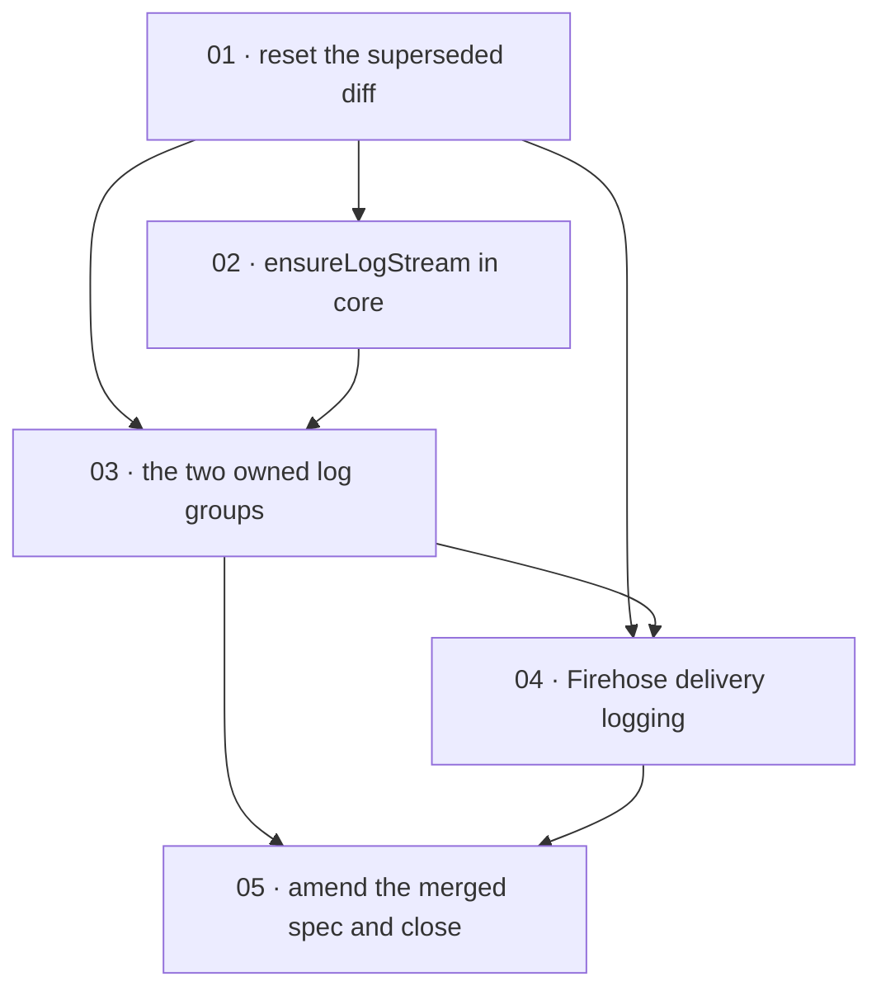

# Plan: The analytics plugin owns its two CloudWatch log groups

**Status:** Done · **Layout:** kanban · **Date:** 2026-08-31 · **Owner:** Ant Stanley · **Source spec:** [The analytics plugin owns its two CloudWatch log groups](../../changes/merged/2026-08-31-analytics_owned_log_groups.md)

Land one change spec as five tasks: the transform Lambda's log group and
Firehose's delivery-error log group become plugin-owned resource nodes on the
site's `logGroupNode` contract, both pinned to `us-east-1` and retained for 365
days, and the delivery stream's `CloudWatchLoggingOptions` is enabled against
the second of them. Twelve nodes become fourteen. The decomposition leads with
the working-tree precondition (task 01), because PR #27's superseded diff sits
uncommitted in the tree over the exact lines three of the four later tasks
edit, and every `file:line` pointer in this plan is against `main@3d47969`,
which the reset restores. Core's `ensureLogStream` (task 02) lands before the
node that calls it, because Firehose creates neither its log group nor its log
stream and `LogsClient` has no stream operation today. The load-bearing task is
not the pair of new nodes (task 03, which is the site's `logGroupNode`
instantiated twice) but task 04: the Firehose stream node's `update()` returns
with zero AWS calls when the recorded `appendOnly` already matches, which it
does on every stream this plugin has created, so enabling logging without
widening that guard would ship a fix that never reaches a deployed environment.
Task 05 executes the spec's merge plan against the merged analytics change
spec it amends.

---

## Source and definition-of-done baseline

- **Spec.** The repo has no canonical spec pages for resource nodes, AWS clients
  or the CLI surface, so
  [2026-08-31-analytics_owned_log_groups.md](../../changes/merged/2026-08-31-analytics_owned_log_groups.md)
  is the source and it amends
  [merged/2026-07-26-analytics_plugin.md](../../changes/merged/2026-07-26-analytics_plugin.md)
  in place. In scope: §Proposed changes (all five blocks, including the new
  §Observability), §Type changes (`IcebergDestinationInput`'s two new fields),
  §Implementation notes 1 to 11, and §Merge plan steps 1 to 7.
- **Working-tree precondition, discharged by task 01 rather than assumed.** The
  tree carries PR #27's diff uncommitted in `packages/analytics/src/nodes.ts`,
  `packages/analytics/src/nodes.test.ts` and
  `.changeset/transform-log-group-grant.md`. That PR is superseded by this spec
  and task 01 closes it unmerged. **A blanket working-tree reset is wrong**: the
  same tree carries this spec's own `.specs/README.md` registration and the
  lessons block appended to
  [plans/2026-07-26-plugin_system_and_analytics/plan.md](../2026-07-26-plugin_system_and_analytics/plan.md),
  both of which are kept - as are the two untracked paths this spec's own
  drafting put there, the change spec at
  [changes/2026-08-31-analytics_owned_log_groups.md](../../changes/merged/2026-08-31-analytics_owned_log_groups.md)
  and this plan folder. Four paths survive task 01, not three, and the folder is
  one of them because it holds the task files the build is reading; a `git stash
  -u` or a `git clean` would take it. Until task 01 lands, every pointer in this plan below
  `packages/analytics/src/nodes.ts:921` resolves ten lines high.
- **Already built.** Preconditions this plan does not schedule as work: the
  twelve-node analytics graph and its scoped state key
  (`packages/analytics/src/nodes.ts:3048`, `buildAnalyticsNodes`); the site's
  `logGroupNode` contract this change instantiates twice
  (`packages/cli/src/nodes.ts:75`, with `logGroupArn` at `:27-29`);
  `LogsClient`'s four log-group operations - `ensureLogGroup` (`:61`),
  `putRetentionPolicy` (`:73`), `logGroupExists` (`:77`) and `deleteLogGroup`
  (`:85`) in `packages/core/src/aws/logs.ts` - and `ctx.clients.logsUsEast1`,
  which the plugin already reaches through `logs(ctx)`
  (`packages/analytics/src/nodes.ts:2541`); the Firehose client's
  `updateDestination` (`packages/analytics/src/aws/firehose.ts:471`) and the
  `versionId`/`destinationId` pair it conditions on, landed at task 51 of the
  2026-07-26 plan; `whileRoleIsPropagating`
  (`packages/analytics/src/nodes.ts:1492`); `boundedName`, which **throws**
  rather than truncating an over-long derived name; and the transport-mocked
  node suite with its scripted reply queue, its stateful `LogsWorld` CloudWatch
  Logs fake (`packages/analytics/src/nodes.test.ts:458,506`) and the permissive
  `analyticsWorld` oracle in `packages/analytics/src/commands.test.ts:573`.
- **Definition of done.** [DEVELOPMENT.md §Definition of done](../../../DEVELOPMENT.md),
  inherited by every task: behaviour covered by tests written with the change
  (positive and negative space), small single-purpose functions, no duplicated
  logic, limits as named constants or validated config fields, errors raised
  with context and no `null` for a domain value, new external interactions
  behind ports, and `pnpm build`, `pnpm typecheck`, `pnpm test`, `pnpm lint`,
  `pnpm exec oxfmt --check .`, `pnpm knip` green locally - the same six gates
  `.github/workflows/ci.yml:21-40` runs, in that order. `pnpm test` runs under
  `TZ=America/New_York` in CI and a local run at `TZ=UTC` is the one setting
  where a whole bug class is invisible. A user-facing change ships a changeset;
  the four published packages are one fixed group (`.changeset/config.json`), so
  a changeset on `blogwright-analytics` versions all four together.
- **`pnpm knip` is a signal, and on this change it is a silent one.** Carried
  from the 2026-07-26 plan's baseline: when knip reports an export with no
  consumer, the honest answers are to delete it, to not export it yet, or to add
  a scoped ignore naming the task that will consume it. Manufacturing a consumer
  is not an answer. **On task 02 the gate says nothing at all**: `ensureLogStream`
  is a method on an already-exported class, and knip does not see unused class or
  interface members, so a green `pnpm knip` is not evidence that anything calls
  it. The evidence that anything calls it is task 03's node.
- **Every assertion must be able to fail, and the fixture is half of that.**
  Carried verbatim in substance from the 2026-07-26 plan's baseline. A vacuous
  fixture is the commonest way an assertion loses its teeth: when the setup never
  lets execution reach the behaviour, an empty expectation passes for the wrong
  reason. So the obligation is not "write a test" but **"watch it fail" - mutate
  the line the test exists to protect, see the named failure, restore**. An
  implementer states that mutation and its observed output for every claim; a
  verifier that cannot reproduce it treats the obligation as undischarged. This
  binds task 04 hardest: its guard is a two-condition early return, and a test
  that only exercises the reconciling side would pass over a guard that never
  returns early at all.
- **A check that cannot fail is a defect, not a style note.** This repo has
  shipped four: greps that matched their own documentation, a grep over generated
  build output, and a command that only fails in the non-colocated workspaces the
  build runs in. Task 03's count grep is the one in this plan most exposed to
  that class, and it carries its own exclusion and its own reason.

---

## Task graph

The dependency table is the **source of truth**; the Mermaid graph visualizes
it. If the two disagree, the table wins.

| Task | Depends on | Edge kind | Produces (reviewable artifact) |
|---|---|---|---|
| 01 · reset the superseded diff | - | - | the working tree carries none of PR #27, that PR is closed unmerged, and this spec's `.specs/README.md` registration and the 2026-07-26 plan's lessons block both survive with the lessons block's two stale sentences corrected |
| 02 · `ensureLogStream` in core | 01 | review | `LogsClient.ensureLogStream(group, stream)` creates a log stream and swallows an already-exists response, rethrowing everything else, with both directions asserted at the transport seam |
| 03 · the two owned log groups | 01, 02 | build, contract | `analytics-transform-log-group` and `analytics-firehose-log-group` reconcile on the site's `logGroupNode` contract with 365-day retention, the Firehose group also converging its `DestinationDelivery` stream on every apply; `buildAnalyticsNodes` returns fourteen and the two writers declare their edges |
| 04 · Firehose delivery logging | 01, 03 | build, data, review | the delivery stream sends `CloudWatchLoggingOptions` on both the create and the update path, the delivery role grants `logs:PutLogEvents` on that one stream, and an already-deployed stream whose recorded `appendOnly` already matches is reconciled into logging instead of skipped |
| 05 · amend the merged spec and close | 03, 04 | review | the merged analytics change spec carries the two new node rows, the restated counts and the new §Observability block with every quoted link re-depthed, its thirteen stale citations are refreshed and the one whose referent is gone is exempted on the record, this spec is `Merged` and moved, and a changeset states what an existing environment gains |

`Depends on` references lower task numbers throughout. Edge kinds: **review** on
`01 → 02` because nothing in `packages/core` is functionally blocked but no task
in this plan can be signed off against a tree carrying a superseded PR's diff;
**build** on `01 → 03` and `01 → 04` because both edit lines PR #27 already
edited or displaced; **contract** on `02 → 03` because the Firehose group node
calls `ensureLogStream`; **data** and **review** on `03 → 04` because the
destination's `LogGroupName` and `LogStreamName` name the group and stream that
node creates, and Firehose rejects `CloudWatchLoggingOptions` for a group that
does not exist yet.

---

## Implementation order and milestones

**Order:** `01, 02, 03, 04, 05`. This is a chain rather than a graph with
choices in it, and the two places worth naming are why it is a chain at all.
Task 01 leads although it changes no behaviour, because it is the only task
whose omission silently corrupts every other one: PR #27's diff sits over
`transformLogGroupArn`'s comment and over `applyTransformRolePolicy`'s logs
statement, which are exactly the two things task 03 rewrites and deliberately
leaves alone, and a builder branching from an unreset tree would either merge
the superseded grant or resolve a conflict against it. Task 02 precedes task 03
by a real contract edge and not by layering convenience: Firehose creates
neither its log group nor its log stream when error logging is enabled through
the API, so the group node has to create both, and `LogsClient` has no stream
operation to call.

Task 04 is deliberately **not** split into "send the logging options" and "make
the guard reconcile". Either half alone leaves the system in a state that reads
as done and is not. Landing the destination fields without the guard change is
inert on every environment this plugin has already provisioned, which is the
whole installed base. Landing the guard change without the destination fields
makes `loggingEnabled` never `true`, so every apply issues an `UpdateDestination`
forever. They are one reviewable slice because there is no cut between them a
reviewer could sign off.

**Milestones:**

| Milestone | Tasks | Demonstrable when complete | Review gate |
|---|---|---|---|
| M1 - the tree and the core operation | 01, 02 | `git diff packages/ .changeset` is empty, PR #27 is closed unmerged, and `LogsClient` can create a log stream idempotently | the six gates are green on the reset tree; the two files this spec's own work put in the tree are still there; `pnpm knip` proves nothing about `ensureLogStream` and is not cited as if it did |
| M2 - the plugin owns its logs | 03, 04 | `blogwright analytics bootstrap` provisions fourteen nodes; `/aws/lambda/<prefix>-analytics-transform` and `/aws/kinesisfirehose/<prefix>-analytics-firehose` both exist with 365-day retention, the second carrying a `DestinationDelivery` stream; the delivery stream reports `CloudWatchLoggingOptions.Enabled` true, on a stream created before this change as well as one created after | the transform role's policy is byte-identical to today's two-action statement; the logging-only reconcile issues `UpdateDestination` and never the replace fallback; the zero-call path still exists and is still asserted |
| M3 - closure | 05 | the merged analytics change spec describes fourteen nodes and holds a §Observability block, and this spec sits in `.specs/changes/merged/` | every relative link in the amended and the moved documents resolves at its new depth; the two not-applicable merge-plan steps are recorded with a reason and an owner rather than passed over |

**Cut lines:** points at which the work can stop and what has shipped there.

- *After task 02.* Core has one more `LogsClient` method and nothing calls it.
  Behaviour-neutral, internal-only, safe to sit on `main`. Do not read a green
  `pnpm knip` as evidence the method is reachable; knip does not inspect class
  members, and its only consumer arrives at task 03.
- *After task 03.* A legitimate stopping point and the more useful of the two.
  Both log groups exist, are retained for 365 days and are torn down with the
  pipeline; the transform Lambda's own output is readable for the first time,
  which is the half of the motivation that cost the diagnosis. Firehose still
  sends no `CloudWatchLoggingOptions`, so the second group is created and empty -
  correct, not broken, and worth saying in the changeset if a release is cut
  here. The delivery role has no fifth statement yet, so nothing is granted that
  nothing uses.
- *Between tasks 03 and 04 the two halves of task 04 are not a cut line.* See
  the order note above: neither half alone reaches a deployed stream.
- *After task 04.* The change is complete in the code and the merged spec still
  says twelve nodes. Releasable; task 05 is documentation and the spec merge.

---

## Assumptions and open questions

**Assumptions**

- The spec's five assumptions hold and are not re-derived here: that Firehose
  creates neither the log group nor the log stream when error logging is enabled
  through the API (verified 2026-08-31 against
  `firehose/latest/dev/monitoring-with-cloudwatch-logs.html`); that
  `logs:PutLogEvents` alone is what the delivery role needs; that Lambda creates
  its own log stream given `logs:CreateLogStream` on the group; that `365` is an
  accepted `retentionInDays` value; and that deleting a log group deletes the
  streams inside it. Each is cited in the spec's Assumptions block; a task that
  finds one false raises it rather than working around it.
- PR #27 is closed rather than merged. Every task after 01 assumes the transform
  role keeps exactly `logs:CreateLogStream` and `logs:PutLogEvents`.
- `IcebergDestinationDescription` carries `CloudWatchLoggingOptions` in a
  `DescribeDeliveryStream` response, which is what makes `loggingEnabled`
  readable back off the live stream. Task 04's first obligation is to verify that
  against the API reference before writing the parse, the way task 34 established
  for every other Firehose body key: a transport test asserts the body the
  implementation itself constructs and cannot catch a wrong key.

**Decisions**

- *Five tasks, not more.* **The decomposition follows the review boundaries, not
  the eleven implementation notes.** Notes 2, 3, 4, 5, 6 and 10 are one node-set
  change and are one task; notes 7, 8 and 9 are one delivery-logging change and
  are one task. Splitting further would produce packages that cannot be reviewed
  apart, which the sizing rule says to merge.
- *The two log groups are one task, not two.* They are the same contract
  instantiated twice, and the node-set count is a single atomic fact: the
  `toHaveLength(12)` assertion at `packages/analytics/src/commands.test.ts:344`
  and the twenty-odd prose statements of the count would otherwise be rewritten
  twice, once to thirteen and once to fourteen, with the merged spec's own
  wording out of step with both intermediate states.
- *Task 01 is a task rather than a precondition note.* It carries a repository
  action (closing PR #27 unmerged), a destructive-if-done-wrong reset, and a
  correction to a lessons block that describes the superseded fix. A precondition
  nobody's definition of done names is a precondition that gets skipped, which is
  the lesson the block itself records.
- *Every `Reviewable:` filter names the package whose tests run.* Core work is
  `pnpm --filter blogwright-core`, analytics work is
  `pnpm --filter blogwright-analytics`. Three tasks in the 2026-07-26 plan shipped
  a filter naming the package the task cited rather than the one its tests lived
  in, and those tests never ran.

**Open questions**

- **Should the stream node's early return compare the whole live destination
  rather than a growing list of fields?** Task 04 makes it two conditions, which
  the spec settles. But the shape is a field allowlist, and the next field the
  destination grows pays this same cost again - and pays it silently, since the
  symptom is a reconcile that does nothing rather than one that fails. Comparing
  the built destination against the described one would end the class; it also
  needs a normalisation layer, because `DescribeDeliveryStream` does not echo an
  `IcebergDestinationConfiguration` back field for field. Out of scope here and
  worth its own change spec. Owner: Ant Stanley.
- **Should retention be configurable?** The spec's own open question, deliberately
  out of scope: adding a `retentionDays` key to `AnalyticsConfig` changes a shape
  the merged analytics spec documents in its `Type changes` fragment, which makes
  it a change spec of its own. Owner: Ant Stanley.
- **Should the site's `iam-build-role` lose its own `logs:CreateLogGroup`?** It
  grants it on `microvm-log-group` (`packages/cli/src/nodes.ts:147`) although the
  site owns that group as a node, while `iam-exec-role` on the same group does not
  (`:214`). The two disagree and the exec role is the one this change follows.
  Tightening the build role is a site-graph change. Owner: Ant Stanley.
- **Should `analytics status` report the two groups' presence specially?** They
  appear in the generic node walk for free. Whether a missing log group deserves
  more prominence than a missing bucket is a judgement this change does not make.
  Owner: Ant Stanley.
